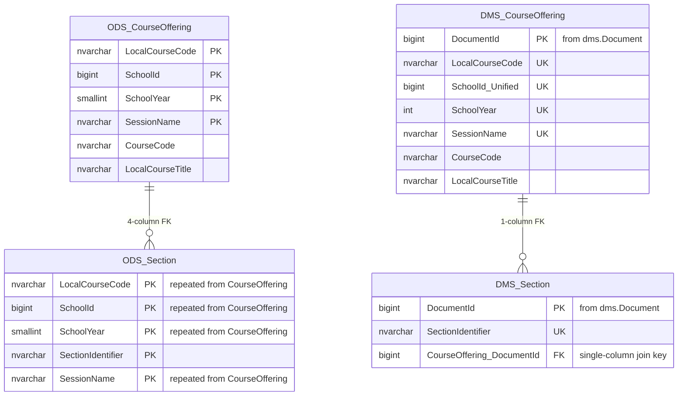
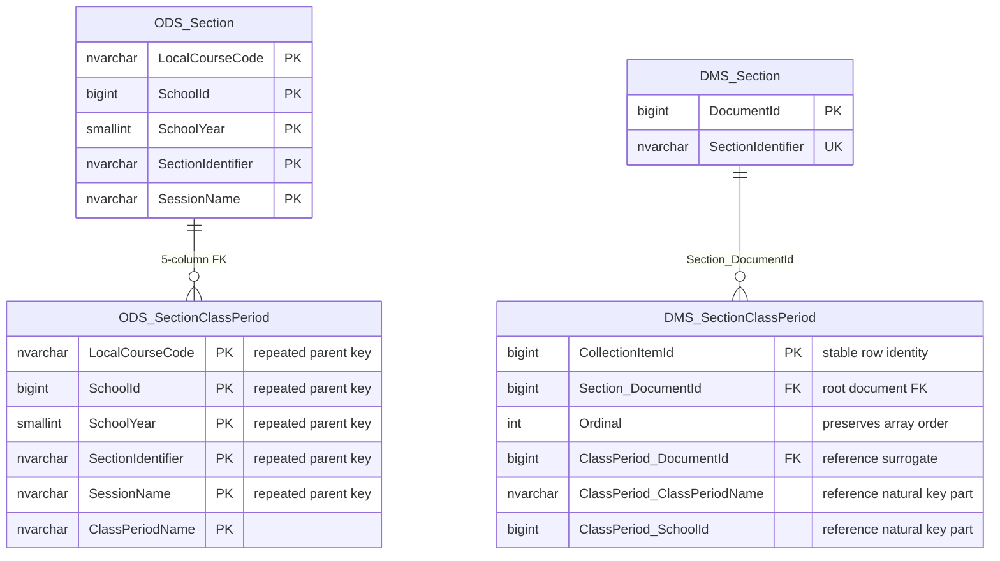
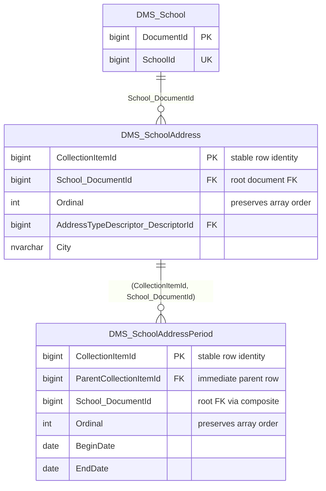
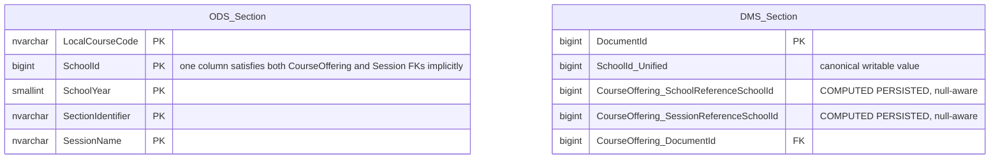
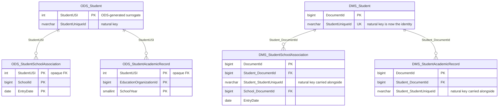
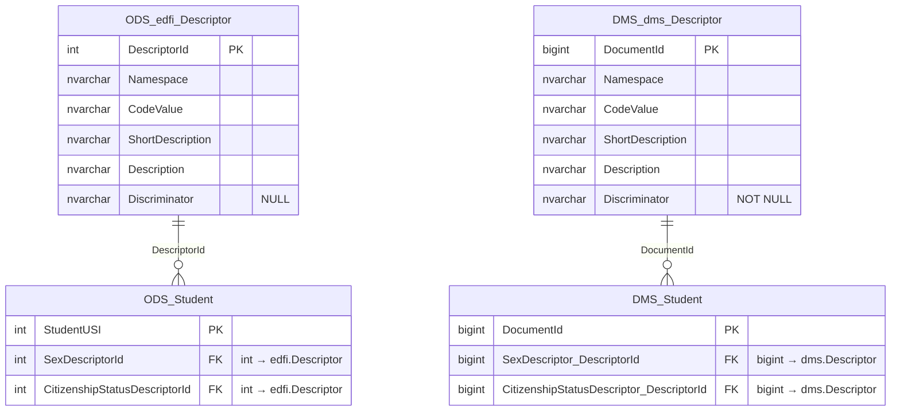
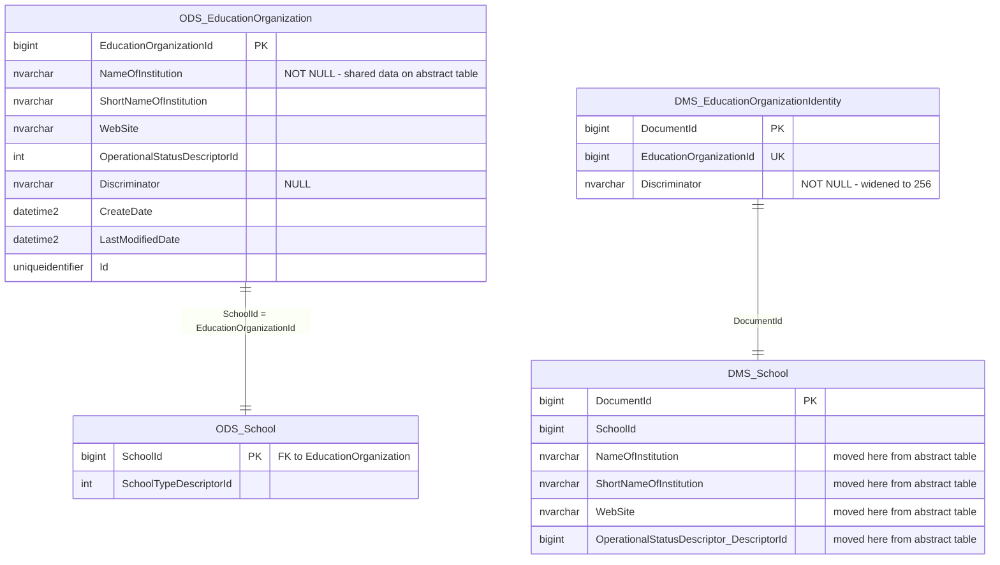
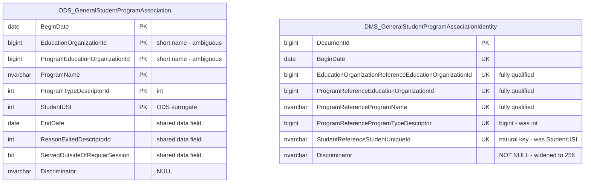
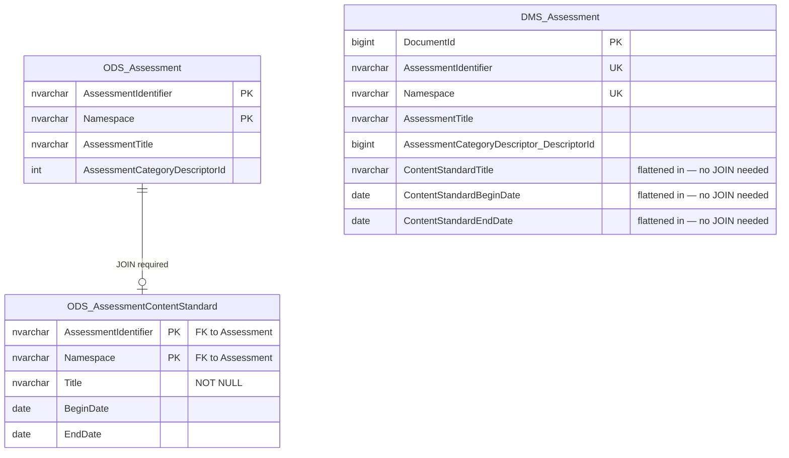
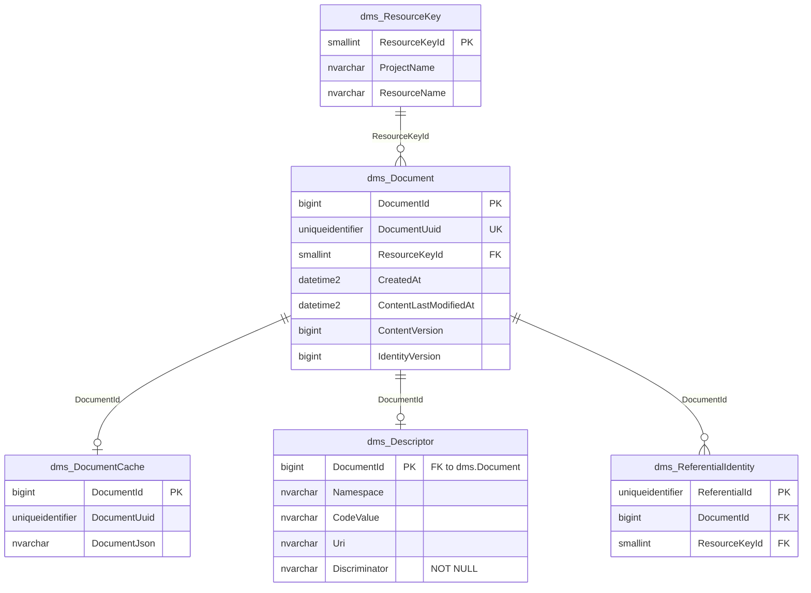

:::note

Ed-Fi API v8 is the production release of the Ed-Fi Data Management Service (DMS) described in this post.

:::

:::info[Updated June 17, 2026]

This post has been updated to reflect the latest implementation. The most significant change since its original publication is that **change tracking is now included**.

:::

## Overview

The Ed‑Fi Data Management Service (DMS) is evolving toward a relational backend, shaped by community feedback and real‑world implementation experience. Building on the proven Ed‑Fi ODS/API foundation, DMS modernizes the storage layer to address long‑standing operational challenges—such as wide composite keys and complex joins—through targeted structural changes.

By prioritizing a relational backend, DMS preserves the core strengths of the ODS: predictable schemas, strong referential integrity, and compatibility with relational tooling. The result is a service that feels familiar to teams with ODS experience and lowers the cognitive and migration cost of adoption.

### What This Means for Implementers

If you work directly with the ODS database today, DMS's data store will feel familiar, but with important structural differences:

- You still work with the same Ed‑Fi entities and natural keys
- Joins are simpler and narrower due to surrogate keys
- Person identity is clearer and no longer mediated by ODS-only integers
- Optional document caching can accelerate API reads

The sections below explain _why_ these changes exist and _how_ they affect database design and operations.

This post is written for database administrators, backend developers, data engineers, and solution architects who work with the Ed‑Fi ODS/API at the database level and are evaluating or planning a transition to DMS. Familiarity with the ODS schema and relational database concepts is assumed.

<!-- truncate -->

## The Same Data Model, A Different Structure

Before examining what changed, it is worth being precise about what did not. DMS implements the same Ed-Fi data model as the ODS. Every resource (e.g., `Student`, `School`, `Section`, and `Assessment`) is present. Every natural key (e.g., `StudentUniqueId`, `SchoolId`, `SectionIdentifier`) is preserved.

What DMS redesigns is the structural layer beneath the data model: how tables are keyed, how relationships are enforced, how changes are tracked, and how the database serves different consumers efficiently.

## Surrogate Keys Replace Natural Composite Keys

The most structurally significant change in DMS is the primary key strategy.

In the ODS database, every table's primary key is the natural key, often a composite of the columns that give the entity its real-world identity. For example, `edfi.Section` has a five-column primary key: `LocalCourseCode`, `SchoolId`, `SchoolYear`, `SectionIdentifier`, and `SessionName`. Child tables carry those same columns as part of their own composite keys. Foreign keys between tables are multi-column matches on these natural keys.

This is a principled design. The data is self-describing, and the schema reflects the domain directly. But it comes with practical costs. Wide composite keys on string columns mean wide indexes, increased I/O, and slower joins. Child table rows must repeat the parent's full key, inflating storage for high-cardinality collections. When a natural key value legitimately changes, the update requires cascading changes across every referencing table in the schema.

DMS replaces this with a surrogate primary key called `DocumentId`. This key is allocated in `dms.Document` and reused as the primary key of each aggregate root row through a foreign key back to `dms.Document`. The Ed-Fi natural key is still present as a unique constraint and participates in composite FK enforcement, but it is no longer the main join key.

```sql
-- ODS: four-column join to follow a reference
JOIN edfi.CourseOffering co
  ON co.LocalCourseCode = sec.LocalCourseCode
 AND co.SchoolId        = sec.SchoolId
 AND co.SchoolYear      = sec.SchoolYear
 AND co.SessionName     = sec.SessionName

-- DMS: single-column join
JOIN edfi.CourseOffering co
  ON co.DocumentId = sec.CourseOffering_DocumentId
```

The diagram below highlights the simplified join shape. In ODS, `Section` must embed four of `CourseOffering`'s key columns to form its FK; in DMS, a single `CourseOffering_DocumentId` column is the entire reference.



## Surrogate Keys in Child Collection Tables

With the surrogate key design comes a related change to how DMS structures child collection tables that back JSON arrays within a resource document.

In ODS, a collection table's primary key is a composite of the parent's natural key plus the child's distinguishing column(s). Every row repeats the full parent key. In DMS, the parent FK shrinks to a single `{Root}_DocumentId` column, and each collection row also gets its own stable primary key: `CollectionItemId bigint`, allocated from a global `dms.CollectionItemIdSequence` sequence.



`Ordinal` preserves the client-supplied array order so the document can be reconstructed exactly.

### Nested Collections

When a collection contains a nested array (e.g., `School.Addresses[*]` → `Addresses[*].Periods[*]`), the nested table links to its **immediate parent collection row** via `ParentCollectionItemId`, not directly back to the root document a second time. The root document FK is still carried on the nested table, but it is enforced through a composite FK on `(ParentCollectionItemId, School_DocumentId)`. This ensures correct cascading.



The structural result: every collection row has a stable, addressable identity (`CollectionItemId`) that extension tables can attach to, cascade deletes flow cleanly through the parent chain, and the root document FK is always available for efficient filtering without additional joins.

## Key Unification: From Implicit to Explicit

One of the more subtle but important aspects of ODS design is key unification — the pattern where a single natural key value appears in multiple parent references within the same child row and must be consistent across all of them.

The canonical example is `SchoolId` on a `Section`. A Section is identified by its CourseOffering, and that CourseOffering reaches the same School two ways within its own identity — directly through its School reference and indirectly through its Session's School — so a single `SchoolId` value has to satisfy both paths. In ODS, because `SchoolId` is part of the composite primary key, there is physically only one `SchoolId` column, and it satisfies every path simultaneously. The database enforces consistency by construction.

In DMS, where each reference is a separate `DocumentId` column, this implicit consistency no longer holds. DMS makes key unification explicit: a single canonical `SchoolId_Unified` column holds the authoritative value, and the per‑reference school columns are **computed, persisted columns** that derive from it automatically. They are named by their full reference path rather than a short alias — on `Section`, the `CourseOffering` reference contributes both `CourseOffering_SchoolReferenceSchoolId` and `CourseOffering_SessionReferenceSchoolId`, both backed by the same `SchoolId_Unified` value:

```sql
"SchoolId_Unified" bigint NOT NULL,
"CourseOffering_SchoolReferenceSchoolId" bigint
    GENERATED ALWAYS AS (CASE WHEN "CourseOffering_DocumentId" IS NULL
                              THEN NULL ELSE "SchoolId_Unified" END) STORED,
"CourseOffering_SessionReferenceSchoolId" bigint
    GENERATED ALWAYS AS (CASE WHEN "CourseOffering_DocumentId" IS NULL
                              THEN NULL ELSE "SchoolId_Unified" END) STORED,
```

The generated expression is null‑aware: an alias resolves to `NULL` when its owning reference is absent, rather than leaking the unified value into an optional reference. When a table has more than one independent unification group, each additional canonical column carries a short hash suffix to keep it distinct — for example `Section` also defines `SchoolId_U35501e03_Unified` for the `Location`/`LocationSchool` references. **ETL authors should read the `*_Unified` column as the authoritative value and treat the per‑reference `*SchoolId` columns as derived and read‑only.**



## How References and Natural Keys Are Constrained

Two constraint conventions appear on essentially every aggregate root table:

**All‑or‑nothing references.** Because a reference is spread across several columns (`{Role}_DocumentId`, the natural‑key columns, and any unified/computed columns), each reference carries a `CK_{Table}_{Role}_AllNone` check constraint asserting that every column of that reference is either all `NULL` (the optional reference is absent) or all non‑`NULL` (the reference is present). To test whether an optional reference exists, check its `{Role}_DocumentId` for `NULL` — the check constraint guarantees the remaining columns agree.

**Two unique constraints per table.** Each table declares:

- `UX_{Table}_NK` — the Ed‑Fi natural key expressed in DMS columns (e.g., `UX_Section_NK` on `CourseOffering_DocumentId`, `SectionIdentifier`). This is the surrogate‑era equivalent of the ODS composite primary key, and it is what enforces business uniqueness.
- `UX_{Table}_RefKey` — the natural key **plus `DocumentId`**, which is what referencing tables' foreign keys actually target so that both the surrogate and the natural key resolve in a single index.

```sql
CONSTRAINT "PK_Section" PRIMARY KEY ("DocumentId"),
CONSTRAINT "UX_Section_NK" UNIQUE ("CourseOffering_DocumentId", "SectionIdentifier"),
CONSTRAINT "UX_Section_RefKey" UNIQUE ("CourseOffering_LocalCourseCode", "SchoolId_Unified",
    "CourseOffering_SchoolYear", "CourseOffering_SessionName", "SectionIdentifier", "DocumentId"),
```

## StudentUSI and Its Siblings Are Eliminated

ODS generates internal integer surrogates for the three person entity types — `StudentUSI`, `StaffUSI`, and `ContactUSI` — and propagates them throughout the schema as the foreign key mechanism for all person references. These surrogates are ODS-internal implementation details that were never part of the Ed-Fi data model itself, but became load-bearing infrastructure that every ODS consumer had to understand and work around.

DMS eliminates the `USI` fields entirely. Student references use `Student_DocumentId` (the DMS surrogate, for joins within the database) alongside `Student_StudentUniqueId` (the Ed-Fi natural key, for identity and external references). The practical effect is that the person's Ed-Fi natural identifier, e.g., `StudentUniqueId`, becomes the first-class reference rather than an opaque integer that requires a lookup to interpret.



## Descriptors Move to the dms Schema

In ODS, descriptors live in `edfi.Descriptor` with `DescriptorId int IDENTITY` as the primary key. Descriptor reference columns throughout the schema follow the pattern `{Type}DescriptorId int`.

In DMS, descriptors are stored in `dms.Descriptor` with `DocumentId bigint` as the primary key, using the same surrogate key pattern used for all resources. Descriptor reference columns are renamed consistently to `{Type}Descriptor_DescriptorId bigint`.

The rename is mechanical and consistent: every descriptor column in the schema follows the same rule, making it straightforward to identify and update programmatically.



## Abstract Base Tables: Renamed and Fundamentally Restructured

Two ODS base tables that represent abstract entities in the Ed-Fi model have been renamed and significantly changed in DMS:

| ODS Table                             | DMS Table                                     |
|---------------------------------------|-----------------------------------------------|
| edfi.EducationOrganization            | edfi.EducationOrganizationIdentity            |
| edfi.GeneralStudentProgramAssociation | edfi.GeneralStudentProgramAssociationIdentity |

The rename reflects a deeper change. In ODS, these tables carry actual data fields alongside the identity columns. In DMS, they are stripped down to pure identity — only the natural key and `Discriminator` remain. All data fields have been moved exclusively to the concrete subtype tables.

### edfi.EducationOrganization → edfi.EducationOrganizationIdentity

The ODS `edfi.EducationOrganization` table holds both identity and shared data fields that apply to all education organization subtypes. The DMS `edfi.EducationOrganizationIdentity` table contains only three columns: `DocumentId`, `EducationOrganizationId`, and `Discriminator`. Fields like `NameOfInstitution` are no longer accessible from the abstract identity table. To retrieve them, you must join to the concrete subtype (e.g., `edfi.School`, `edfi.LocalEducationAgency`).



### edfi.GeneralStudentProgramAssociation → edfi.GeneralStudentProgramAssociationIdentity

Beyond the rename and removal of data fields, this identity table also illustrates the `StudentUSI` elimination and descriptor type widening covered in earlier sections.



Reference naming on these identity tables is fully qualified. Where ODS used short column names (e.g., `EducationOrganizationId`, `ProgramName`), the identity table uses names that make the reference relationship explicit (e.g., `EducationOrganizationReferenceEducationOrganizationId`, `ProgramReferenceProgramName`). Note that this concatenated `…Reference…` form is specific to these abstract identity tables, where the denormalized natural key would otherwise be ambiguous; ordinary reference columns elsewhere in the schema use the role‑prefixed `{Role}_{Column}` form (e.g., `CourseOffering_DocumentId`, `School_SchoolId`, `Student_StudentUniqueId`).

The ODS surrogate integer `StudentUSI` in the composite key is replaced by `StudentReferenceStudentUniqueId`, the Ed-Fi natural identifier. The identity table in DMS carries the real student identifier rather than an ODS-internal surrogate.

`ProgramTypeDescriptorId` widens from `int` to `bigint`. This is consistent with the broader DMS descriptor type change, but it affects the natural key composition of this identity table.

### The Common Pattern

Both DMS identity tables are pure referential anchors. They exist solely so that foreign keys from other tables can point to "any EducationOrganization subtype" or "any GeneralStudentProgramAssociation subtype" without knowing the concrete type. They carry no data beyond what is needed to identify the entity. All descriptive data lives exclusively on the concrete subtype tables. This is a deliberate architectural choice: the identity table's job is referential integrity, not data storage.

## The Schema Is Smaller

The DMS `edfi` schema has approximately 25% fewer tables than ODS. The reduction comes from flattening one-to-one sub-objects into their parent aggregate root. Where ODS modeled `AssessmentContentStandard` as a separate table joined to `Assessment`, DMS folds those columns directly onto the `Assessment` row with a consistent prefix (e.g., `ContentStandardTitle`, `ContentStandardBeginDate`).

The motivation is alignment with how the API actually works. An `Assessment` resource is a single API document. It does not have a separate "content standard" resource. The ODS representation of this as a separate table was a normalization artifact; DMS collapses it to match the API's document boundary. The result is a schema where aggregate root rows more directly correspond to the API resource they represent.



## A Centralized Document Registry

DMS introduces a `dms` schema containing the infrastructure tables that support the new design. Three of these carry the core runtime model:

**`dms.Document`** is a universal registry of every resource instance in the database. Every `edfi` table's `DocumentId` is a foreign key to `dms.Document`. This table holds the resource UUID (`DocumentUuid`), a `ResourceKeyId` identifying the resource type, `CreatedAt`, and **two independent version counters** drawn from the global `dms.ChangeVersionSequence`: `ContentVersion`/`ContentLastModifiedAt`, which advance whenever any field of the document changes, and `IdentityVersion`/`IdentityLastModifiedAt`, which advance only when the document's natural key changes. Separating the two lets consumers distinguish an ordinary edit from a re‑identification. Metadata that ODS scattered as columns on every individual `edfi` table is centralized here; each `edfi` root row also carries a denormalized `ContentVersion`/`ContentLastModifiedAt` kept in sync by trigger.

**`dms.DocumentCache`** stores a pre-serialized JSON document for every resource. When populated, it allows the API to serve GET responses from a single row rather than reconstructing the document from a multi-table join at query time.

**`dms.ReferentialIdentity`** stores the UUIDv5 hash of each resource's natural key (`ReferentialId`) alongside its `DocumentId` and `ResourceKeyId`. The hash is computed by the `dms.uuidv5` function over a canonical string built from the resource name and natural‑key JSON path/value pairs. This allows DMS to resolve any natural key to its owning document without scanning resource tables, and ensures that references remain consistent when natural keys change.

Three more support schema governance rather than carrying data:

**`dms.ResourceKey`** maps each `(ProjectName, ResourceName)` pair to the compact `smallint ResourceKeyId` used on `dms.Document` and `dms.ReferentialIdentity`.

**`dms.EffectiveSchema`** and **`dms.SchemaComponent`** record which Ed‑Fi API schema and extension schemas the deployed database was built from, so API can confirm the database matches the expected API schema.

Triggers on every aggregate root table keep the DMS infrastructure tables in sync: a `TF_TR_{Resource}_ReferentialIdentity` trigger maintains `dms.ReferentialIdentity` on insert and on natural‑key change, and a `TF_TR_{Resource}_Stamp` trigger maintains `dms.Document` versioning (and the row's mirrored `ContentVersion`).



## Change Tracking and Change Queries

Change tracking has two halves:

**Monotonic versions for upserts.** Every `dms.Document` row carries `ContentVersion` and `IdentityVersion` drawn from a single global `dms.ChangeVersionSequence`, and each `edfi` aggregate root row mirrors `ContentVersion` locally. To pull everything that changed since a watermark, filter on `ContentVersion > @lastSeen` and order by it. Because the sequence is global and monotonic, a single high‑water mark works across all resources, exactly as the ODS `ChangeVersion` does. `IdentityVersion` (on `dms.Document`) advances separately when a natural key changes, so a re‑identification is distinguishable from an ordinary content edit.

**Deleted and re‑keyed rows.** Surviving rows cannot tell a consumer about rows that no longer exist, so DMS ships a `tracked_changes_edfi` schema with one table per resource. Each records the `Old_` natural‑key values, the `New_` values (null for a hard delete), the resource `Id`, the `ChangeVersion` at which the change occurred, and `CreatedAt`:

```sql
CREATE TABLE "tracked_changes_edfi"."School"
(
    "Old_SchoolId" bigint NOT NULL,
    "New_SchoolId" bigint NULL,
    "Id" uuid NOT NULL,
    "ChangeVersion" bigint NOT NULL,
    "CreatedAt" timestamp with time zone NOT NULL DEFAULT now(),
    CONSTRAINT "PK_tracked_changes_edfi_School" PRIMARY KEY ("ChangeVersion")
);
```

An incremental extract therefore reads new and updated rows from the resource tables where `ContentVersion > @lastSeen`, and reads deletes and key changes from the corresponding `tracked_changes_edfi` table for the same `ChangeVersion` range. This is the direct DMS analogue of the ODS `changes` / `tracked_changes` pattern, keyed on a surrogate‑era `DocumentId`/natural‑key pair instead of USIs and composite keys.

## Performance and Storage Characteristics

The surrogate key design has clear performance benefits. Indexes on `DocumentId` columns are 8 bytes wide. Indexes on ODS natural key columns can be hundreds of bytes wide for string-heavy composite keys. Narrower indexes mean more entries per page, better buffer cache utilization, and faster scans.

Sub-table rows see the largest storage reduction. An ODS sub-table row must carry the full parent composite key; for a Section-related collection table, that can be 600 bytes or more of key columns before a single data column appears. The equivalent DMS collection row carries an 8-byte `CollectionItemId` primary key, an 8-byte `{Root}_DocumentId` root FK, and a 4-byte `Ordinal`, totaling 20 bytes of structural overhead regardless of how wide the parent's natural key is. Aggregate root rows, by contrast, have grown slightly. Each reference stores its `{Root}_DocumentId` in addition to the natural-key columns it already carried.

Write operations carry some additional overhead. Each insert to an `edfi` table requires a prior insert to `dms.Document`, then fires triggers that maintain `dms.ReferentialIdentity` and `dms.Document` versioning. A single resource insert touches multiple infrastructure tables.

The optional `dms.DocumentCache` imposes additional storage costs by storing a full JSON copy of every resource. Whether this cost is justified depends on the read patterns of the deployment and real-time event streaming for downstream consumers.

## Conclusion

The move to surrogate keys, explicit identity management, and flattened aggregates reflects practical lessons learned from years of operating large ODS deployments, shaped directly by feedback from the Ed‑Fi community and real‑world implementation experience. These changes simplify joins, reduce operational overhead, and better align the database with an API‑first runtime.

DMS remains intentionally familiar. Its schema is relational, its constraints are explicit, and its behavior is predictable for teams experienced with the ODS. The differences are structural rather than conceptual. This is an evolution shaped by how the community builds and operates Ed‑Fi systems today, not a break from what has worked in the past.
