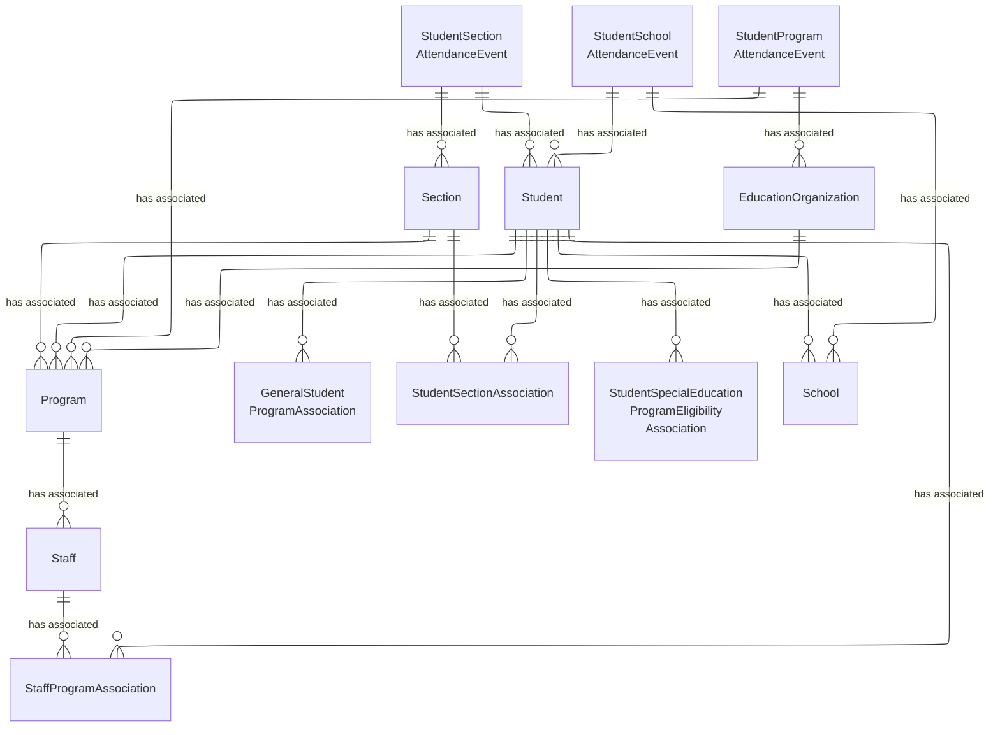

# Alternative and Supplemental Services Domain - Model Diagrams

This section contains reference information for the Alternative and Supplemental
Services domain model and subdomains.

## Alternative and Supplemental Services Model UML Diagram

### Federal Programs Subdomain

#### Alternative and Supplemental Services, Federal Programs Model UML Diagram

```mermaid
---
config:
  layout: elk
---
erDiagram
    Program {
    }
    Student {
    }
    EducationOrganization {
    }
    GeneralStudentProgramAssociation {
    }
    StudentCTEProgramAssociation {
    }
    StudentHomelessProgramAssociation {
    }
    StudentLanguageInstructionProgramAssociation {
    }
    StudentMigrantEducationProgramAssociation {
    }
    StudentNeglectedOrDelinquentProgramAssociation {
    }
    StudentProgramAssociation {
    }
    StudentSchoolFoodServiceProgramAssociation {
    }
    StudentSpecialEducationProgramAssociation {
    }
    StudentTitleIPartAProgramAssociation {
    }
    StudentSpecialEducationProgramEligibilityAssociation {
    }
    StudentSection504ProgramAssociation {
    }
    EducationOrganization ||--o{ Program : "has associated"
    Student ||--o{ Program : "has associated"
    GeneralStudentProgramAssociation ||--o{ EducationOrganization : "has associated"
    StudentSpecialEducationProgramEligibilityAssociation ||--o{ EducationOrganization : "has associated"
    StudentCTEProgramAssociation ||--o{ GeneralStudentProgramAssociation : "has associated"
    StudentHomelessProgramAssociation ||--o{ GeneralStudentProgramAssociation : "has associated"
    StudentLanguageInstructionProgramAssociation ||--o{ GeneralStudentProgramAssociation : "has associated"
    StudentMigrantEducationProgramAssociation ||--o{ GeneralStudentProgramAssociation : "has associated"
    StudentNeglectedOrDelinquentProgramAssociation ||--o{ GeneralStudentProgramAssociation : "has associated"
    StudentProgramAssociation ||--o{ GeneralStudentProgramAssociation : "has associated"
    StudentSchoolFoodServiceProgramAssociation ||--o{ GeneralStudentProgramAssociation : "has associated"
    StudentSpecialEducationProgramAssociation ||--o{ GeneralStudentProgramAssociation : "has associated"
    StudentTitleIPartAProgramAssociation ||--o{ GeneralStudentProgramAssociation : "has associated"
    StudentSection504ProgramAssociation ||--o{ GeneralStudentProgramAssociation : "has associated"
```

