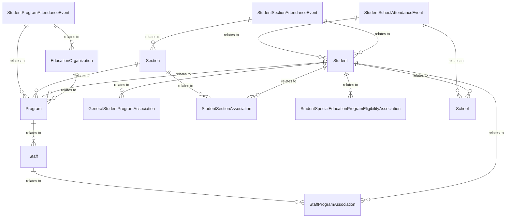

# Alternative and Supplemental Services Domain - Model Diagrams

This section contains reference information for the Alternative and Supplemental
Services domain model and subdomains.

### Federal Programs Subdomain

#### Alternative and Supplemental Services, Federal Programs Model UML Diagram

[_Large Version_](https://edfidocs.blob.core.windows.net/$web/img/reference/data-standard/AlternativeAndSupplementalServices_FederalPrograms_v6.X.png)
