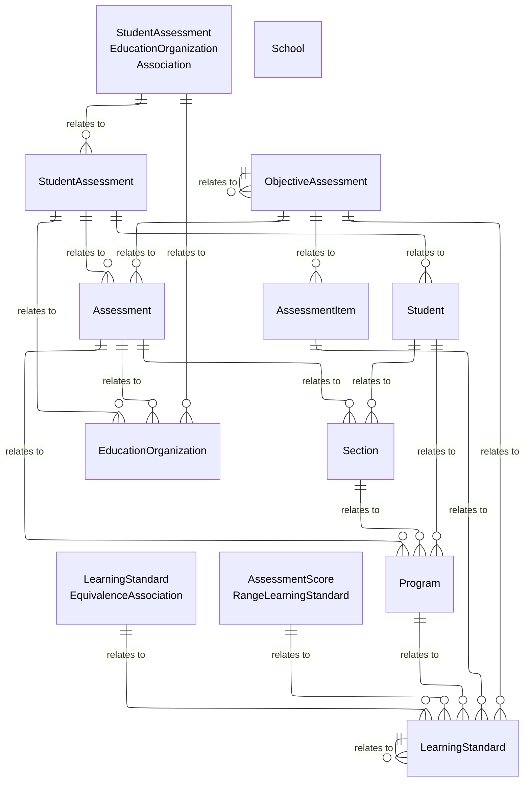
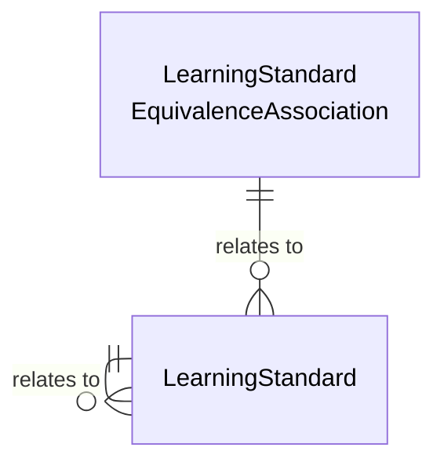
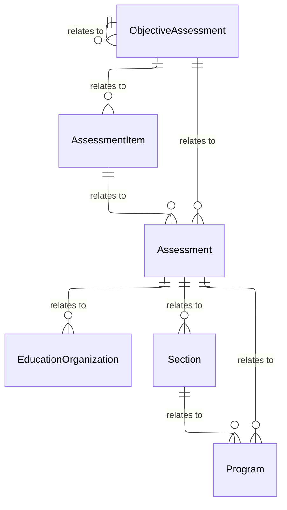
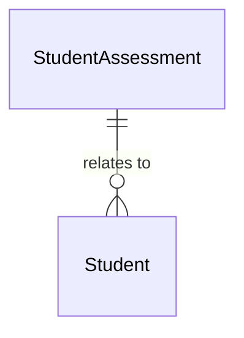

# Assessment Domain - Model Diagrams

This section contains reference information for the Assessment domain model and
subdomains.

## Assessment Model UML Diagram

### Learning Standard Subdomain

Many states have learning standards that drive the curriculum and the
assessments. The Common Core State Standards Initiative
([www.corestandards.org](http://www.corestandards.org)) is a national initiative
for standards in this area. The assessment model stores Common Core or locally
defined standards in the LearningStandard and related entities.

The model supports a hierarchical taxonomy of learning skills using multiple
levels of LearningStandard, which may correspond to levels of subjects, domains,
or strands; the LearningStandardScope element captures the appropriate scope of
these levels whereas the SuccessCriteria element captures the criterion that
teacher and students use to check for attainment of the objective.

The LearningStandard entity may also be hierarchically organized to support the
use case that adopters of the Common Core often decompose a standard into lower
level standards in their curriculum. The HasAssociatedPrerequisite association
captures prerequisites for a learning standard as would be specified in a
learning map.

The LearningStandardEquivalenceAssociation allows for standards of varying
scopes and sources, defined using the LearningStandardScope and Namespace
elements respectively, to have a defined equivalence and strength of
equivalence.

#### Assessment, Learning Standards Model UML Diagram

### Assessment Metadata Subdomain

Assessment metadata is information describing the assessment instrument itself.
This includes details about the overall Assessment, defined
ObjectiveAssessments, and individual AssessmentItems.

Score and performance level (or cut score) metadata can be defined in the
Assessment and ObjectiveAssessment entities. AssessmentItem details include
questions including associated learning standards, the item text, all possible
responses, and the correct response.

Assessments can be associated with a particular section, program, or remain
stand-alone. For example, if an Assessment is defined to assess Common Core
Standards, then the association shall be with Section. If the Assessment is
defined to assess the Developmental Domains by an Early Learning program, then
the association shall be with Program. State assessments are an example of
stand-alone assessments that do not tie to a particular section or program.

#### Assessment, Assessment Metadata Model UML Diagram

### Student Assessment Subdomain

The Assessment entity represents a specific administration of an assessment and
contains the minimum amount of metadata required for an assessment.

* If the Assessment entity is associated with one or more sections, an
    association is made to the section(s).
* The ObjectiveAssessment entity is the optional identification of portions of
    the assessment that test specific learning objectives. If required, there
    can be multiple levels of hierarchical ObjectiveAssessment entities.
* The AssessmentItem entity supports the optional identification of the
    individual questions or items on a test to be scored. Typically, the
    identification of AssessmentItem entities is done in conjunction with their
    mapping to LearningStandard entities.
* If the assessment references the Common Core or other state standards for
    LearningStandard entities, then the assessment metadata would reference the
    preloaded standards. If the assessment references its own set of
    LearningStandard entities, then that data would be loaded as assessment
    metadata. An ObjectiveAssessment entity may test one or more
    LearningStandard entities.

The student's assessment results follow a similar structure to the assessment
metadata.

* The StudentAssessment entity holds the overall assessment score and other
    information about a specific student's results for a specific assessment.
* The StudentObjectiveAssessment common type included in the StudentAssessment
    entity optionally holds the student's score for individually scored results
    for a specific learning objective. If the assessment metadata includes
    objective assessments, then there would be corresponding
    StudentObjectiveAssessment entities for each student.
* The StudentAssessmentItem common type included in the StudentAssessment
    entity optionally holds the student's score for individual AssessmentItem
    entities. If the assessment metadata includes AssessmentItem, then there
    would be corresponding StudentAssessmentItem entities for each student.

#### Assessment, Student Assessment Model UML Diagram

