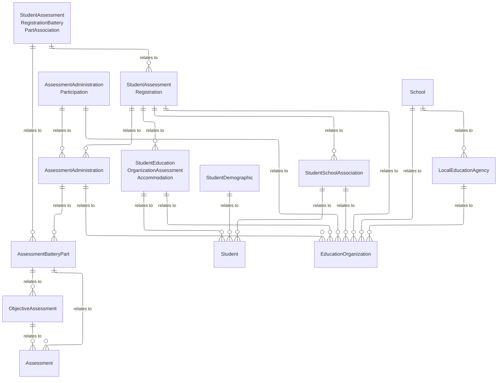

# Assessment Registration Domain - Model Diagrams

The UML diagram below illustrates the model for the Assessment Registration domain
with its entities, attributes and associations.

```mermaid
---

config:
  layout: elk
---

erDiagram
    Assessment {
    }
    AssessmentAdministration {
    }
    AssessmentAdministrationParticipation["AssessmentAdministration<br/>Participation"] {
    }
    AssessmentBatteryPart {
    }
    ObjectiveAssessment {
    }
    StudentAssessmentRegistration["StudentAssessment<br/>Registration"] {
    }
    StudentAssessmentRegistrationBatteryPartAssociation["StudentAssessment<br/>RegistrationBattery<br/>PartAssociation"] {
    }
    StudentEducationOrganizationAssessmentAccommodation["StudentEducation<br/>OrganizationAssessment<br/>Accommodation"] {
    }
    Student {
    }
    StudentDemographic {
    }
    StudentSchoolAssociation {
    }
    EducationOrganization {
    }
    LocalEducationAgency {
    }
    School {
    }
    School ||--o{ EducationOrganization : "relates to"
    School ||--o{ LocalEducationAgency : "relates to"
    LocalEducationAgency ||--o{ EducationOrganization : "relates to"
    AssessmentBatteryPart ||--o{ Assessment : "relates to"
    AssessmentBatteryPart ||--o{ ObjectiveAssessment : "relates to"
    ObjectiveAssessment ||--o{ Assessment : "relates to"
    AssessmentAdministration ||--o{ AssessmentBatteryPart : "relates to"
    AssessmentAdministration ||--o{ EducationOrganization : "relates to"
    AssessmentAdministrationParticipation ||--o{ AssessmentAdministration : "relates to"
    AssessmentAdministrationParticipation ||--o{ EducationOrganization : "relates to"
    StudentAssessmentRegistration ||--o{ AssessmentAdministration : "relates to"
    StudentAssessmentRegistration ||--o{ StudentSchoolAssociation : "relates to"
    StudentAssessmentRegistration ||--o{ EducationOrganization : "relates to"
    StudentAssessmentRegistration ||--o{ StudentEducationOrganizationAssessmentAccommodation : "relates to"
    StudentAssessmentRegistrationBatteryPartAssociation ||--o{ StudentAssessmentRegistration : "relates to"
    StudentAssessmentRegistrationBatteryPartAssociation ||--o{ AssessmentBatteryPart : "relates to"
    StudentEducationOrganizationAssessmentAccommodation ||--o{ Student : "relates to"
    StudentEducationOrganizationAssessmentAccommodation ||--o{ EducationOrganization : "relates to"
    StudentSchoolAssociation ||--o{ Student : "relates to"
    StudentSchoolAssociation ||--o{ EducationOrganization : "relates to"
    StudentDemographic ||--o{ Student : "relates to"
```
