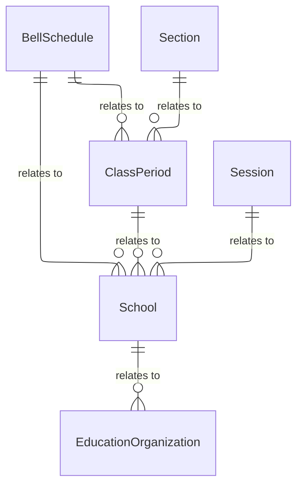

# Bell Schedule Domain - Model Diagrams

## Bell Schedule Model UML Diagram

```mermaid
---

config:
  layout: elk
---

erDiagram
    BellSchedule {
    }
    ClassPeriod {
    }
    Session {
    }
    Section {
    }
    EducationOrganization {
    }
    School {
    }
    School ||--o{ EducationOrganization : "relates to"
    BellSchedule ||--o{ School : "relates to"
    BellSchedule ||--o{ ClassPeriod : "relates to"
    ClassPeriod ||--o{ School : "relates to"
    Session ||--o{ School : "relates to"
    Section ||--o{ ClassPeriod : "relates to"
```
