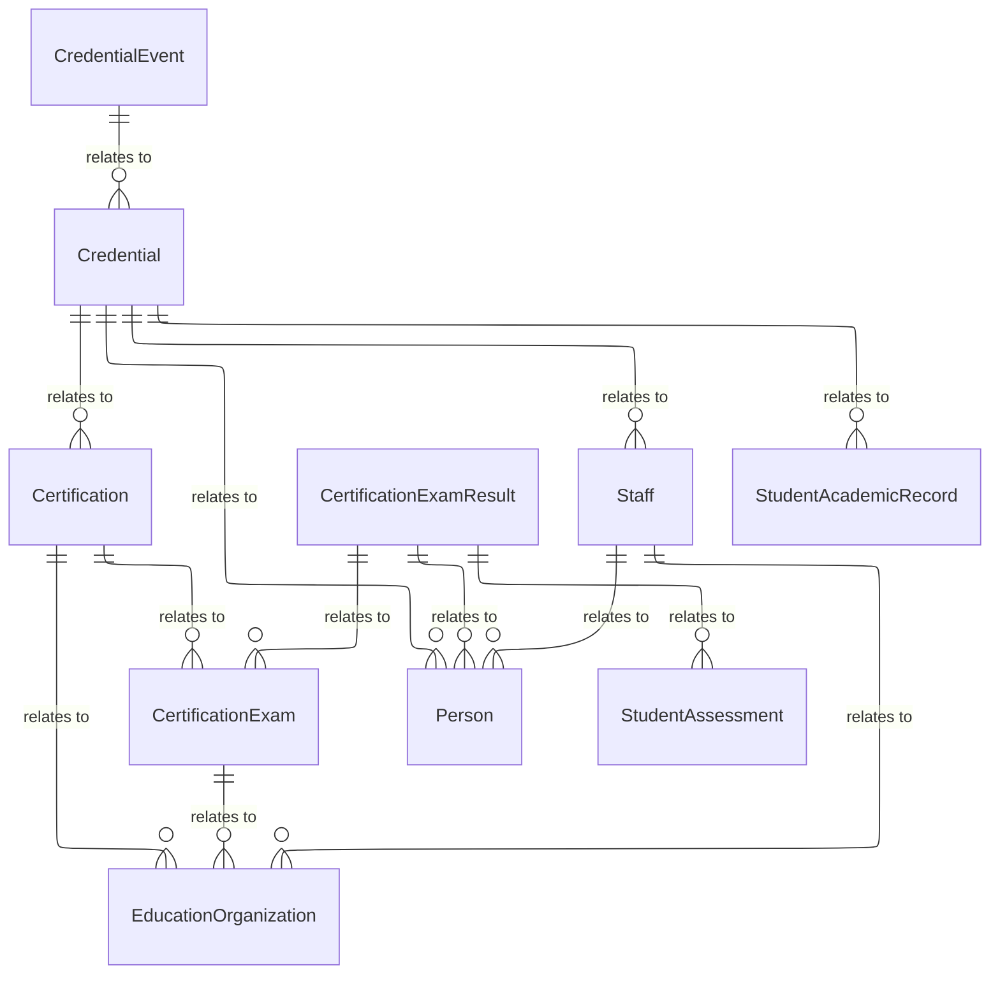

# Credential Data Model Domain - Model Diagrams

## Credential UML Diagram

```mermaid
---

config:
  layout: elk
---

erDiagram
    Credential {
    }
    CredentialEvent {
    }
    Certification {
    }
    CertificationExam {
    }
    CertificationExamResult {
    }
    Person {
    }
    Staff {
    }
    StudentAcademicRecord {
    }
    EducationOrganization {
    }
    StudentAssessment {
    }
    Staff ||--o{ Person : "relates to"
    Staff ||--o{ EducationOrganization : "relates to"
    Credential ||--o{ Staff : "relates to"
    Credential ||--o{ Person : "relates to"
    Credential ||--o{ Certification : "relates to"
    Credential ||--o{ StudentAcademicRecord : "relates to"
    CredentialEvent ||--o{ Credential : "relates to"
    Certification ||--o{ CertificationExam : "relates to"
    Certification ||--o{ EducationOrganization : "relates to"
    CertificationExam ||--o{ EducationOrganization : "relates to"
    CertificationExamResult ||--o{ CertificationExam : "relates to"
    CertificationExamResult ||--o{ Person : "relates to"
    CertificationExamResult ||--o{ StudentAssessment : "relates to"
```
