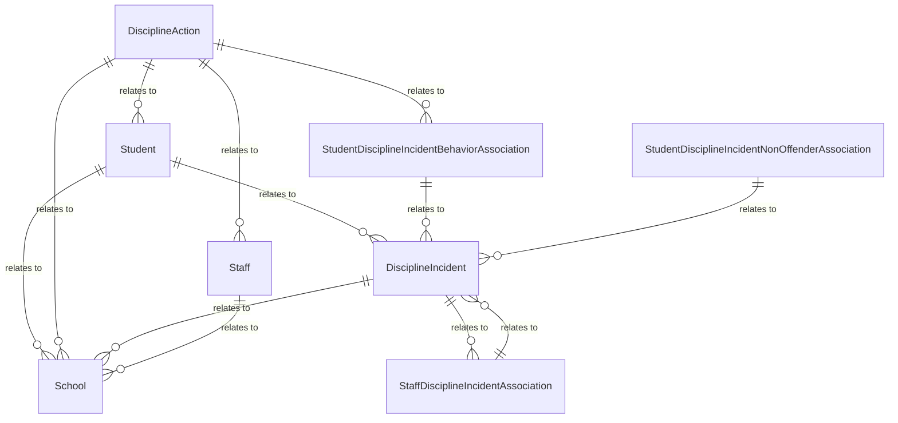

# Discipline Domain - Model Diagrams

## Discipline Model UML Diagram

```mermaid
erDiagram
    DisciplineIncident {
    }
    DisciplineAction {
    }
    StaffDisciplineIncidentAssociation {
    }
    StudentDisciplineIncidentBehaviorAssociation {
    }
    StudentDisciplineIncidentNonOffenderAssociation {
    }
    Student {
    }
    Staff {
    }
    School {
    }
    Student ||--o{ School : "relates to"
    Student ||--o{ DisciplineIncident : "relates to"
    DisciplineAction ||--o{ Student : "relates to"
    DisciplineAction ||--o{ StudentDisciplineIncidentBehaviorAssociation : "relates to"
    DisciplineAction ||--o{ Staff : "relates to"
    DisciplineAction ||--o{ School : "relates to"
    DisciplineIncident ||--o{ School : "relates to"
    DisciplineIncident ||--o{ StaffDisciplineIncidentAssociation : "relates to"
    StaffDisciplineIncidentAssociation ||--o{ DisciplineIncident : "relates to"
    StudentDisciplineIncidentBehaviorAssociation ||--o{ DisciplineIncident : "relates to"
    StudentDisciplineIncidentNonOffenderAssociation ||--o{ DisciplineIncident : "relates to"
    Staff ||--o{ School : "relates to"
```
