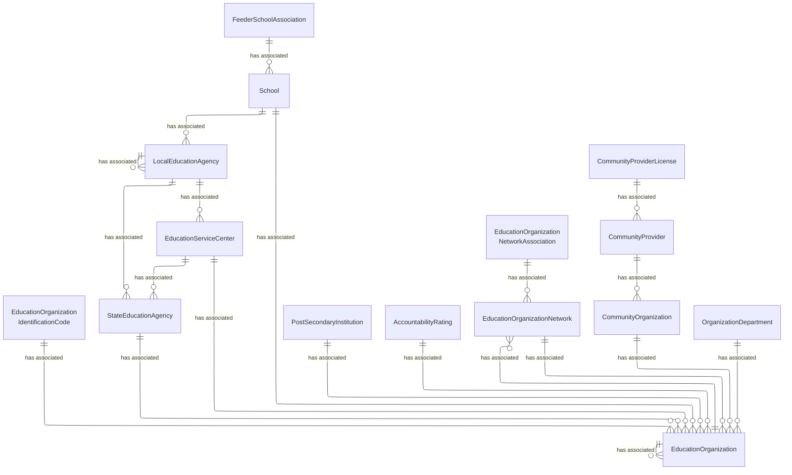

# Education Organization Domain - Model Diagrams

## Education Organization Model UML Diagram

```mermaid
---
config:
  layout: elk
---
erDiagram
    EducationOrganization {
    }
    EducationOrganizationIdentificationCode["EducationOrganization<br/>IdentificationCode"] {
    }
    StateEducationAgency {
    }
    LocalEducationAgency {
    }
    EducationServiceCenter {
    }
    School {
    }
    PostSecondaryInstitution {
    }
    AccountabilityRating {
    }
    EducationOrganizationNetwork {
    }
    EducationOrganizationNetworkAssociation["EducationOrganization<br/>NetworkAssociation"] {
    }
    FeederSchoolAssociation {
    }
    CommunityOrganization {
    }
    CommunityProvider {
    }
    CommunityProviderLicense {
    }
    OrganizationDepartment {
    }
    StateEducationAgency ||--o{ EducationOrganization : "has associated"
    EducationServiceCenter ||--o{ EducationOrganization : "has associated"
    School ||--o{ EducationOrganization : "has associated"
    PostSecondaryInstitution ||--o{ EducationOrganization : "has associated"
    CommunityOrganization ||--o{ EducationOrganization : "has associated"
    OrganizationDepartment ||--o{ EducationOrganization : "has associated"
    EducationOrganization ||--o{ EducationOrganization : "has associated"
    EducationOrganization ||--o{ EducationOrganizationNetwork : "has associated"
    EducationOrganizationNetwork ||--o{ EducationOrganization : "has associated"
    AccountabilityRating ||--o{ EducationOrganization : "has associated"
    EducationOrganizationNetworkAssociation ||--o{ EducationOrganizationNetwork : "has associated"
    School ||--o{ LocalEducationAgency : "has associated"
    LocalEducationAgency ||--o{ EducationServiceCenter : "has associated"
    LocalEducationAgency ||--o{ LocalEducationAgency : "has associated"
    EducationServiceCenter ||--o{ StateEducationAgency : "has associated"
    LocalEducationAgency ||--o{ StateEducationAgency : "has associated"
    FeederSchoolAssociation ||--o{ School : "has associated"
    CommunityProvider ||--o{ CommunityOrganization : "has associated"
    CommunityProviderLicense ||--o{ CommunityProvider : "has associated"
    EducationOrganizationIdentificationCode ||--o{ EducationOrganization : "has associated"
```
