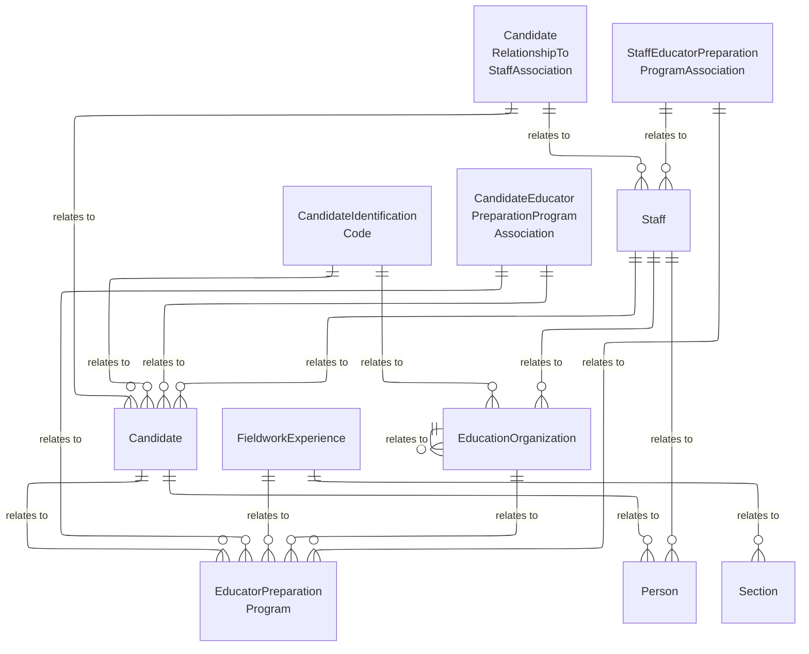

# Educator Preparation Program Model Domain - Model Diagrams

## Educator Preparation Program Model Domain UML Diagram

```mermaid
---
config:
  layout: elk
---
erDiagram
    Candidate {
    }
    CandidateIdentificationCode["CandidateIdentification<br/>Code"] {
    }
    EducatorPreparationProgram["EducatorPreparation<br/>Program"] {
    }
    FieldworkExperience {
    }
    CandidateEducatorPreparationProgramAssociation["CandidateEducator<br/>PreparationProgram<br/>Association"] {
    }
    CandidateRelationshipToStaffAssociation["Candidate<br/>RelationshipTo<br/>StaffAssociation"] {
    }
    StaffEducatorPreparationProgramAssociation["StaffEducatorPreparation<br/>ProgramAssociation"] {
    }
    Person {
    }
    Staff {
    }
    EducationOrganization {
    }
    Section {
    }
    Candidate ||--o{ Person : "relates to"
    Staff ||--o{ Person : "relates to"
    Candidate ||--o{ EducatorPreparationProgram : "relates to"
    CandidateEducatorPreparationProgramAssociation ||--o{ Candidate : "relates to"
    CandidateEducatorPreparationProgramAssociation ||--o{ EducatorPreparationProgram : "relates to"
    Staff ||--o{ Candidate : "relates to"
    CandidateRelationshipToStaffAssociation ||--o{ Candidate : "relates to"
    CandidateRelationshipToStaffAssociation ||--o{ Staff : "relates to"
    StaffEducatorPreparationProgramAssociation ||--o{ Staff : "relates to"
    StaffEducatorPreparationProgramAssociation ||--o{ EducatorPreparationProgram : "relates to"
    EducationOrganization ||--o{ EducatorPreparationProgram : "relates to"
    Staff ||--o{ EducationOrganization : "relates to"
    FieldworkExperience ||--o{ EducatorPreparationProgram : "relates to"
    FieldworkExperience ||--o{ Section : "relates to"
    CandidateIdentificationCode ||--o{ Candidate : "relates to"
    CandidateIdentificationCode ||--o{ EducationOrganization : "relates to"
    EducationOrganization ||--o{ EducationOrganization : "relates to"
```
