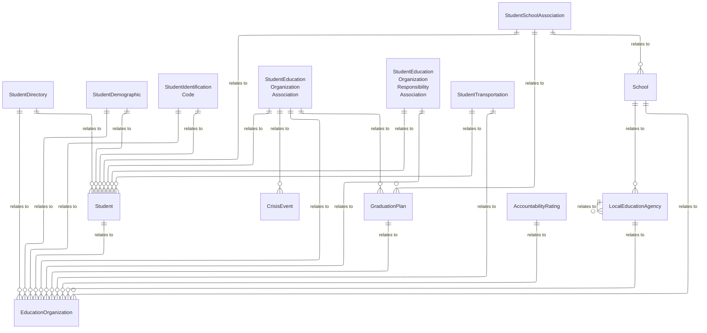

# Enrollment Domain - Model Diagrams

## Enrollment Model UML Diagram

```mermaid
---
config:
  layout: elk
---
erDiagram
    Student {
    }
    StudentDirectory {
    }
    StudentDemographic {
    }
    StudentIdentificationCode["StudentIdentification<br/>Code"] {
    }
    StudentSchoolAssociation {
    }
    StudentEducationOrganizationAssociation["StudentEducation<br/>Organization<br/>Association"] {
    }
    StudentEducationOrganizationResponsibilityAssociation["StudentEducation<br/>Organization<br/>Responsibility<br/>Association<br/>"] {
    }
    GraduationPlan {
    }
    CrisisEvent {
    }
    StudentTransportation {
    }
    AccountabilityRating {
    }
    EducationOrganization {
    }
    LocalEducationAgency {
    }
    School {
    }
    StudentDirectory ||--o{ Student : "relates to"
    StudentDirectory ||--o{ EducationOrganization : "relates to"
    StudentDemographic ||--o{ Student : "relates to"
    StudentDemographic ||--o{ EducationOrganization : "relates to"
    StudentIdentificationCode ||--o{ Student : "relates to"
    StudentIdentificationCode ||--o{ EducationOrganization : "relates to"
    Student ||--o{ EducationOrganization : "relates to"
    StudentSchoolAssociation ||--o{ Student : "relates to"
    StudentSchoolAssociation ||--o{ School : "relates to"
    StudentSchoolAssociation ||--o{ GraduationPlan : "relates to"
    StudentEducationOrganizationAssociation ||--o{ Student : "relates to"
    StudentEducationOrganizationAssociation ||--o{ EducationOrganization : "relates to"
    StudentEducationOrganizationAssociation ||--o{ CrisisEvent : "relates to"
    StudentEducationOrganizationAssociation ||--o{ GraduationPlan : "relates to"
    StudentEducationOrganizationResponsibilityAssociation ||--o{ Student : "relates to"
    StudentEducationOrganizationResponsibilityAssociation ||--o{ EducationOrganization : "relates to"
    StudentTransportation ||--o{ Student : "relates to"
    StudentTransportation ||--o{ EducationOrganization : "relates to"
    GraduationPlan ||--o{ EducationOrganization : "relates to"
    AccountabilityRating ||--o{ EducationOrganization : "relates to"
    School ||--o{ EducationOrganization : "relates to"
    School ||--o{ LocalEducationAgency : "relates to"
    LocalEducationAgency ||--o{ EducationOrganization : "relates to"
    LocalEducationAgency ||--o{ LocalEducationAgency : "relates to"
```
