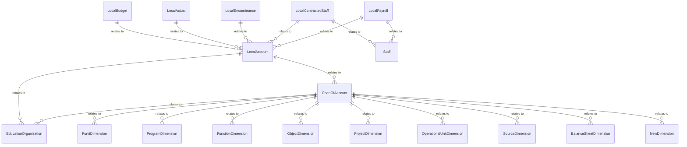

# Finance Domain - Model Diagrams

## Finance Domain UML Diagram

```mermaid
erDiagram
    EducationOrganization {
    }
    LocalAccount {
    }
    ChartOfAccount {
    }
    LocalBudget {
    }
    LocalActual {
    }
    LocalEncumbrance {
    }
    LocalContractedStaff {
    }
    LocalPayroll {
    }
    FundDimension {
    }
    ProgramDimension {
    }
    FunctionDimension {
    }
    ObjectDimension {
    }
    ProjectDimension {
    }
    BalanceSheetDimension {
    }
    OperationalUnitDimension {
    }
    SourceDimension {
    }
    NewDimension {
    }
    Staff {
    }
    LocalAccount ||--o{ EducationOrganization : "relates to"
    LocalAccount ||--o{ ChartOfAccount : "relates to"
    ChartOfAccount ||--o{ EducationOrganization : "relates to"
    ChartOfAccount ||--o{ FundDimension : "relates to"
    ChartOfAccount ||--o{ ProgramDimension : "relates to"
    ChartOfAccount ||--o{ FunctionDimension : "relates to"
    ChartOfAccount ||--o{ ObjectDimension : "relates to"
    ChartOfAccount ||--o{ ProjectDimension : "relates to"
    ChartOfAccount ||--o{ OperationalUnitDimension : "relates to"
    ChartOfAccount ||--o{ SourceDimension : "relates to"
    ChartOfAccount ||--o{ BalanceSheetDimension : "relates to"
    ChartOfAccount ||--o{ NewDimension : "relates to"
    LocalBudget ||--o{ LocalAccount : "relates to"
    LocalActual ||--o{ LocalAccount : "relates to"
    LocalEncumbrance ||--o{ LocalAccount : "relates to"
    LocalContractedStaff ||--o{ LocalAccount : "relates to"
    LocalContractedStaff ||--o{ Staff : "relates to"
    LocalPayroll ||--o{ LocalAccount : "relates to"
    LocalPayroll ||--o{ Staff : "relates to"
```
