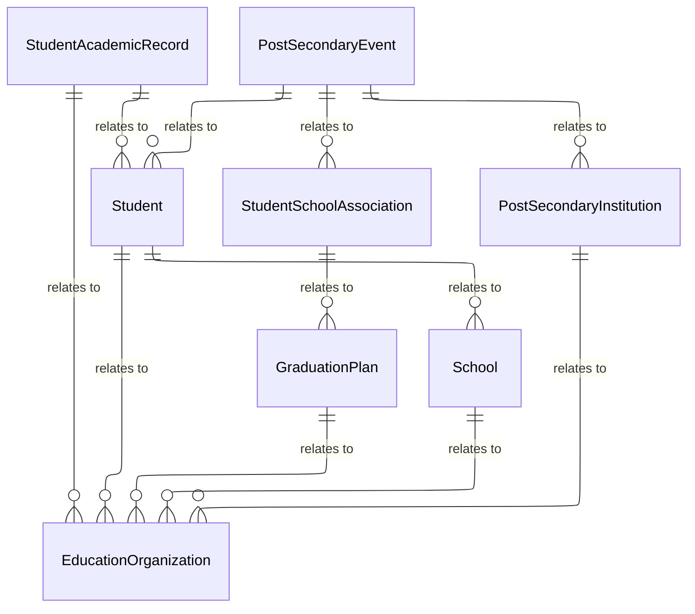

# Graduation Domain - Model Diagrams

## Graduation Model UML Diagram

```mermaid
---
config:
  layout: elk
---
erDiagram
    Student {
    }
    StudentSchoolAssociation {
    }
    StudentAcademicRecord {
    }
    GraduationPlan {
    }
    PostSecondaryEvent {
    }
    PostSecondaryInstitution {
    }
    EducationOrganization {
    }
    School {
    }
    Student ||--o{ EducationOrganization : "relates to"
    Student ||--o{ School : "relates to"
    StudentSchoolAssociation ||--o{ GraduationPlan : "relates to"
    StudentAcademicRecord ||--o{ Student : "relates to"
    StudentAcademicRecord ||--o{ EducationOrganization : "relates to"
    GraduationPlan ||--o{ EducationOrganization : "relates to"
    PostSecondaryEvent ||--o{ Student : "relates to"
    PostSecondaryEvent ||--o{ StudentSchoolAssociation : "relates to"
    PostSecondaryEvent ||--o{ PostSecondaryInstitution : "relates to"
    PostSecondaryInstitution ||--o{ EducationOrganization : "relates to"
    School ||--o{ EducationOrganization : "relates to"
    style Student color:#000000
    style StudentSchoolAssociation color:#000000
    style StudentAcademicRecord color:#000000
    style GraduationPlan color:#000000
    style PostSecondaryEvent color:#000000
    style PostSecondaryInstitution color:#000000
    style EducationOrganization color:#000000
    style School color:#000000
```
