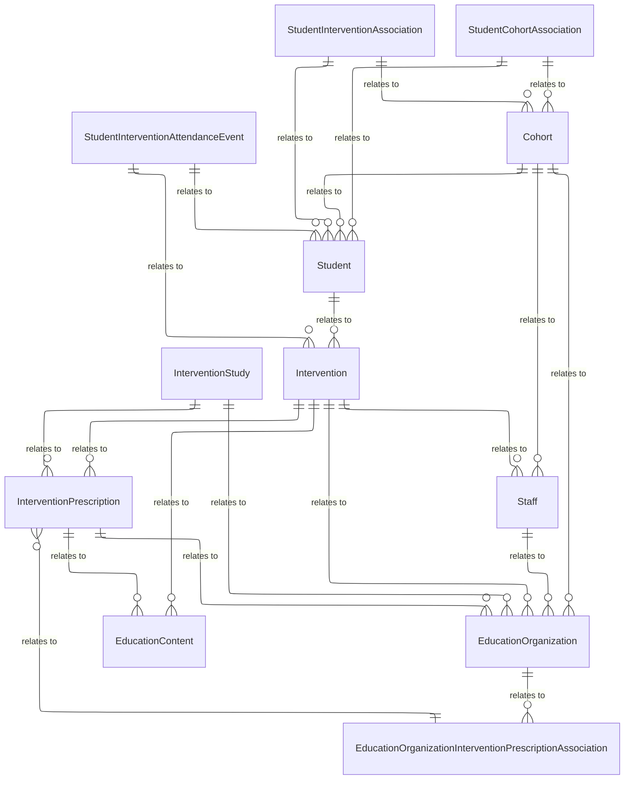

# Intervention Domain - Model Diagrams

## Intervention Model UML Diagram

```mermaid
---

config:
  layout: elk
---

erDiagram
    InterventionStudy {
    }
    EducationContent {
    }
    InterventionPrescription {
    }
    Intervention {
    }
    EducationOrganizationInterventionPrescriptionAssociation {
    }
    StudentInterventionAssociation {
    }
    StudentInterventionAttendanceEvent {
    }
    StudentCohortAssociation {
    }
    Cohort {
    }
    Student {
    }
    EducationOrganization {
    }
    Staff {
    }
    Intervention ||--o{ InterventionPrescription : "relates to"
    Intervention ||--o{ EducationContent : "relates to"
    Intervention ||--o{ EducationOrganization : "relates to"
    Intervention ||--o{ Staff : "relates to"
    InterventionPrescription ||--o{ EducationContent : "relates to"
    InterventionPrescription ||--o{ EducationOrganization : "relates to"
    InterventionStudy ||--o{ InterventionPrescription : "relates to"
    InterventionStudy ||--o{ EducationOrganization : "relates to"
    EducationOrganization ||--o{ EducationOrganizationInterventionPrescriptionAssociation : "relates to"
    EducationOrganizationInterventionPrescriptionAssociation ||--o{ InterventionPrescription : "relates to"
    Student ||--o{ Intervention : "relates to"
    StudentInterventionAssociation ||--o{ Student : "relates to"
    StudentInterventionAssociation ||--o{ Cohort : "relates to"
    StudentInterventionAttendanceEvent ||--o{ Student : "relates to"
    StudentInterventionAttendanceEvent ||--o{ Intervention : "relates to"
    StudentCohortAssociation ||--o{ Student : "relates to"
    StudentCohortAssociation ||--o{ Cohort : "relates to"
    Cohort ||--o{ EducationOrganization : "relates to"
    Cohort ||--o{ Student : "relates to"
    Cohort ||--o{ Staff : "relates to"
    Staff ||--o{ EducationOrganization : "relates to"
```
