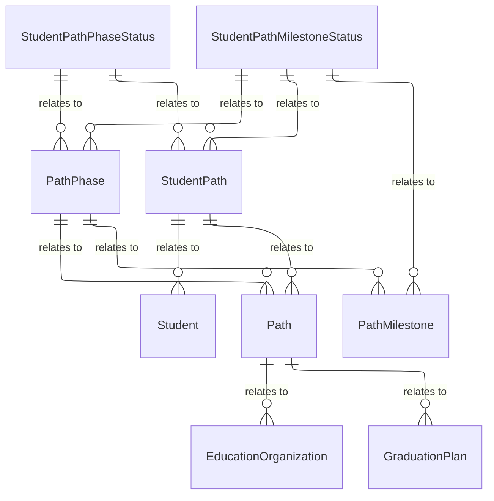

# Path Data Model Domain - Model Diagrams

## Path UML Diagram

```mermaid
---
config:
  layout: elk
---
erDiagram
    Student {
    }
    EducationOrganization {
    }
    GraduationPlan {
    }
    Path {
    }
    PathPhase {
    }
    PathMilestone {
    }
    StudentPath {
    }
    StudentPathPhaseStatus {
    }
    StudentPathMilestoneStatus {
    }
    Path ||--o{ EducationOrganization : "relates to"
    Path ||--o{ GraduationPlan : "relates to"
    PathPhase ||--o{ Path : "relates to"
    PathPhase ||--o{ PathMilestone : "relates to"
    StudentPath ||--o{ Student : "relates to"
    StudentPath ||--o{ Path : "relates to"
    StudentPathPhaseStatus ||--o{ StudentPath : "relates to"
    StudentPathPhaseStatus ||--o{ PathPhase : "relates to"
    StudentPathMilestoneStatus ||--o{ StudentPath : "relates to"
    StudentPathMilestoneStatus ||--o{ PathPhase : "relates to"
    StudentPathMilestoneStatus ||--o{ PathMilestone : "relates to"
```
