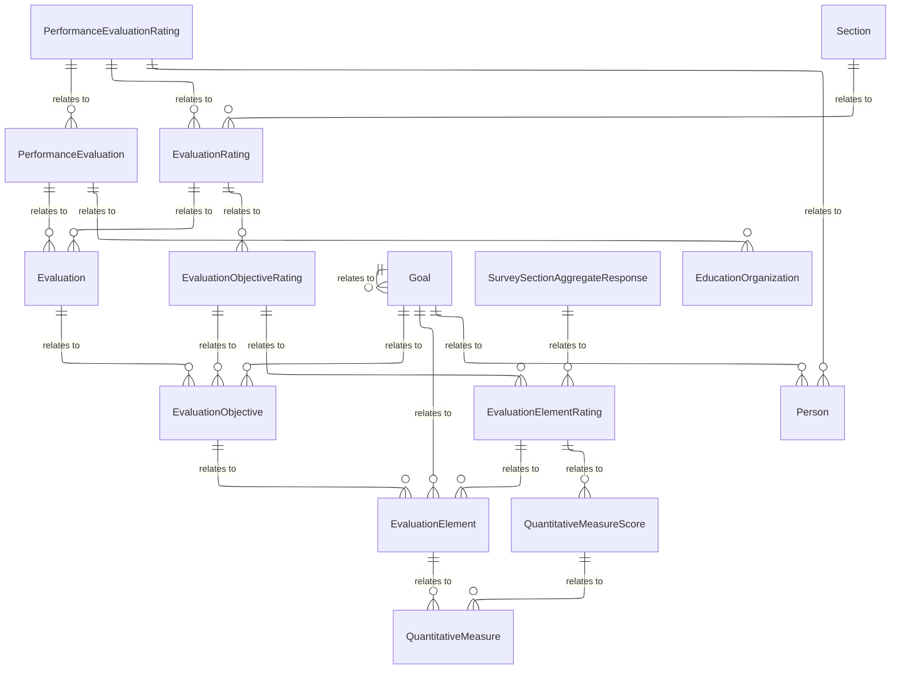

# Performance Evaluation Data Model Domain - Model Diagrams

## Performance Evaluation UML Diagram

```mermaid
---

config:
  layout: elk
---

erDiagram
    PerformanceEvaluation {
    }
    PerformanceEvaluationRating {
    }
    Evaluation {
    }
    EvaluationRating {
    }
    EvaluationObjective {
    }
    EvaluationObjectiveRating {
    }
    EvaluationElement {
    }
    EvaluationElementRating {
    }
    QuantitativeMeasure {
    }
    QuantitativeMeasureScore {
    }
    Goal {
    }
    Person {
    }
    Section {
    }
    SurveySectionAggregateResponse {
    }
    EducationOrganization {
    }
    PerformanceEvaluation ||--o{ EducationOrganization : "relates to"
    PerformanceEvaluation ||--o{ Evaluation : "relates to"
    PerformanceEvaluationRating ||--o{ PerformanceEvaluation : "relates to"
    PerformanceEvaluationRating ||--o{ EvaluationRating : "relates to"
    PerformanceEvaluationRating ||--o{ Person : "relates to"
    EvaluationRating ||--o{ Evaluation : "relates to"
    EvaluationRating ||--o{ EvaluationObjectiveRating : "relates to"
    Evaluation ||--o{ EvaluationObjective : "relates to"
    EvaluationObjective ||--o{ EvaluationElement : "relates to"
    EvaluationObjectiveRating ||--o{ EvaluationObjective : "relates to"
    EvaluationObjectiveRating ||--o{ EvaluationElementRating : "relates to"
    EvaluationElementRating ||--o{ EvaluationElement : "relates to"
    EvaluationElementRating ||--o{ QuantitativeMeasureScore : "relates to"
    EvaluationElement ||--o{ QuantitativeMeasure : "relates to"
    QuantitativeMeasureScore ||--o{ QuantitativeMeasure : "relates to"
    Goal ||--o{ Person : "relates to"
    Goal ||--o{ EvaluationObjective : "relates to"
    Goal ||--o{ EvaluationElement : "relates to"
    Goal ||--o{ Goal : "relates to"
    Section ||--o{ EvaluationRating : "relates to"
    SurveySectionAggregateResponse ||--o{ EvaluationElementRating : "relates to"
```
