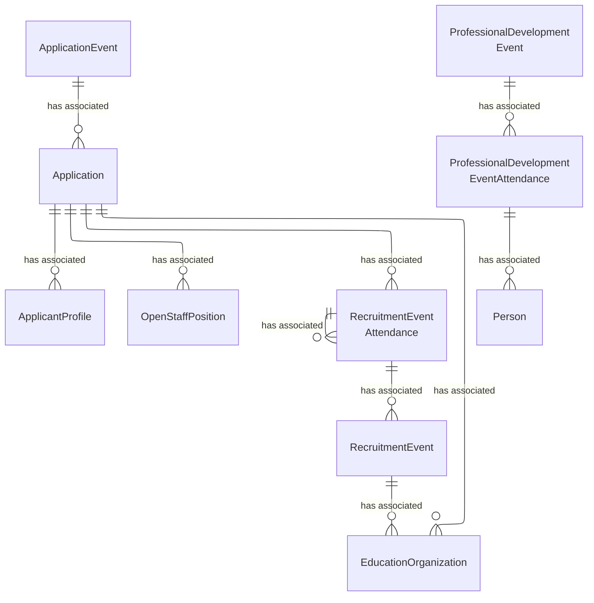

# Recruitment And Staffing Domain - Model Diagrams

## Recruitment And Staffing UML Diagram

```mermaid
---
config:
  layout: elk
---
erDiagram
    ApplicantProfile {
    }
    Application {
    }
    ApplicationEvent {
    }
    OpenStaffPosition {
    }
    RecruitmentEvent {
    }
    RecruitmentEventAttendance["RecruitmentEvent<br/>Attendance"] {
    }
    ProfessionalDevelopmentEvent["ProfessionalDevelopment<br/>Event"] {
    }
    ProfessionalDevelopmentEventAttendance["ProfessionalDevelopment<br/>EventAttendance"] {
    }
    Person {
    }
    EducationOrganization {
    }
    Application ||--o{ ApplicantProfile : "has associated"
    Application ||--o{ EducationOrganization : "has associated"
    Application ||--o{ OpenStaffPosition : "has associated"
    Application ||--o{ RecruitmentEventAttendance : "has associated"
    ApplicationEvent ||--o{ Application : "has associated"
    RecruitmentEventAttendance ||--o{ RecruitmentEvent : "has associated"
    RecruitmentEventAttendance ||--o{ RecruitmentEventAttendance : "has associated"
    RecruitmentEvent ||--o{ EducationOrganization : "has associated"
    ProfessionalDevelopmentEvent ||--o{ ProfessionalDevelopmentEventAttendance : "has associated"
    ProfessionalDevelopmentEventAttendance ||--o{ Person : "has associated"
```
