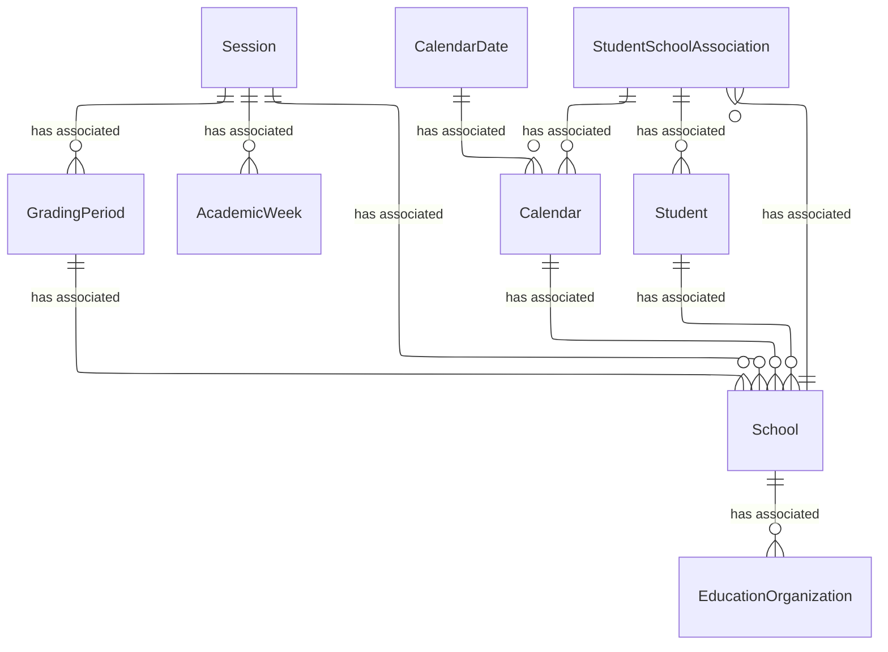

# School Calendar Domain - Model Diagrams

## School Calendar Model UML Diagram

```mermaid
---
config:
  layout: elk
---
erDiagram
    Session {
    }
    GradingPeriod {
    }
    AcademicWeek {
    }
    Calendar {
    }
    CalendarDate {
    }
    StudentSchoolAssociation {
    }
    Student {
    }
    EducationOrganization {
    }
    School {
    }
    Session ||--o{ School : "has associated"
    Session ||--o{ AcademicWeek : "has associated"
    Session ||--o{ GradingPeriod : "has associated"
    GradingPeriod ||--o{ School : "has associated"
    Calendar ||--o{ School : "has associated"
    CalendarDate ||--o{ Calendar : "has associated"
    StudentSchoolAssociation ||--o{ Calendar : "has associated"
    StudentSchoolAssociation ||--o{ Student : "has associated"
    School ||--o{ StudentSchoolAssociation : "has associated"
    School ||--o{ EducationOrganization : "has associated"
    Student ||--o{ School : "has associated"
```
