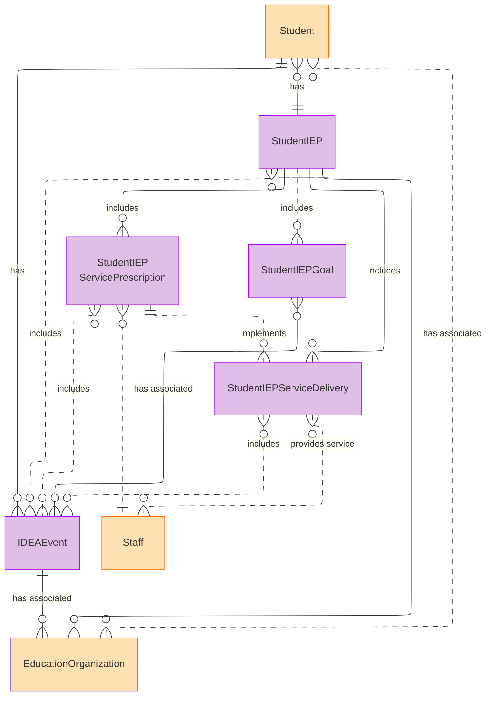

# Special Education Data Model Domain - Model Diagrams

## Special Education Data Model Domain Model ER Diagram

```mermaid
---

config:
  layout: elk
---

erDiagram
 direction TB
 StudentIEP {

 }

 IDEAEvent {

 }

 EducationOrganization {

 }

 StudentIEPServicePrescription["StudentIEP<br/>ServicePrescription"] {

 }

 StudentIEPServiceDelivery {

 }

 Student {

 }

 Staff {

 }

 StudentIEPGoal {

 }

 Student}o..o{EducationOrganization:"has associated"
 Student}o--||StudentIEP:"has"
 Student||--o{IDEAEvent:"has"
 IDEAEvent||--o{EducationOrganization:"has associated"
 IDEAEvent}o..o{StudentIEP:"includes"
 StudentIEPGoal}o--o{IDEAEvent:"has associated"
 StudentIEP||--o{EducationOrganization:"  "
 StudentIEP||--o{StudentIEPServicePrescription:"includes"
 StudentIEP||--o{StudentIEPServiceDelivery:"includes"
 StudentIEP||..o{StudentIEPGoal:"includes"
 StudentIEPServicePrescription||..o{StudentIEPServiceDelivery:"implements"
 StudentIEPServiceDelivery}o..o{Staff:"provides service"
 StudentIEPServiceDelivery}o..o{IDEAEvent:"includes"
 StudentIEPServicePrescription}o..||Staff:"  "
 StudentIEPServicePrescription}o..o{IDEAEvent:"includes"

 style StudentIEP fill:#E1BEE7,stroke:#AA00FF
 style IDEAEvent fill:#E1BEE7,stroke:#AA00FF
 style EducationOrganization fill:#FFE0B2
 style StudentIEPServicePrescription fill:#E1BEE7,stroke:#AA00FF
 style StudentIEPServiceDelivery fill:#E1BEE7,stroke:#AA00FF
 style Student fill:#FFE0B2,stroke:#FF6D00
 style Staff fill:#FFE0B2,stroke:#FF6D00
 style StudentIEPGoal fill:#E1BEE7,stroke:#AA00FF

```
