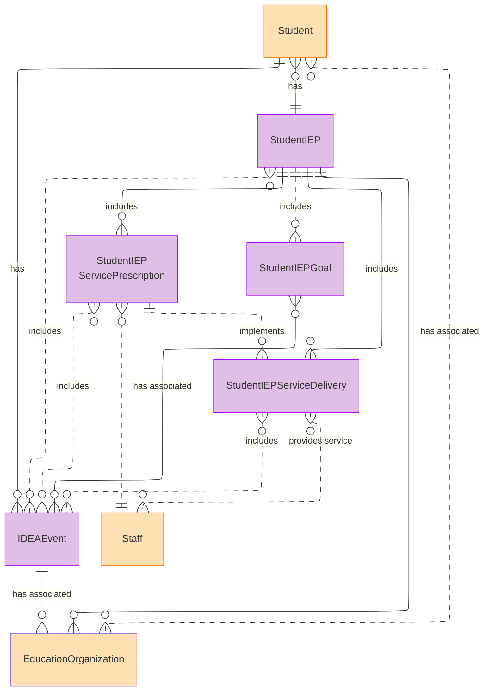

# Special Education Data Model Domain - Model Diagrams

:::important

EARLY ACCESS DOMAIN (Released in version 6.1) - This domain is being released in order to allow early adopters a chance to preview and test the proposed update and provide feedback
on its viability for possible future enhancements. This domain should not be considered fully stable at this time. See [Early Access Material](https://docs.ed-fi.org/reference/data-exchange/versioning-and-releases/#early-access-material) for more information.

:::

## Special Education Data Model Domain Model ER Diagram

### IDEAEvent

The IDEAEvent entity captures legally significant events required under IDEA—such as referrals, evaluations, parental consent, meetings, and IEP approval—as discrete, auditable records. Explicitly modeling these events enables systems to reconstruct procedural timelines, understand why actions were taken, and demonstrate compliance based on evidence rather than inference.

#### IDEAEvent Properties

| Field | Type | Required / Optional |
| --- | --- | --- |
| Student | Reference | :triangular_flag_on_post: Part of Identity |
| EducationOrganization | Reference | :triangular_flag_on_post: Part of Identity |
| IDEAEventIdentifier | String (120) | :triangular_flag_on_post: Part of Identity |
| IDEAEvent | Descriptor | :triangular_flag_on_post: Part of Identity |
| BeginDate | Date | :white_check_mark: Yes |
| EndDate | Date | Optional [0..1] |
| EventCompliance | Descriptor | Optional [0..1] |
| EventNarrative | String (2048) | Optional [0..1] |
| EventReason | Descriptor | Optional [0..1] |

### StudentIEP

The StudentIEP entity represents the Individualized Education Program as a first-class, time-bound legal document, independent of program enrollment. It anchors special education data to the plan that was finalized at a specific point in time, preserving IEP effective periods, amendments, and historical continuity across school years and organizational changes.

When an IEP is amended, a new StudentIEP record should be created with the amended data rather than modifying the existing record. The IEPAmendedDate field records the date of amendment on the new record to maintain a clear audit trail.

#### StudentIEP Properties

| Field | Type | Required / Optional |
| --- | --- | --- |
| Student | Reference | :triangular_flag_on_post: Part of Identity |
| EducationOrganization | Reference | :triangular_flag_on_post: Part of Identity |
| StudentIEPIdentifier | String (120) | :triangular_flag_on_post: Part of Identity |
| IEPFinalizedDate | Date | :triangular_flag_on_post: Part of Identity |
| IEPBeginDate | Date | :white_check_mark: Yes |
| IEPEndDate | Date | :white_check_mark: Yes |
| IEPStatus | Descriptor | :white_check_mark: Yes |
| Accommodation | Descriptor | Optional [0..n] |
| Disability | Common | Optional [0..n] |
| IDEAEvent | Reference | Optional [0..n] |
| IEPAmendedDate | Date | Optional [0..1] |
| MedicallyFragile | Boolean | Optional [0..1] |
| MultiplyDisabled | Boolean | Optional [0..1] |
| ReasonExited | Descriptor | Optional [0..1] |
| SchoolHoursPerWeek | Decimal (5,2) | Optional [0..1] |
| SpecialEducationHoursPerWeek | Decimal  (5,2) | Optional [0..1] |
| SpecialEducationSetting | Descriptor | Optional [0..1] |

### StudentIEPGoal

StudentIEPGoal represents the goals established as part of an IEP, including their achievement periods and intended outcomes. By tying goals directly to the IEP document, the model preserves the context needed to evaluate progress relative to the plan in effect at the time goals were set. This supports consistent progress monitoring over time, even as IEPs are revised or replaced.

#### StudentIEPGoal Properties

| Field | Type | Required / Optional |
| --- | --- | --- |
| StudentIEP | Reference | :triangular_flag_on_post: Part of Identity |
| IEPGoalIdentifier | String (120) | :triangular_flag_on_post: Part of Identity |
| IEPGoalDetails | String (2048) | :white_check_mark: Yes |
| IEPGoalType | Descriptor | :white_check_mark: Yes |
| GoalAchievementPeriod | Common | Optional [0..1] |
| IDEAEvent | Reference | Optional [0..n] |

### StudentIEPServicePrescription

StudentIEPServicePrescription defines the services a student is entitled to receive under a specific IEP, including frequency, duration, and effective dates. Separating prescribed services from delivery clarifies what was planned versus what was implemented and ensures that service obligations are evaluated relative to the IEP in effect at the time. This entity provides a stable reference for compliance checks, progress monitoring, and service continuity when plans are amended.

#### StudentIEPServicePrescription Properties

| Field | Type | Required / Optional |
| --- | --- | --- |
| StudentIEP | Reference | :triangular_flag_on_post: Part of Identity |
| ServicePrescription | Descriptor | :triangular_flag_on_post: Part of Identity |
| ServicePrescriptionDate | Date | :triangular_flag_on_post: Part of Identity |
| BeginDate | Date | :white_check_mark: Yes |
| Duration | Integer | :white_check_mark: Yes |
| DurationInterval | Descriptor | :white_check_mark: Yes |
| Frequency | Decimal (5,2) | :white_check_mark: Yes |
| FrequencyInterval | Descriptor | :white_check_mark: Yes |
| ServiceLocationType | Descriptor | :white_check_mark: Yes |
| IDEAEvent | Reference | Optional [0..n] |
| EndDate | Attribute | Optional [0..1] |
| Staff | Reference | Optional [0..n] |

### StudentIEPServiceDelivery

The StudentIEPServiceDelivery entity records the actual delivery of services prescribed in the IEP, including when services occurred and who provided them. Modeling service delivery explicitly enables districts and states to assess whether services were provided as required, rather than assuming delivery based on enrollment or staffing data. This distinction supports evidence-based compliance reviews, operational monitoring, and retrospective analysis of service implementation.

#### StudentIEPServiceDelivery Properties

| Field | Type | Required / Optional |
| --- | --- | --- |
| StudentIEP | Reference | :triangular_flag_on_post: Part of Identity |
| IEPServiceDeliveryIdentifier | String (120) | :triangular_flag_on_post: Part of Identity |
| ServiceDelivery | Descriptor | :triangular_flag_on_post: Part of Identity |
| ServiceDeliveryDate | Date | :triangular_flag_on_post: Part of Identity |
| IDEAEvent | Reference | Optional [0..n] |
| Provider (See below) | Common | Optional [0..n] |
| StudentIEPServicePrescription | Reference | Optional [0..1] |

#### NEW Common - Provider

| Field | Type | Required / Optional |
| --- | --- | --- |
| FirstName | String (75) | :triangular_flag_on_post: Part of Identity |
| LastSurname | String (75) | :triangular_flag_on_post: Part of Identity |
| MiddleName | String (75) | Optional [0..1] |
| PrimaryProvider | Boolean | Optional [0..1] |
| ProviderCode | String (16) | Optional [0..1] |
| ServiceProviderType | Descriptor | Optional [0..1] |
| Staff | Reference | Optional [0..1] |
