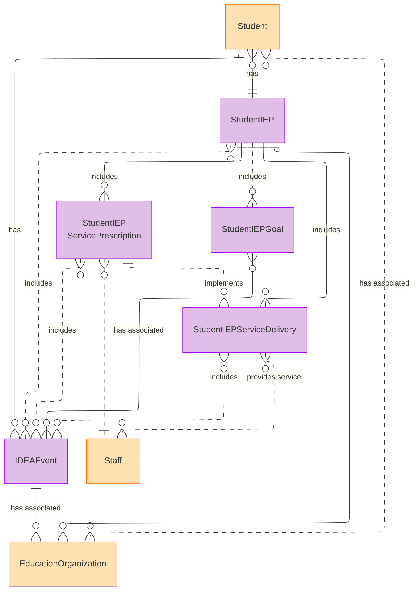

# Special Education Data Model Domain - Model Diagrams

## Special Education Data Model Domain Model ER Diagram

### IDEAEvent

| Field | Type | Required |
| --- | --- | --- |
| IDEAEventIdentifier | Attribute | :white_check_mark: Yes |
| IDEAEvent | Attribute | :white_check_mark: Yes |
| BeginDate | Attribute | :white_check_mark: Yes |
| EndDate | Attribute | :white_check_mark: Yes |
| EventReason | Attribute | :warning: Optional [0..1] |
| EventCompliance | Attribute | :warning: Optional [0..1] |
| EventNarrative | Attribute | :warning: Optional [0..1] |

### StudentIEP

| Field | Type | Required |
| --- | --- | --- |
| StudentIEPIdentifier | Attribute |  :white_check_mark: Yes |
| IEPAmendedDate | Attribute | :white_check_mark: Yes |
| IEPBeginDate | Attribute | :white_check_mark: Yes |
| IEPEndDate | Attribute | :white_check_mark: Yes |
| IEPFinalizedDate | Attribute | :white_check_mark: Yes |
| IEPStatus | Attribute | :white_check_mark: Yes |
| Accommodation | Attribute |  :warning: Optional [0..n] |
| Disability | Attribute |  :warning: Optional [0..n] |
| MedicallyFragile | Attribute | :warning: Optional [0..1] |
| MultiplyDisabled | Attribute | :warning: Optional [0..1] |
| ReasonExited | Attribute | :warning: Optional [0..1] |
| SchoolHoursPerWeek | Attribute | :warning: Optional [0..1] |
| SpecialEducationSetting | Attribute | :warning: Optional [0..1] |
| SpecialEducationHoursPerWeek | Attribute | :warning: Optional [0..1] |

### StudentIEPGoal

| Field | Type | Required |
| --- | --- | --- |
| IEPGoalIdentifier | Attribute |  :white_check_mark: Yes |
| IEPGoalDetails | Attribute | :white_check_mark: Yes |
| IEPGoalType | Attribute | :white_check_mark: Yes |
| GoalAchievementPeriod | Attribute |  :warning: Optional [0..1] |

### StudentIEPServicePrescription

| Field | Type | Required |
| --- | --- | --- |
| ServicePrescription | Attribute |  :white_check_mark: Yes |
| ServicePrescriptionDate | Attribute | :white_check_mark: Yes |
| BeginDate | Attribute | :white_check_mark: Yes |
| Duration | Attribute | :white_check_mark: Yes |
| DurationInterval | Attribute | :white_check_mark: Yes |
| Frequency | Attribute | :white_check_mark: Yes |
| FrequencyInterval | Attribute | :white_check_mark: Yes |
| ServiceLocationType | Attribute | :white_check_mark: Yes |
| StudentIEPServicePrescriptionIdentifier | Attribute | :white_check_mark: Yes |
| EndDate | Attribute |  :warning: Optional [0..1] |

### StudentIEPServiceDelivery

| Field | Type | Required |
| --- | --- | --- |
| IEPServiceDeliveryIdentifier | Attribute |  :white_check_mark: Yes |
| ServiceDelivery | Attribute | :white_check_mark: Yes |
| ServiceDeliveryDate | Attribute | :white_check_mark: Yes |
| Provider | Attribute | :warning: Optional [0..n] |
