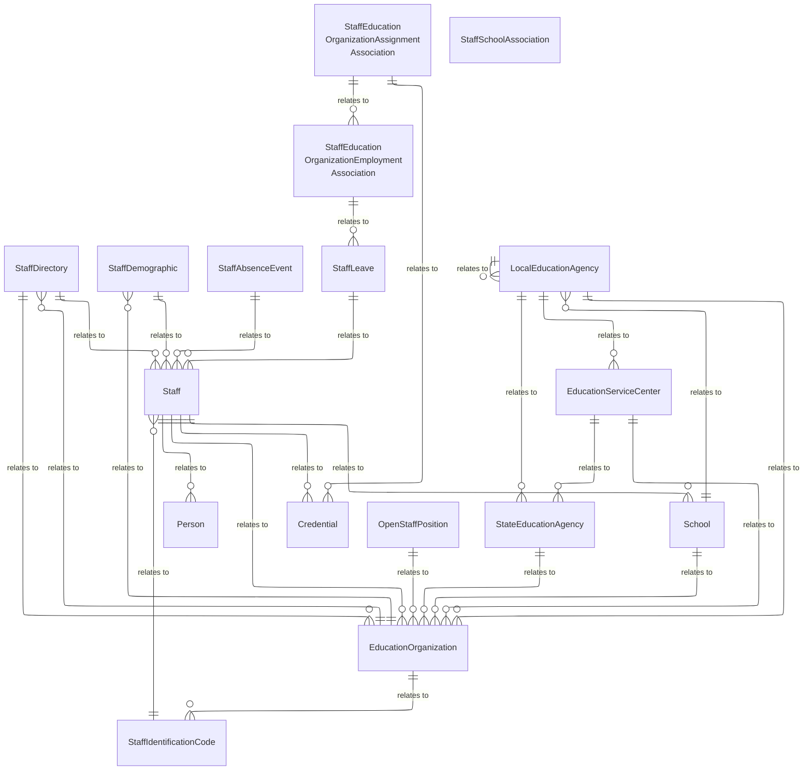

# Staff Domain - Model Diagrams

## Staff Domain UML Diagram

# StaffDataModel

```mermaid
---
config:
  layout: elk
---
erDiagram
    Staff {
    }
    StaffIdentificationCode {
    }
    StaffDirectory {
    }
    StaffDemographic {
    }
    Person {
    }
    Credential {
    }
    StaffAbsenceEvent {
    }
    StaffLeave {
    }
    StaffEducationOrganizationEmploymentAssociation["StaffEducation<br/>OrganizationEmployment<br/>Association"] {
    }
    StaffEducationOrganizationAssignmentAssociation["StaffEducation<br/>OrganizationAssignment<br/>Association"] {
    }
    StaffSchoolAssociation {
    }
    OpenStaffPosition {
    }
    EducationOrganization {
    }
    EducationServiceCenter {
    }
    LocalEducationAgency {
    }
    StateEducationAgency {
    }
    School {
    }
    Staff ||--o{ Person : "relates to"
    Staff ||--o{ Credential : "relates to"
    Staff ||--o{ School : "relates to"
    Staff ||--o{ EducationOrganization : "relates to"
    StaffIdentificationCode ||--o{ Staff : "relates to"
    StaffDirectory ||--o{ Staff : "relates to"
    StaffDirectory ||--o{ EducationOrganization : "relates to"
    StaffDemographic ||--o{ Staff : "relates to"
    StaffAbsenceEvent ||--o{ Staff : "relates to"
    StaffLeave ||--o{ Staff : "relates to"
    StaffEducationOrganizationEmploymentAssociation ||--o{ StaffLeave : "relates to"
    StaffEducationOrganizationAssignmentAssociation ||--o{ StaffEducationOrganizationEmploymentAssociation : "relates to"
    StaffEducationOrganizationAssignmentAssociation ||--o{ Credential : "relates to"
    EducationOrganization ||--o{ StaffDirectory : "relates to"
    EducationOrganization ||--o{ StaffIdentificationCode : "relates to"
    EducationOrganization ||--o{ StaffDemographic : "relates to"
    OpenStaffPosition ||--o{ EducationOrganization : "relates to"
    School ||--o{ EducationOrganization : "relates to"
    School ||--o{ LocalEducationAgency : "relates to"
    LocalEducationAgency ||--o{ EducationOrganization : "relates to"
    LocalEducationAgency ||--o{ EducationServiceCenter : "relates to"
    LocalEducationAgency ||--o{ StateEducationAgency : "relates to"
    LocalEducationAgency ||--o{ LocalEducationAgency : "relates to"
    EducationServiceCenter ||--o{ EducationOrganization : "relates to"
    EducationServiceCenter ||--o{ StateEducationAgency : "relates to"
    StateEducationAgency ||--o{ EducationOrganization : "relates to"
```
