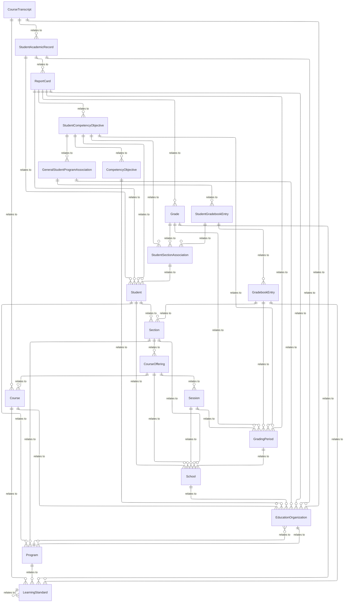
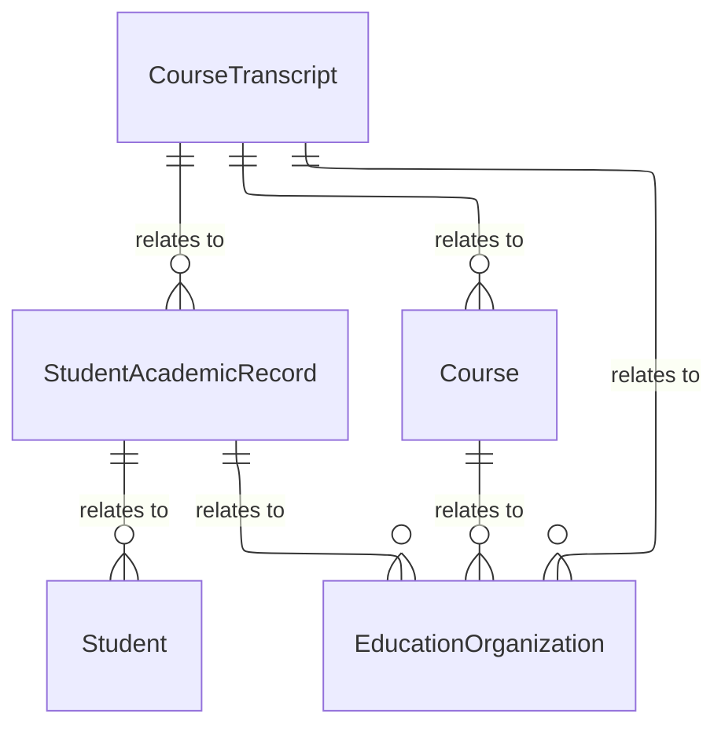
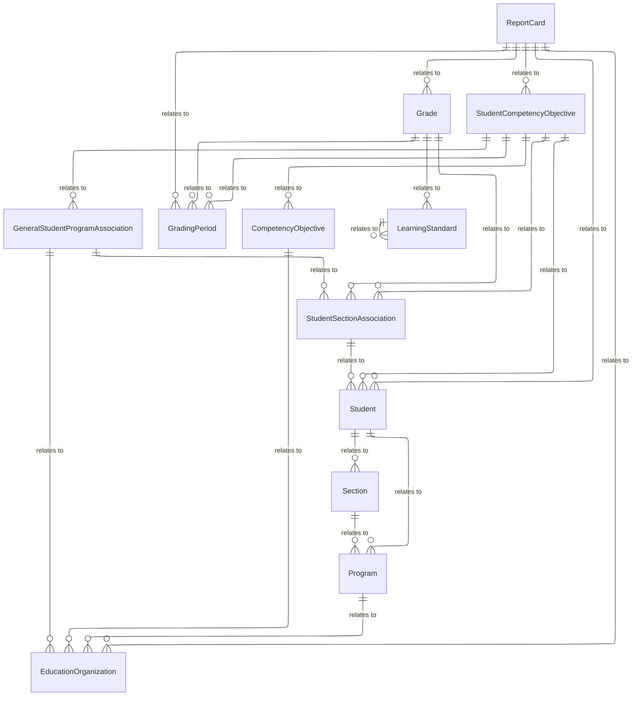
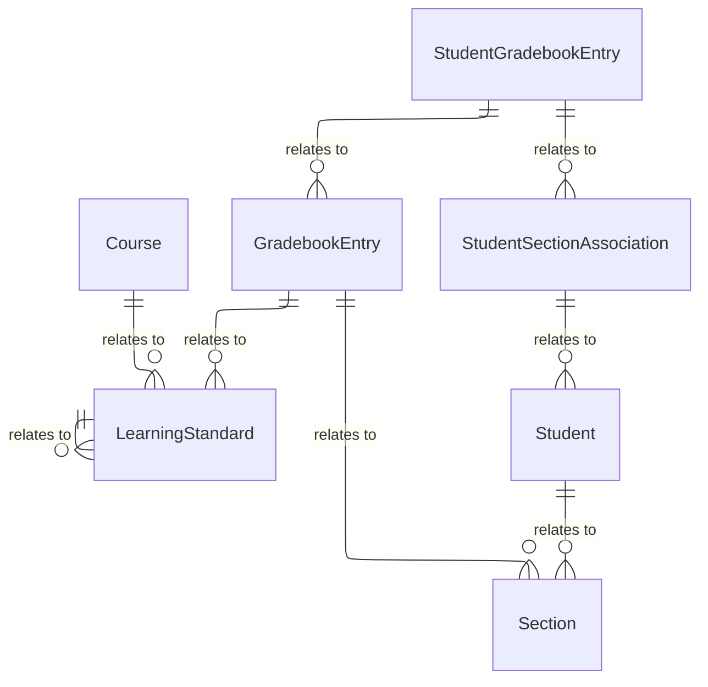

# Student Academic Record Domain - Model Diagrams

This section contains reference information for the Student Academic Record
domain model.

## Student Academic Record Model UML Diagram

### Student Transcript Subdomain

The Student Transcript Model provides an academic history for a student.

#### Student Academic Record, Student Transcript Model UML Diagram

### Report Card Subdomain

A Student has a ReportCard for each GradingPeriod. A Grade is associated with
each Section. For early grade levels, a StudentCompetencyObjective is assigned
to CompetencyObjectives.

#### Student Academic Record, Report Card Model UML Diagram

# StudentAcademicRecordReportCardDataModel

### Student Academic Record, Gradebook Model

An individual assignment in a gradebook is represented as a GradebookEntry. A
GradebookEntry may be mapped to LearningStandards. Each student’s score for that
entry is a StudentGradebookEntry which can be a grade or a CompetencyLevel.

#### Student Academic Record, Gradebook Model UML Diagram

# StudentAcademicRecordGradebookDataModel

