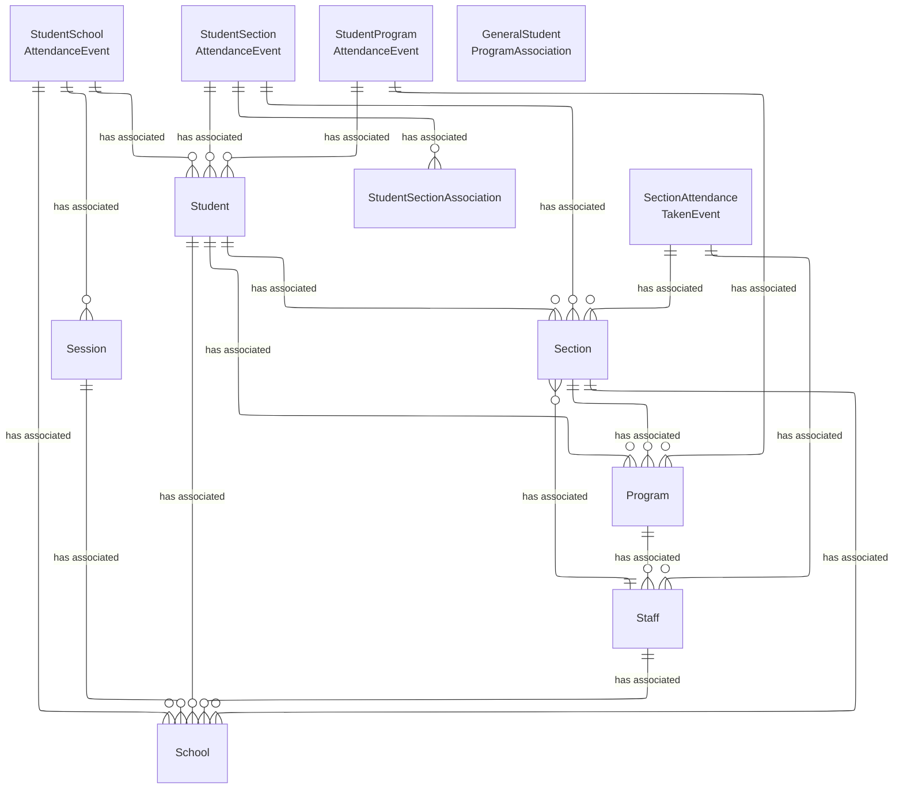

# Student Attendance Domain - Model Diagrams

## Student Attendance Model UML Diagram

```mermaid
---
config:
  layout: elk
---
erDiagram
    Student {
    }
    StudentSchoolAttendanceEvent["StudentSchool<br/>AttendanceEvent"] {
    }
    StudentSectionAttendanceEvent["StudentSection<br/>AttendanceEvent"] {
    }
    StudentProgramAttendanceEvent["StudentProgram<br/>AttendanceEvent"] {
    }
    StudentSectionAssociation {
    }
    GeneralStudentProgramAssociation["GeneralStudent<br/>ProgramAssociation"] {
    }
    SectionAttendanceTakenEvent["SectionAttendance<br/>TakenEvent"] {
    }
    Session {
    }
    Section {
    }
    Program {
    }
    School {
    }
    Staff {
    }
    StudentSchoolAttendanceEvent ||--o{ Student : "has associated"
    StudentSchoolAttendanceEvent ||--o{ School : "has associated"
    StudentSchoolAttendanceEvent ||--o{ Session : "has associated"
    StudentSectionAttendanceEvent ||--o{ Student : "has associated"
    StudentSectionAttendanceEvent ||--o{ Section : "has associated"
    StudentSectionAttendanceEvent ||--o{ StudentSectionAssociation : "has associated"
    StudentProgramAttendanceEvent ||--o{ Student : "has associated"
    StudentProgramAttendanceEvent ||--o{ Program : "has associated"
    SectionAttendanceTakenEvent ||--o{ Section : "has associated"
    SectionAttendanceTakenEvent ||--o{ Staff : "has associated"
    Student ||--o{ School : "has associated"
    Student ||--o{ Section : "has associated"
    Student ||--o{ Program : "has associated"
    Session ||--o{ School : "has associated"
    Section ||--o{ School : "has associated"
    Section ||--o{ Program : "has associated"
    Program ||--o{ Staff : "has associated"
    Staff ||--o{ School : "has associated"
    Staff ||--o{ Section : "has associated"
```
