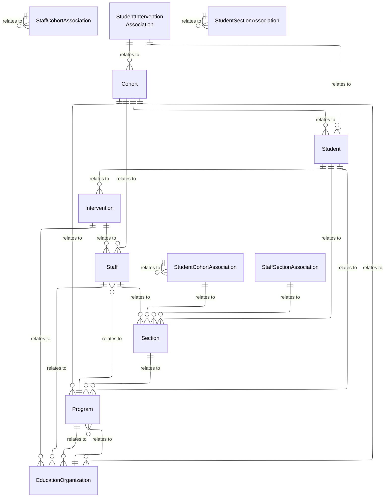

# Student Cohort Domain - Model Diagrams

## Student Cohort Model UML Diagram

```mermaid
---
config:
  layout: elk
---
erDiagram
    Student {
    }
    Staff {
    }
    Cohort {
    }
    StudentCohortAssociation {
    }
    StaffCohortAssociation {
    }
    StudentInterventionAssociation["StudentIntervention<br/>Association"] {
    }
    Intervention {
    }
    StudentSectionAssociation {
    }
    StaffSectionAssociation {
    }
    Program {
    }
    Section {
    }
    EducationOrganization {
    }
    Cohort ||--o{ Student : "relates to"
    Cohort ||--o{ Program : "relates to"
    Cohort ||--o{ EducationOrganization : "relates to"
    Cohort ||--o{ Staff : "relates to"
    StudentCohortAssociation ||--o{ StudentCohortAssociation : "relates to"
    StudentCohortAssociation ||--o{ Section : "relates to"
    StaffCohortAssociation ||--o{ StaffCohortAssociation : "relates to"
    StudentInterventionAssociation ||--o{ Cohort : "relates to"
    StudentInterventionAssociation ||--o{ Student : "relates to"
    StudentSectionAssociation ||--o{ StudentSectionAssociation : "relates to"
    StaffSectionAssociation ||--o{ Section : "relates to"
    Student ||--o{ Intervention : "relates to"
    Student ||--o{ Program : "relates to"
    Student ||--o{ Section : "relates to"
    Staff ||--o{ EducationOrganization : "relates to"
    Staff ||--o{ Section : "relates to"
    Intervention ||--o{ EducationOrganization : "relates to"
    Intervention ||--o{ Staff : "relates to"
    Program ||--o{ EducationOrganization : "relates to"
    Program ||--o{ Staff : "relates to"
    EducationOrganization ||--o{ Program : "relates to"
    Section ||--o{ Program : "relates to"
    style Student color:#000000
    style Staff color:#000000
    style Cohort color:#000000
    style StudentCohortAssociation color:#000000
    style StaffCohortAssociation color:#000000
    style StudentInterventionAssociation color:#000000
    style Intervention color:#000000
    style StudentSectionAssociation color:#000000
    style StaffSectionAssociation color:#000000
    style Program color:#000000
    style Section color:#000000
    style EducationOrganization color:#000000
```
