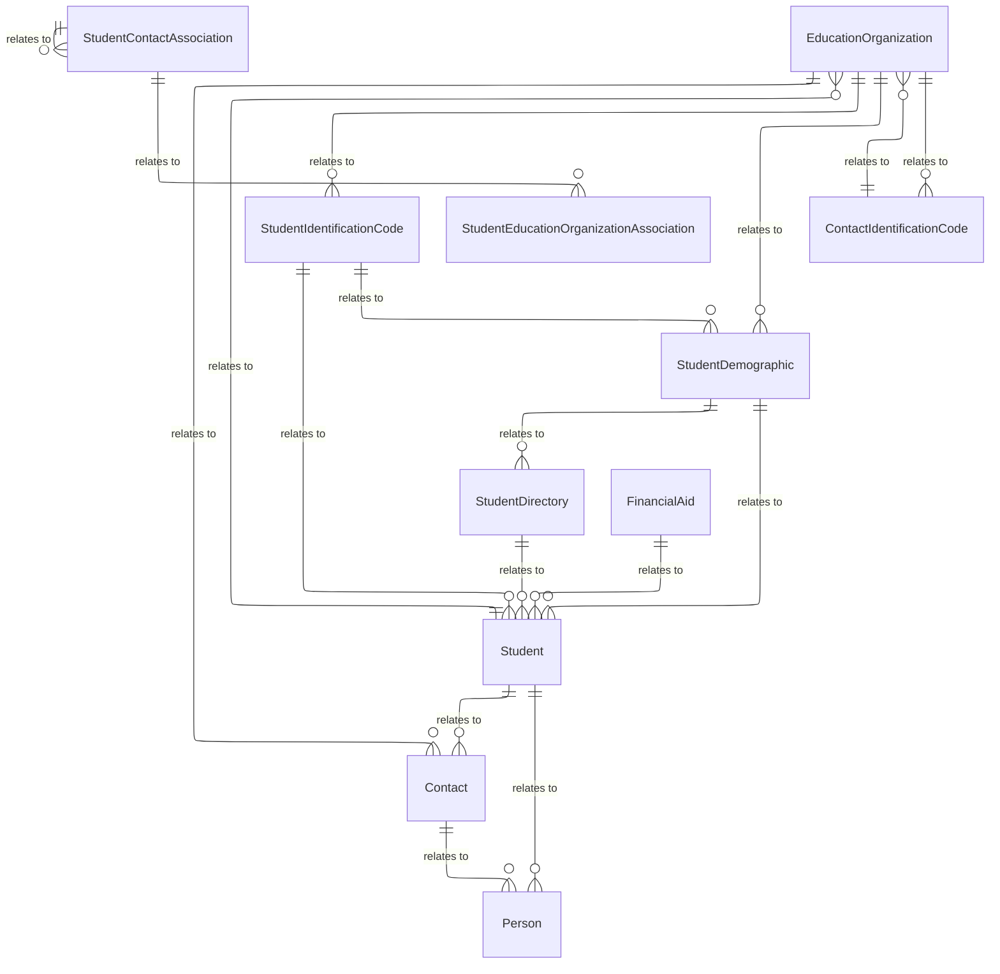

# Student Identification and Demographics Domain - Model Diagrams

## Student Identification and Demographics Model UML Diagram

```mermaid
---
config:
  layout: elk
---
erDiagram
    Student {
    }
    StudentIdentificationCode {
    }
    StudentDirectory {
    }
    StudentDemographic {
    }
    StudentEducationOrganizationAssociation {
    }
    StudentContactAssociation {
    }
    Contact {
    }
    ContactIdentificationCode {
    }
    FinancialAid {
    }
    Person {
    }
    EducationOrganization {
    }
    Student ||--o{ Contact : "relates to"
    Student ||--o{ EducationOrganization : "relates to"
    Student ||--o{ Person : "relates to"
    StudentContactAssociation ||--o{ StudentContactAssociation : "relates to"
    StudentContactAssociation ||--o{ StudentEducationOrganizationAssociation : "relates to"
    StudentIdentificationCode ||--o{ Student : "relates to"
    StudentIdentificationCode ||--o{ StudentDemographic : "relates to"
    StudentDemographic ||--o{ Student : "relates to"
    StudentDemographic ||--o{ StudentDirectory : "relates to"
    StudentDirectory ||--o{ Student : "relates to"
    EducationOrganization ||--o{ StudentDemographic : "relates to"
    EducationOrganization ||--o{ StudentIdentificationCode : "relates to"
    EducationOrganization ||--o{ Contact : "relates to"
    EducationOrganization ||--o{ ContactIdentificationCode : "relates to"
    ContactIdentificationCode ||--o{ EducationOrganization : "relates to"
    Contact ||--o{ Person : "relates to"
    FinancialAid ||--o{ Student : "relates to"
```
