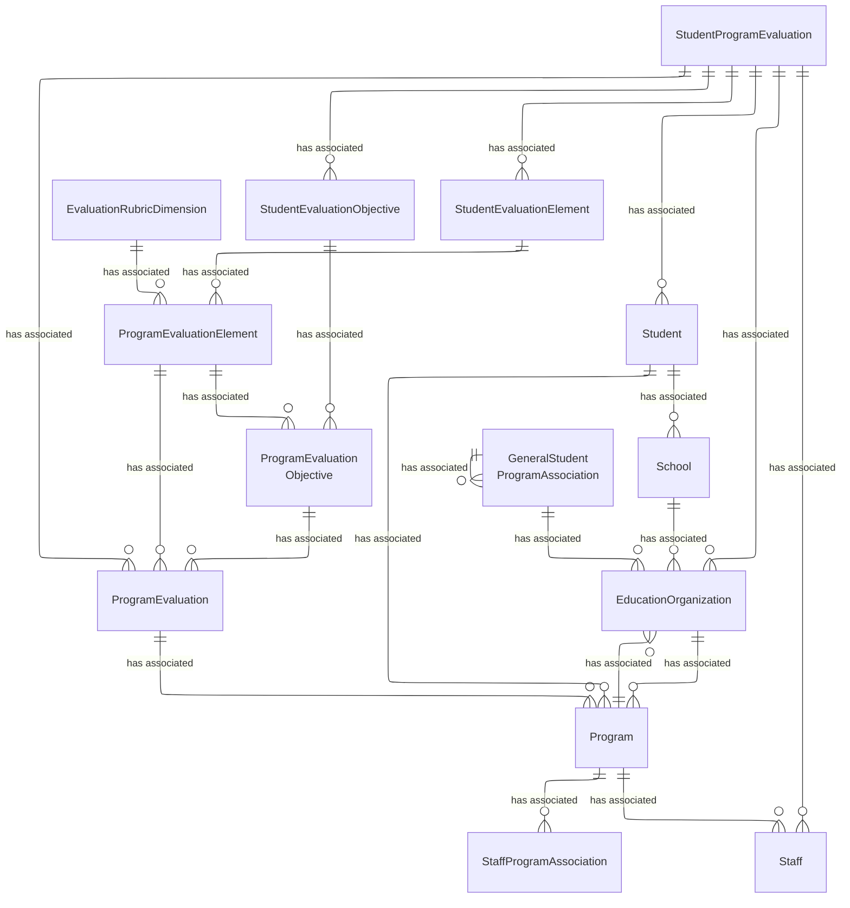

# Student Program Evaluation Domain - Model Diagrams

This section contains reference information for the Student Program Evaluation
domain model. The model includes entities such as StudentProgramEvaluation,
ProgramEvaluation, ProgramEvaluationObjective, ProgramEvaluationElement,
EvaluationRubricDimension. These entities are related to each other to provide
insights into the effectiveness of programs.

## Student Program Evaluation  UML Model Diagram

