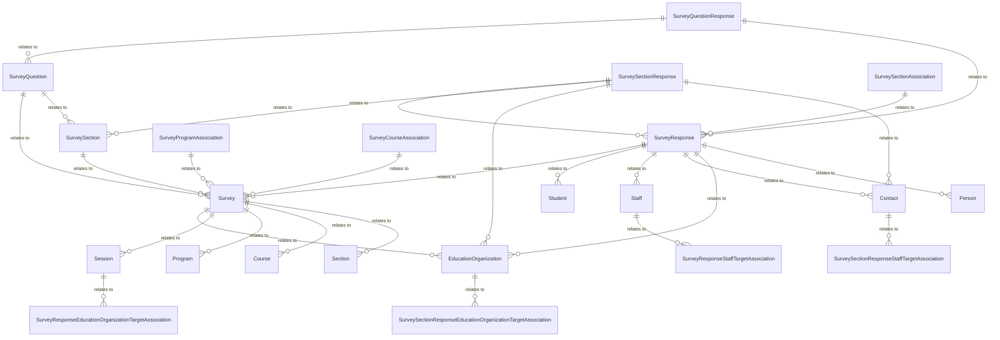

# Survey Domain - Model Diagrams

This section contains reference information for the Assessment domain model and
subdomains.

## Survey Model UML Diagram

```mermaid
erDiagram
    Survey {
    }
    SurveySection {
    }
    SurveyQuestion {
    }
    SurveyResponse {
    }
    SurveySectionResponse {
    }
    SurveyQuestionResponse {
    }
    SurveyProgramAssociation {
    }
    SurveyCourseAssociation {
    }
    SurveySectionAssociation {
    }
    SurveyResponseEducationOrganizationTargetAssociation {
    }
    SurveyResponseStaffTargetAssociation {
    }
    SurveySectionResponseEducationOrganizationTargetAssociation {
    }
    SurveySectionResponseStaffTargetAssociation {
    }
    Session {
    }
    Course {
    }
    Program {
    }
    Section {
    }
    Student {
    }
    Contact {
    }
    Staff {
    }
    Person {
    }
    EducationOrganization {
    }
    Survey ||--o{ EducationOrganization : "relates to"
    Survey ||--o{ Session : "relates to"
    Survey ||--o{ Program : "relates to"
    Survey ||--o{ Course : "relates to"
    Survey ||--o{ Section : "relates to"
    SurveySection ||--o{ Survey : "relates to"
    SurveyQuestion ||--o{ Survey : "relates to"
    SurveyQuestion ||--o{ SurveySection : "relates to"
    SurveyResponse ||--o{ Survey : "relates to"
    SurveyResponse ||--o{ Student : "relates to"
    SurveyResponse ||--o{ Staff : "relates to"
    SurveyResponse ||--o{ Contact : "relates to"
    SurveyResponse ||--o{ EducationOrganization : "relates to"
    SurveyResponse ||--o{ Person : "relates to"
    SurveySectionResponse ||--o{ SurveyResponse : "relates to"
    SurveySectionResponse ||--o{ SurveySection : "relates to"
    SurveySectionResponse ||--o{ EducationOrganization : "relates to"
    SurveySectionResponse ||--o{ Contact : "relates to"
    SurveyQuestionResponse ||--o{ SurveyQuestion : "relates to"
    SurveyQuestionResponse ||--o{ SurveyResponse : "relates to"
    SurveyProgramAssociation ||--o{ Survey : "relates to"
    SurveyCourseAssociation ||--o{ Survey : "relates to"
    SurveySectionAssociation ||--o{ SurveyResponse : "relates to"
    Session ||--o{ SurveyResponseEducationOrganizationTargetAssociation : "relates to"
    Staff ||--o{ SurveyResponseStaffTargetAssociation : "relates to"
    EducationOrganization ||--o{ SurveySectionResponseEducationOrganizationTargetAssociation : "relates to"
    Contact ||--o{ SurveySectionResponseStaffTargetAssociation : "relates to"
```
