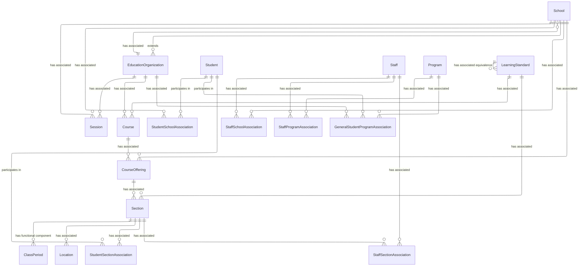
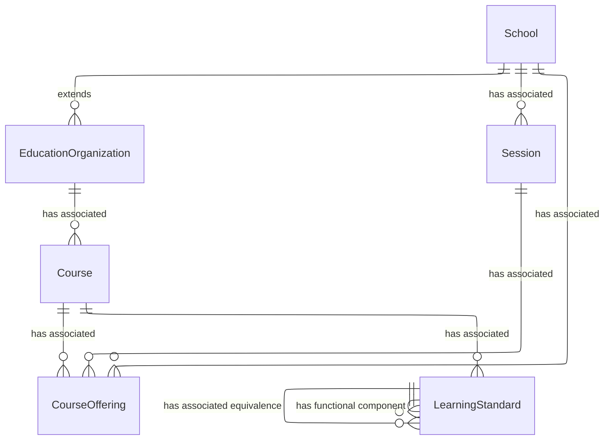
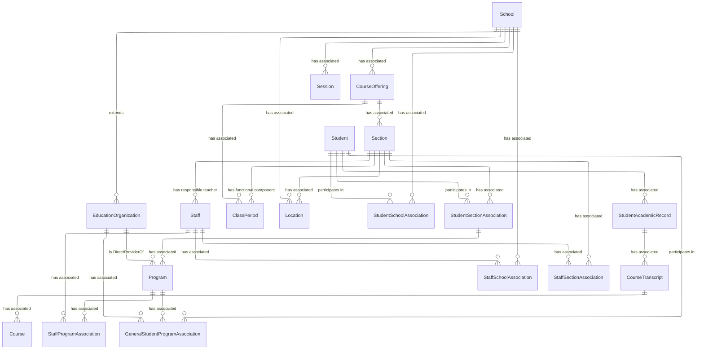

# Teaching and Learning Domain - Model Diagrams

This section contains reference information for the Teaching and Learning domain
model.

## Teaching and Learning UML Model Diagram

### Course Catalog Subdomain

The model is based upon multiple levels of definition, as follows:

* The CourseOffering entity represents a course that is offered by a school
    during a session. The CourseOffering entity will have a LocalCourseCode
    element and may have a LocalCourseTitle element.
* A school will have one or more sections for each CourseOffering entity.
    Students are enrolled in specific sections. Each Section entity will have
    one or more assigned staff, will typically meet in a specific location in
    the school, and will be assigned a ClassPeriod entity for the session. Since
    early learning instruction is based on programs, students are enrolled by
    association to the Program and Staff entities as well.

#### Teaching and Learning, Course Catalog Model UML Diagram

### Sections and Programs Subdomain

A school will have one or more Sections for each CourseOffering. Students are
enrolled in specific Sections. Each Section will have one or more assigned
Staff, will typically meet in a specific location in the school, and be assigned
a ClassPeriod for the Session.

#### Teaching and Learning, Sections and Programs Model UML Diagram

