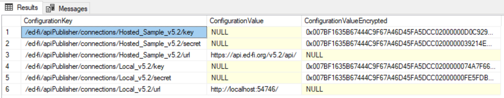
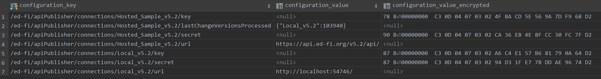
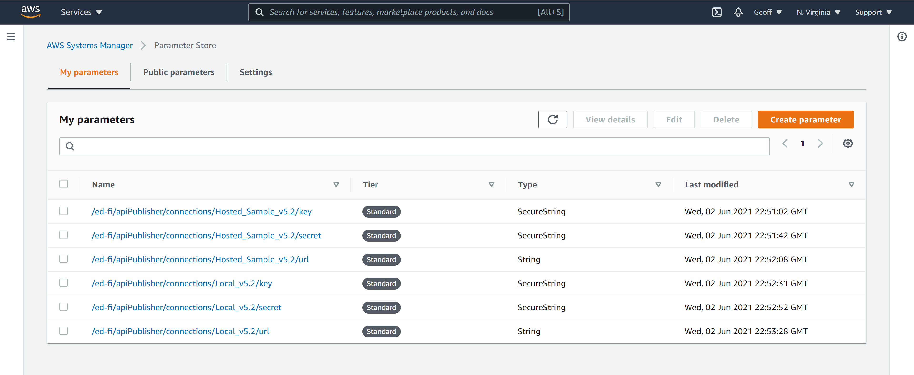

# API Connection Management

The Quick Start exercise supplies all connection information explicitly as
command-line arguments, however to better operationalize the API Publisher you
should create a Configuration Store to securely configure named API connections,
and to track the state of publishing between various source and target APIs.

The Configuration Store implementation can be selected by passing the
`--configurationStoreProvider` command-line argument, by setting the
`EdFi:ApiPublisher:ConfigurationStore:Provider` environment variable, by
modifying the `provider` value in the `configurationStoreSettings.json` file (in
that order of precedence).

```json
{
  "configurationStore": {
    "provider": "postgreSql",
    "sqlServer": {
      "connectionString": "Server=(local);Database=EdFi_API_Publisher_Configuration;Trusted_Connection=True"
    },
    "postgreSql": {
      "connectionString": "Server=localhost;Port=5432;Database=edfi_api_publisher_configuration",
      "encryptionPassword": ""
    },
    "awsParameterStore": {
      "Profile": "default",
      "Region": "us-east-1"
    },
    "plainText": { }
  }
}
```

Currently there are four configuration store implementations available:

| Setting Value                    | Implementation                                                                           | Description                                                                                                                                                                                                                                                                                                                                                                                                                                                                                                                                                                                               |
| -------------------------------- | ---------------------------------------------------------------------------------------- | --------------------------------------------------------------------------------------------------------------------------------------------------------------------------------------------------------------------------------------------------------------------------------------------------------------------------------------------------------------------------------------------------------------------------------------------------------------------------------------------------------------------------------------------------------------------------------------------------------- |
| `sqlServer`         | [Configuration Store for SQL Server](ConfigurationStore/Sql-Server.md)                   | Reads API connection details from and writes successfully published changed version numbers to a SQL Server configuration table. Enables management of individual connection settings with encryption for securely storing keys and secrets using the built-in support for symmetric key encryption in SQL Server.                                                                                                                                                                                                                                                                                        |
| `postgreSql`        | [Configuration Store for PostgreSQL](ConfigurationStore/PostgreSql.md)                   | Reads API connection details from and writes successfully published changed version numbers to a PostgreSQL configuration table. Enables management of individual connection settings with encryption support for securely storing keys and secrets using a supplied password for symmetric key encryption using the `pgcrypto` extension for PostgreSQL.                                                                                                                                                                                                                                                 |
| `awsParameterStore` | [Configuration Store for AWS Parameter Store](ConfigurationStore/Aws-Parameter-Store.md) | Reads API connection details from and writes successfully published changed version numbers to the [AWS Systems Manager Parameter Store](https://docs.aws.amazon.com/systems-manager/latest/userguide/systems-manager-parameter-store.html) using the AWS region specified in the `awsParameterStore` property of the `configurationStoreSettings.json` file. It also assumes the runtime environment has been initialized with the necessary credentials for accessing AWS services. Enables management of individual connection settings with encryption support for securely storing keys and secrets. |
| `plainText`                      | Plain Text Configuration Store                                                           | Reads connection information defined in plain text in the _plainTextNamedConnection.json file_. Intended for development purposes only. Does not support writing back the successfully published Change Version.                                                                                                                                                                                                                                                                                                                                                                                          |

## Defining API Connections

Regardless of the configuration store implementation in use, the configuration
settings needed for defining a named API connection are described below.

| Parameter Name                                                                            | Type         | Description                                                                                                                                                                                                                                                                                                                                                                                                                                                                                                                                                                                                                                                                                                                                 |
|---------------------------------------------------------------------------------------------| ------------ |---------------------------------------------------------------------------------------------------------------------------------------------------------------------------------------------------------------------------------------------------------------------------------------------------------------------------------------------------------------------------------------------------------------------------------------------------------------------------------------------------------------------------------------------------------------------------------------------------------------------------------------------------------------------------------------------------------------------------------------------|
| `/ed-fi/apiPublisher/connections/`<br/>`_{connectionName}_/url`                          | String       | The base URL of the Ed-Fi ODS API (up to, but not including, the _/data/v3_ portion of the URL).                                                                                                                                                                                                                                                                                                                                                                                                                                                                                                                                                                                                                                            |
| `/ed-fi/apiPublisher/connections/`<br/>`_{connectionName}_/key`                          | SecureString | The key to use for API authentication.                                                                                                                                                                                                                                                                                                                                                                                                                                                                                                                                                                                                                                                                                                      |
| `/ed-fi/apiPublisher/connections/`<br/>`_{connectionName}_/secret`                       | SecureString | The secret to use for API authentication.                                                                                                                                                                                                                                                                                                                                                                                                                                                                                                                                                                                                                                                                                                   |
| `/ed-fi/apiPublisher/connections/`<br/>`_{connectionName}_/ignoreIsolation`             | String       | (_Optional_) A boolean value (true/false) indicating whether the source Ed-Fi ODS API data should be published even if it does not support an isolated context for processing through Change Query snapshots.                                                                                                                                                                                                                                                                                                                                                                                                                                                                                                                               |
| `/ed-fi/apiPublisher/connections/`<br/>`_{connectionName}_/include`                     | String       | (_Optional_) For _source_ API connections, the resources to publish to the target with their dependencies. The value is defined using a CSV format (comma-separated values), and should contain the partial paths to the resources (e.g. _/ed-fi/students_,_/custom/busRoutes_). For convenience when working with Ed-Fi standard resources, only the name is required (e.g. _students,studentSchoolAssociations_). The Ed-Fi API Publisher will also evaluate and automatically include all dependencies of the requested resources (using the dependency metadata exposed by the target API). This will ensure (barring misconfigured authorization metadata or data policies) that data can be successfully published to the target API. |
| `/ed-fi/apiPublisher/connections/`<br/>`_{connectionName}_/includeOnly`                 | String       | (_Optional_) For _source_ API connections, the resources to publish to the target without their dependencies. The value is defined using the same format as with `--include` (see above). <br/><br/> NOTE: Use caution when publishing without automatically including all dependencies.                                                                                                                                                                                                                                                                                                                                                                                                                                                    |
| `/ed-fi/apiPublisher/connections/`<br/>`_{connectionName}_/exclude`                     | String       | (_Optional_) For _source_ API connections, the resources (and their dependents) to NOT publish to the target. The value is defined using the same format as with `--include` (see above). The Ed-Fi API Publisher will also evaluate and automatically exclude all dependent resources of the excluded resources (using the dependency metadata exposed by the target API). This will ensure (barring misconfigured authorization metadata or data policies) that data can be successfully published to the target API.                                                                                                                                                                                                                     |
| `/ed-fi/apiPublisher/connections/`<br/>`_{connectionName}_/excludeOnly`                | String       | (_Optional_) For _source_ API connections, the specific resources to skip publishing to the target (dependent resources will still be published). The value is defined using the same format as with `--include` (see above).<br/><br/> NOTE: Use caution when publishing without automatically including all dependencies.                                                                                                                                                                                                                                                                                                                                                                                                                 |
|`/ed-fi/apiPublisher/connections/`<br/>`_{connectionName}_/lastChangeVersionsProcessed` | String       | _(Optional)_ For _source_ API connections, contains a JSON object, keyed by target API name, that indicates the last change version successfully published from the source to the target. This value is automatically created/updated by the Ed-Fi API Publisher after successfully completing the publishing process.                                                                                                                                                                                                                                                                                                                                                                                                                      |

## Screenshots

### SQL Server Configuration



### PostgreSQL Configuration



### AWS Parameter Store Configuration


