# Ed-Fi Overview and ESA Implementation

## Ed-Fi Overview and ESA Implementation

The cover introduces an Ed-Fi Alliance presentation about Ed-Fi and Educational Service Agency implementation.

## State, ESA, and district pain points

The slide groups pain points by stakeholder. State education agencies struggle with timeliness, inconsistent district formats, missing information, and costly data processing. ESAs are framed as change agents that fill LEA staffing and data-management gaps. Local districts face reporting burden, delayed absenteeism alerts, limited assessment views, and limited visibility into college and career readiness.

| Stakeholder | Pain points |
| --- | --- |
| State Education Agencies | Timeliness (legislative requests can take weeks or months), data quality (districts submit in inconsistent formats), and costly collection (avg 10–15 staff at $1.1M+ per SEA to process and clean district data). |
| Education Service Agencies | Change-agent responsibilities, visibility into district data needs, and shared cost pressure. |
| Local Districts | Reporting burden (avg 6 staff at $0.5M per district), delayed absenteeism alerts, limited consolidated assessment views, and limited college/career readiness visibility. |

## Ed-Fi interoperability mission

The diagram shows districts connecting through an ESA to Ed-Fi, while states and vendors also connect to Ed-Fi. The right side identifies three core supports: data standard, open-source APIs, and community resources.

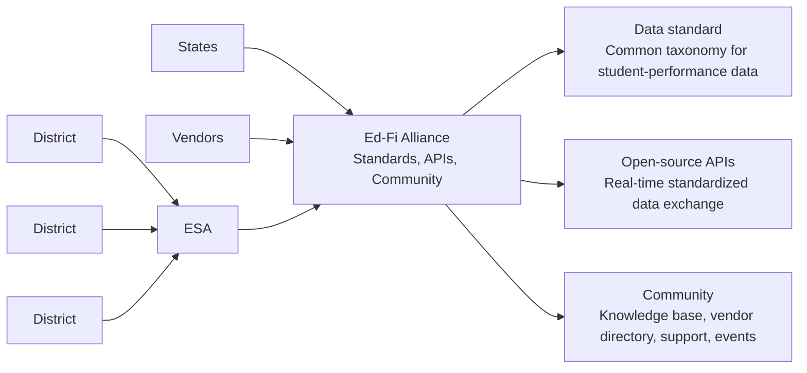

## State Ed-Fi adoption for reporting

The bar chart shows state adoption increasing from 3 states in 2013 to 5 in 2016, 6 in 2019, and 14 total states in 2022, split between 8 production and 6 implementing.

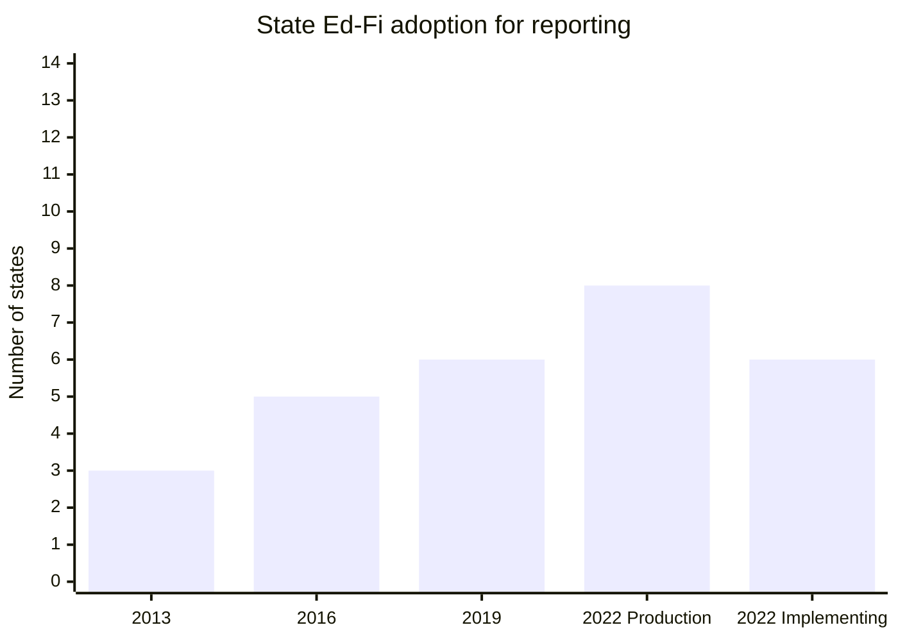

## District adoption through ESAs

The chart shows LEA adoption via ESAs growing from 65 districts in 2013 to 1,283 in 2022, described as a 7.8x increase from 2019 to 2022. The slide notes that this local-use-case adoption is separate from 1.9k districts in states using Ed-Fi for state reporting.

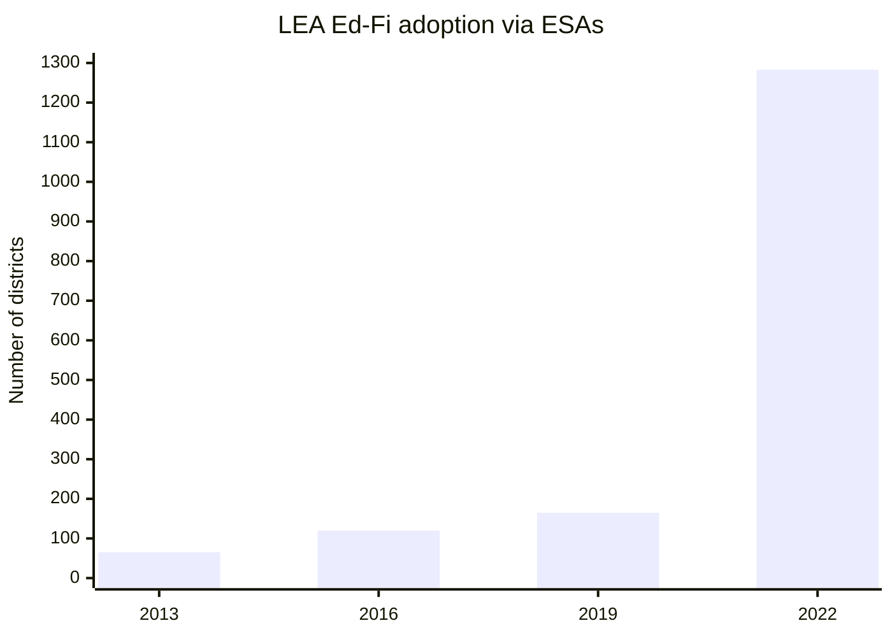

## Michigan local-use-case examples

Michigan examples are grouped into new analytics, new tools, and vendor integrations. MiRead and Digital Equity Data Collection support analytics; MiStrategyBank and MiEWIMS provide tools; Ed-Fi reduces the need for LEAs to manage separate integrations.

| Category | Description of impact |
| --- | --- |
| New analytics | MiRead identifies students struggling to read at grade level; Digital Equity Data Collection identifies internet-access equity gaps. |
| New tools | MiStrategyBank provides evidence-based strategies; MiEWIMS creates plans for attendance and behavior issues. |
| Vendor integrations | LEAs do not need to implement and manage all vendor integrations; the slide says Ed-Fi provides 10 integrations per school. |

> “The ability to obtain immediate information on newly enrolled students has improved our ability to provide timely services. Before we would have to wait for the previous school to send student status related to special education, English language, homelessness, etc., which caused a delay in needed services.” — Sarah Mohler, Madison District

## Common ESA-driven local use cases

The slide lists local data services that ESAs can drive, ranging from assessment and attendance to data warehousing and rostering.

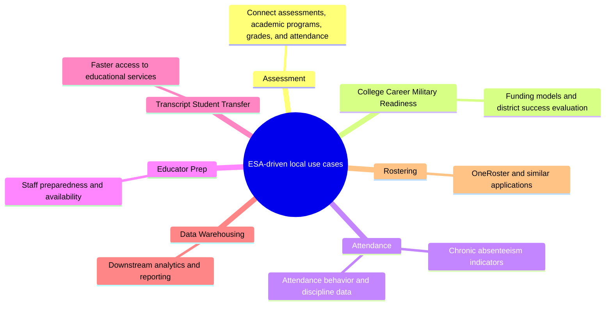

## Why ESAs are positioned to provide data services

This slide frames the ESA opportunity across existing market relationships, an expanded service offering, and the broader state/district/vendor ecosystem.

| Area | Description of impact |
| --- | --- |
| Existing Market | ESAs are involved in contracts and services, while districts struggle with data access and interoperability. |
| Your Opportunity | ESAs can offer a technology stack that helps districts now and supports layered ESA services later; the slide says this is better when ESAs work with others and share resources. |
| Ecosystem | ESAs may not determine state direction, but they can enable district needs, include the state to drive vendor requirements, and reduce district burden. |

## Examples working today

The slide presents South Carolina District Data Governance, Texas Education Exchange, and Michigan DataHub as examples of ESA/state data-service models working today.

## Three implementation approaches

The comparison table presents three approaches. “Do It Together + State Vendor Support” is marked as the best-practice option because it combines implementation partners, state involvement, vendor expectations, and local use-case support.

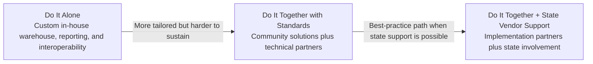

| Category | Do It Alone | Do It Together with standards | Do It Together + State Vendor Support |
| --- | --- | --- | --- |
| Description | Build data warehouse, reporting, and interoperability solutions in-house for district members. | Use community solutions and technical partners to deliver core services, then layer ESA support and use-case services on top. | Build warehousing, reporting, and interoperability with implementation partners and state involvement to drive vendor expectations. |
| Benefits | Tailored to priority use cases; can include state legislative priorities. | Shortest (1.5–2 yr) time to impact; addresses local district use cases; lowest cost and limited SEA role; clear sustainability model; national vendor support. | Greatest impact ($30M+ in local use cases); shortens time to impact (1.5–2 yr); addresses local use cases with state legislative consideration. |
| Tradeoffs | Expensive custom development and maintenance; hard to get vendor participation; challenging sustainability plan. | May lack state legislative extension support in the region; extra expenses and services for offering a core platform. | State focus may be on legislative rather than local use cases; requires SEA/ESA coordination. |
| When to adopt | Unique legislative requirements and use cases in the region. | State reporting modernization is not a priority, but ESAs can deliver use cases on a common platform. | ESA model drives local use cases and wants to de-risk reporting modernization. |

## District challenges in using data

The slide emphasizes that an ESA data hub does not compete with district SaaS tools. Instead, it helps districts extract value across those tools and wrap ESA programs and services around them.

| Challenge | Meaning |
| --- | --- |
| Low staff capacity | Most districts do not have the staff to run data-project infrastructure. |
| Complexity | Data infrastructure requires different expertise than data analysis. |
| Expensive walled gardens | Vendor systems make it hard to use district data across tools or choose best-of-breed tools. |
| Timeliness | Data visibility can be too slow and disconnected to be useful. |

## Reporting + data hub architecture

LEA systems such as SIS, assessment, HR, LMS, and other applications send data through Ed-Fi APIs into an ESA data hub. The ESA hub supports analytics, data warehousing, and data services, and can send reporting data to the SEA Ed-Fi environment, where state/federal reporting is produced.

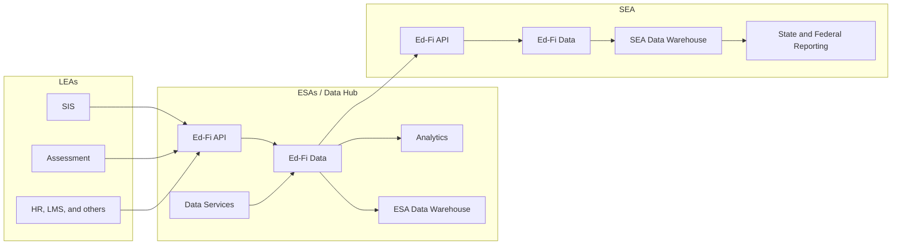

## Contact slide

The slide provides Ed-Fi Alliance contacts for follow-up questions.

| Name | Role | Email |
| --- | --- | --- |
| David Clements | Solutions Architect | [david.clements@ed-fi.org](mailto:david.clements@ed-fi.org) |
| Eric Jansson | VP, Solutions | [eric.jansson@ed-fi.org](mailto:eric.jansson@ed-fi.org) |

## Implementation section divider

This divider introduces the implementation portion of the playbook. A note says the remaining slides are for leaders trying to bring their team on board and that additional details are available in the knowledge base repository.

_Note: The remaining slides are intended for leaders working to bring their team on board. Additional details are available in the Ed-Fi knowledge base repository._

## Organizational roles

Four vertical role columns describe responsibilities for SEA, LEAs, vendors, and ESAs/data hubs.

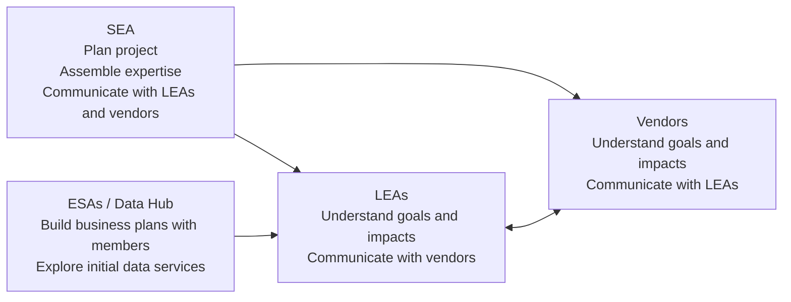

| Organization | Role in implementation |
| --- | --- |
| SEA | Plan the project, assemble internal and external expertise, and launch communications with LEAs and vendors. |
| LEAs | Understand the goals and impacts of the state modernization project and initiate communications with vendors. |
| Vendors | Understand project goals and impacts and initiate communications with LEAs. |
| ESAs / Data Hub | Build business plans collaboratively with members and explore candidates for initial data services. |

## The four phases

The implementation roadmap has four phases: market research, planning, pilot, and growth. The key success message is to be in production within a year, align with the school calendar, and use vendor awareness, MSPs, and established best practices to accelerate production.

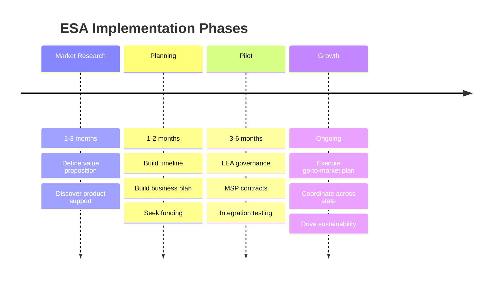

| Phase | Time | ESA activities |
| --- | ---: | --- |
| Market Research | 1–3 months | Define value proposition and discover key product support. |
| Planning | 1–2 months | Build timeline and business plan, and seek funding. |
| Pilot | 3–6 months | LEA governance, MSP contracts, and integration testing with LEAs. |
| Growth | Ongoing | Execute go-to-market plan, coordinate across the state, and drive toward sustainability. |

:::tip Key to Success
Best practice is to be in production within a year and align with the school calendar. A faster timeline helps with project sustainability and creates a clear connection between the project and LEA valuable use cases. With vendor awareness, use of MSPs, and access to well-known best practices, the timeline to production has become much more rapid than in years past.
:::

## Market Research Phase: ESA tasks

The slide instructs ESAs to define their value proposition by talking to districts and stakeholders, exploring existing services, identifying market fit, and checking support for standards in their region.

| Task area | Questions or actions |
| --- | --- |
| Talk to districts | What pressing data needs are districts facing? |
| Talk to stakeholders | Who are the stakeholders and what are their data priorities? |
| Investigate existing services | Which current data services could benefit from a consistent data platform? |
| Identify market fit | Where can the ESA grow through new services and regional partners? |
| Identify product support | Are SIS vendors Ed-Fi certified? Are state initiatives blockers? Which implementation partners and MSPs can help? |

## Engage Ed-Fi expertise

The slide recommends hiring a badged Ed-Fi Managed Service Provider or consultant, arguing that MSPs accelerate work, know common gotchas, understand hosting and maintenance, debug integrations, and provide vendor support.

| Recommendation | Rationale |
| --- | --- |
| Hire a badged MSP or consultant | MSPs have done the work repeatedly and understand best practices. |
| Avoid a pure DIY approach | Learning the full implementation path from scratch can slow progress and create avoidable mistakes. |
| Use subcontracting when needed | Existing consultants or preferred vendors can subcontract with experienced Ed-Fi MSPs. |
| Get references | Ed-Fi maintains a list of badged MSPs, and other Ed-Fi ESAs can provide references. |

## Data mapping and specifications development

The slide contrasts recommended and not-recommended practices for initial mapping and specifications.

| Recommended | Not recommended |
| --- | --- |
| Use your MSP to create mappings and initial data specifications. | Doing Ed-Fi mappings on your own with staff new to Ed-Fi standards. |
| Follow Ed-Fi Descriptor Guidance for code sets in specifications. | Using default Ed-Fi Descriptor values for data elements critical to collections. |
| Train staff on Ed-Fi Data Standard language through the MSP and participation in the process. | Letting this process take more than two months; refinement can continue during the pilot. |

## Planning Phase: ESA tasks

Planning is organized into building a timeline, building a business plan, and seeking funding. The slide also offers examples of minimal viable products and common funding sources.

| Workstream | Actions |
| --- | --- |
| Build Timeline | Reserve 1–3 months for market research, align with the academic year or procurement timelines, and identify a minimal viable product. |
| Build Business Plan | Identify MSPs and implementation partners, build costs, marketing costs, and sustainability costs. |
| Seek Funding | Explore state grants, philanthropic grants, self-funding, and mixed funding models. |

**MVP examples from the slide:** Texas Education Exchange started with 4 apps; Indiana INSite started with a dashboard; Michigan DataHub started with 3rd-grade reading intervention using MIRead.

## Pilot Phase: ESA tasks

The pilot phase should last 3–6 months and align to the academic calendar. District budgeting around February and district catalog timing are called out as important constraints.

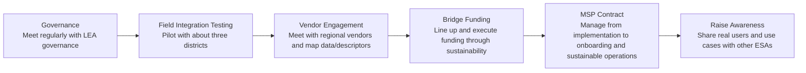

| Task | Action |
| --- | --- |
| Governance | Start meeting regularly with LEA governance. |
| Field Integration Testing | Pilot with about three districts. |
| Vendor Engagement | Meet regularly with regional vendors and conduct data/descriptor mapping within Ed-Fi. |
| Bridge Funding | Line up and execute funding through sustainability. |
| MSP Contract | Manage the MSP contract from implementation into onboarding and sustainable management. |
| Raise Awareness | Share real pilot users and use cases with other ESAs. |

:::warning
Be careful not to let the first three phases run long — it greatly impacts project sustainability and success. Stakeholders will start to lose interest and may see extended timelines as an inability to execute. Align with the academic calendar: districts tend to set budgets in February and publish solutions to their district catalog on a fixed cycle.
:::

## Growth and Expansion Phase

Growth and expansion should occur during the school year after the pilot. The slide warns that longer periods can affect sustainability, word of mouth, and bridge funding requirements.

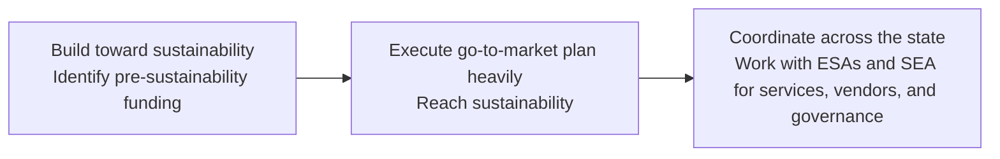

| Focus | Actions |
| --- | --- |
| Build toward sustainability | Identify pre-sustainability funding and execute the go-to-market plan to reach sustainability. |
| Execute go-to-market plan heavily | Expand adoption after the pilot and convert project momentum into ongoing service demand. |
| Coordinate across the state | Work with other ESAs for statewide service coverage and work with the state on vendor and data governance support. |

## Do this, not that

The slide advises focus, scaling, state relevance, and ecosystem building while warning against over-scoping, working in isolation, and targeting LEA subgroups that cannot scale.

| Recommended | Not recommended |
| --- | --- |
| Go to market with focused core use cases and add additional use cases over time. | Boiling the ocean with too many vendor dependencies, use cases, or drill-downs. |
| Continue to grow districts. | Doing the project in isolation without vendors, MSPs, and district support. |
| Identify use cases that could also be interesting to the state. | Targeting LEA subgroups that cannot scale. |
| Establish a statewide ecosystem by engaging multiple ESAs. | Depending on only a couple willing LEAs rather than building a path for wider adoption. |

## When the state already uses Ed-Fi for reporting

If your state is already using Ed-Fi for state reporting, vendors in your state already have some ability to work with Ed-Fi standards — that's a significant advantage. However, SEA specifications are often a subset of the data LEAs actually need, and state specifications serve different goals than local analytics. ESAs still need their own specifications, vendor engagement, and SEA collaboration.

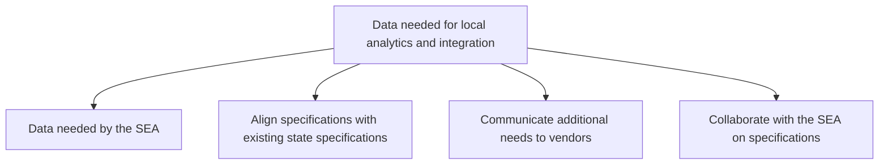

| Key action | Example |
| --- | --- |
| Align data specifications with existing state specifications to avoid confusing vendors or creating unnecessary work. | If the state has an existing attendance-data integration, start with its definitions and usage in planning. |
| Communicate additional needs to vendors and explain what those needs enable; maintain an ESA vendor-engagement team. | If the state does not collect transcript information but the ESA needs it, open vendor conversations about adding that data. |
| Open a conversation with the SEA about collaboration and specifications. | Meet with the person who manages state specifications and set up a regular cadence to explore collaboration. |
