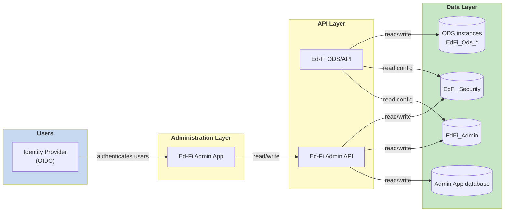
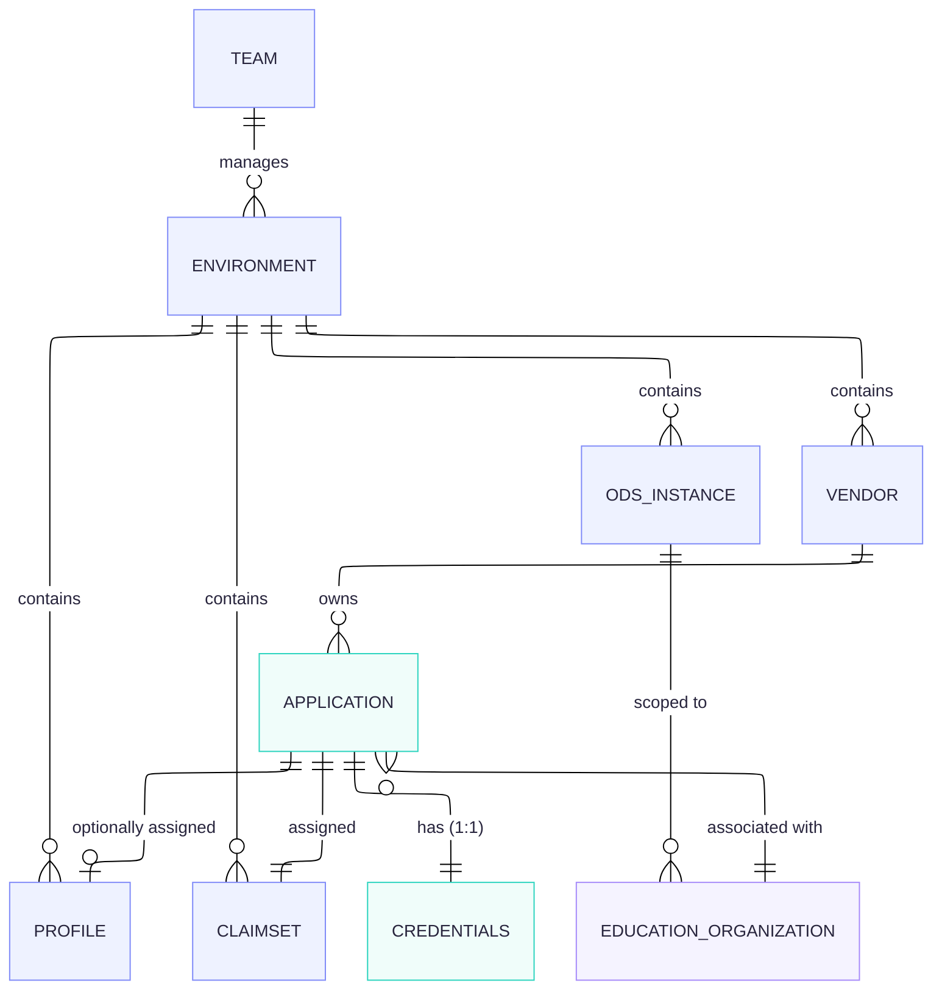

This section is the Ed-Fi Admin App deployment guide for State Education Agencies (SEAs). It helps you understand the deployment architecture and make the critical decisions you need to make _before_ beginning the installation process, so that your team can move through setup quickly and with confidence.

Most detailed product documentation for the Ed-Fi Admin App lives in the [Admin App Reference](/reference/admin-app) section of Docs. The pages here orient SEA teams to the bigger picture and to the choices that matter most up front.

## Roadmap to success

The Ed-Fi Admin App manages vendor credentials for integrating with one or more deployments of the Ed-Fi ODS/API. Each deployment contains one or more ODS database instances — for example, one instance per school year. The Admin App gives administrators a single place to create and manage the vendors, applications, claimsets, and credentials that vendors and integrating systems use to exchange data with each ODS instance.

## Deployment architecture

The diagram below shows the major components involved in an Ed-Fi Admin App deployment and how they relate to one another.

How the components relate:

- The **Ed-Fi Admin App** is the web user interface that administrators sign in to. It stores its own application state (users, teams, ownership) in the **Admin App database**, and it performs all credential and configuration management by calling the **Ed-Fi ODS Admin API**.
- The **Ed-Fi Admin API** reads and writes the **EdFi\_Admin** database (vendors, applications, claimset assignments, credentials) and the **EdFi\_Security** database (claim/resource authorization metadata).
- The **Ed-Fi ODS/API** serves data to vendors and integrating systems from one or more **ODS instances** (the `EdFi_Ods_*` databases), and reads the same `EdFi_Admin` and `EdFi_Security` databases at runtime to authenticate and authorize API clients.
- The **Identity Provider** authenticates Admin App users; it is not involved in authenticating API clients (which use the credentials managed in `EdFi_Admin`).

## Authentication (Identity Provider)

User authentication for the Admin App requires an Open ID Connect (OIDC) compatible Identity Provider (IdP), such as Keycloak, Microsoft Entra ID or Google Workspace. The IdP authenticates the administrators who sign in to the Admin App; permissions and roles for those users are then managed within the Admin App itself.

For configuration details and supported providers, see [Configuring an Identity Provider for Ed-Fi Admin App](/reference/admin-app/configuration/identity-provider).

## Network Security

:::warning

Initially, place the Ed-Fi Admin App _inside_ your network security firewall, accessible only by staff and contractors. The Admin App is an administrative tool that can create and reveal API credentials, so limiting who can reach it directly limits the attack surface of your deployment.

:::

## Optional: Yopass

:::note

Yopass is an optional component that provides higher security for sharing credentials, at the cost of additional components to install and configure. Because vendors need to retrieve the credentials you share with them, a Yopass deployment must be reachable by vendors through the firewall.

For installation and configuration details, see the [Yopass Administrator Guide](/reference/admin-app/configuration/yopass-administrators-guide).

:::

## Core concepts glossary

The Ed-Fi Admin App organizes everything it manages around a small set of core concepts. The definitions below match the [User's Guide to Admin App](/reference/admin-app/user-guide); use this section as the single glossary for the terms.

- **Teams** — A collection of owned resources. Most installations will have a single team consisting of all environments at the top level, and all the related owned resources therein.
- **Environments** — A single deployment of the Ed-Fi ODS/API. Drilling into an environment lists its Tenants, ODSs, Ed-Orgs, Vendors, Applications, and Claimsets.
- **Instances (ODS)** — Operational Data Store. A database that holds operational data for the current school year in the Ed-Fi API, stored per the Ed-Fi Data Standard. A single `EdFi_Admin` + `EdFi_Security` pairing can support one or more `EdFi_Ods` instances (for example, one instance per school year).
- **Education Organizations (Ed-Orgs)** — The education organization with which API credentials are associated. Data in the environment that is related to that Ed-Org is accessible via the application's credentials.
- **Vendors** — A named entity that owns multiple applications within the system. They are the main link between applications and namespace prefixes — for example, an assessment vendor like iReady or ACT, or a SIS vendor like PowerSchool.
- **Profiles** — Complement claimsets by controlling access at a more granular level — at the columnar or sub-collection level within resources.
- **Claimsets** — A collection of rules/permissions that define which resources can be accessed, what actions can be performed, and the authorization strategies that apply.
- **Applications** — A named entity that associates resource authorizations with API clients. All applications belong to a vendor and are assigned a claimset (and optionally a profile).
- **Credentials** — The `client_id` and `client_secret` (key and secret) for authenticating with an Ed-Fi API application. The Admin App treats credentials as a one-to-one mapping with the application.

The diagram below shows how these concepts relate to one another.

In words:

- One **team** manages one or many **environments**.
- One **environment** can contain many **ODS instances** (each scoped to one or more Ed-Orgs/LEAs), as well as many **vendors**, **profiles**, and **claimsets**.
- One **vendor** owns many **applications**.
- An **application** is assigned one **claimset** and, optionally, one **profile**, is associated with an **education organization**, and has one set of **credentials** (a one-to-one mapping in the Admin App).

## What this guide covers

This deployment guide walks you through a focused, end-to-end setup so your team can move quickly:

- A single admin user with full administrative rights
- A single team
- A single environment
- Two school-year ODS instances
- Two local education agencies (LEAs)

Completing this path gives you a working baseline that you can grow into a fuller deployment as your program expands.
