# Ed-Fi Overview and Implementation Playbook

Last updated: December 16, 2024

This playbook provides an overview of Ed-Fi and practical guidance for State Education Agencies
(SEAs) implementing Ed-Fi for data modernization. It covers the problem space, available
implementation approaches, a phased timeline, and best practices for vendor and LEA coordination.

**Download the original slide deck:**

- [PowerPoint Version](https://edfi.atlassian.net/wiki/download/attachments/22905309/SEA%20Ed-Fi%20Overview%20and%20Implementation%20Playbook.pptx?api=v2)
- [PDF Version](https://edfi.atlassian.net/wiki/download/attachments/22905309/SEA%20Ed-Fi%20Overview%20and%20Implementation%20Playbook.pdf?api=v2)

## Data Pain Points

States and districts share related but distinct data challenges.

**State Education Agencies:**

- _Timeliness_ — responding to legislative data requests can take weeks or months
- _Data quality_ — data received from districts is often in different formats and missing
  information
- _Costly collection_ — the average SEA employs 10–15 FTEs ($1.1M+) to process and clean
  district data

**Local Districts:**

- _Reporting burden_ — average of 6 FTEs ($0.5M) per district to collect and format data
- _Absenteeism_ — need earlier alerts of potential chronic absenteeism rather than months later
- _Assessments_ — lack access to a consolidated student-level view of assessment results
- _College and Career Readiness_ — limited visibility into performance against state targets

## Ed-Fi Alliance's Mission

Ed-Fi enables data interoperability across K–12 states, districts, and vendors through four
pillars:

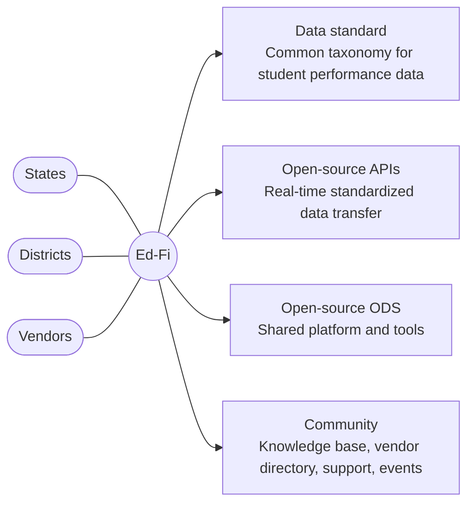

## Adoption Growth

State adoption of the Ed-Fi Data Standard has accelerated significantly:

District adoption for data services has grown substantially — roughly an 8× increase from 2019 to
2022, separate from the approximately 1,900 districts in states using Ed-Fi for state reporting:

## Impact

### State Reporting Savings: Nebraska Example

Adopting Ed-Fi for state reporting delivers substantial savings:

| Area | Impact |
| ------ | -------- |
| District data burden | Reduced by ~25% or 1.5 FTEs per district (~$125K savings × 244 districts) |
| EDFacts quarterly reporting | Reduced from 10 weeks to less than 1 day |
| Average Daily Membership reporting | Reduced from 10 days to less than 4 hours |
| SEA FTEs for district data collection | Reduced from 10 to 7 |
| **Total annual savings** | **~$30.7M (state) + ~$0.4M (SEA operations)** |

Source: Nebraska Department of Education

### District Use Cases: Michigan Example

Michigan demonstrates how Ed-Fi enables district-level impact beyond state reporting:

| Category | Example |
| -------- | ------- |
| Vendor integrations | LEAs now have ~10 integrations per school without managing each individually |
| Analytics | MiRead (reading level identification); Digital Equity Data Collection |
| Tools | MiStrategyBank (evidence-based strategies); MiEWIMS (attendance and behavior plans) |

> "The ability to obtain immediate information on newly enrolled students has improved our ability
> to provide timely services. Before we would have to wait for the previous school to send student
> status related to special education, English language, homelessness, etc., which caused a delay
> in needed services."
>
> — _Sarah Mohler, Madison District_

## Implementation Approaches

There are three primary ways to implement Ed-Fi:

:::tip Best Practice
The **Reporting + Data Hub** approach is considered best practice where a strong ESA model exists
and the state wants to de-risk reporting modernization. It delivers the greatest combined impact:
$30M+ in state reporting savings _plus_ local district use case benefits.
:::

## Reporting + Data Hub: Recommended Approach

### Implementation Phases

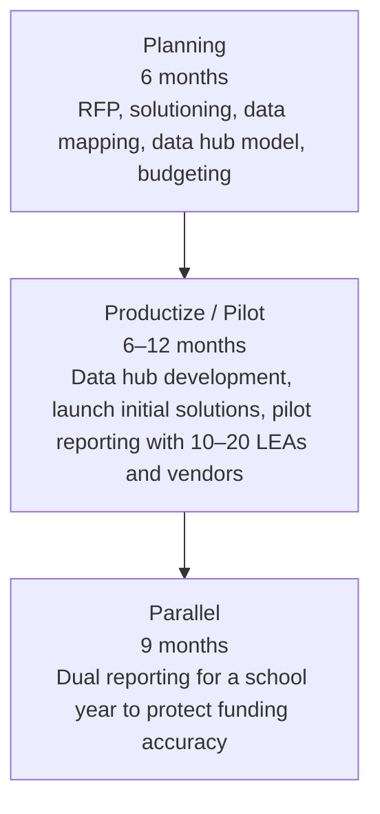

Key activities by phase:

- _Planning_ — RFP to identify a managed provider; ESA-led solution design; SEA data element
  mapping; data hub funding model; budget ($2.5M for reporting plus any data hub state funding
  up to $2M)
- _Productize / Pilot_ — develop 2–3 initial local use cases (e.g., absenteeism); launch data
  hub; pilot state reporting with 10–20 LEAs and vendors
- _Parallel_ — run Ed-Fi-based reporting alongside the legacy system for the full school year
  to ensure accurate funding

### Architecture

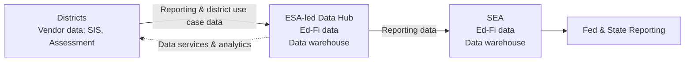

### Core Implementation Team

### Risk Mitigation

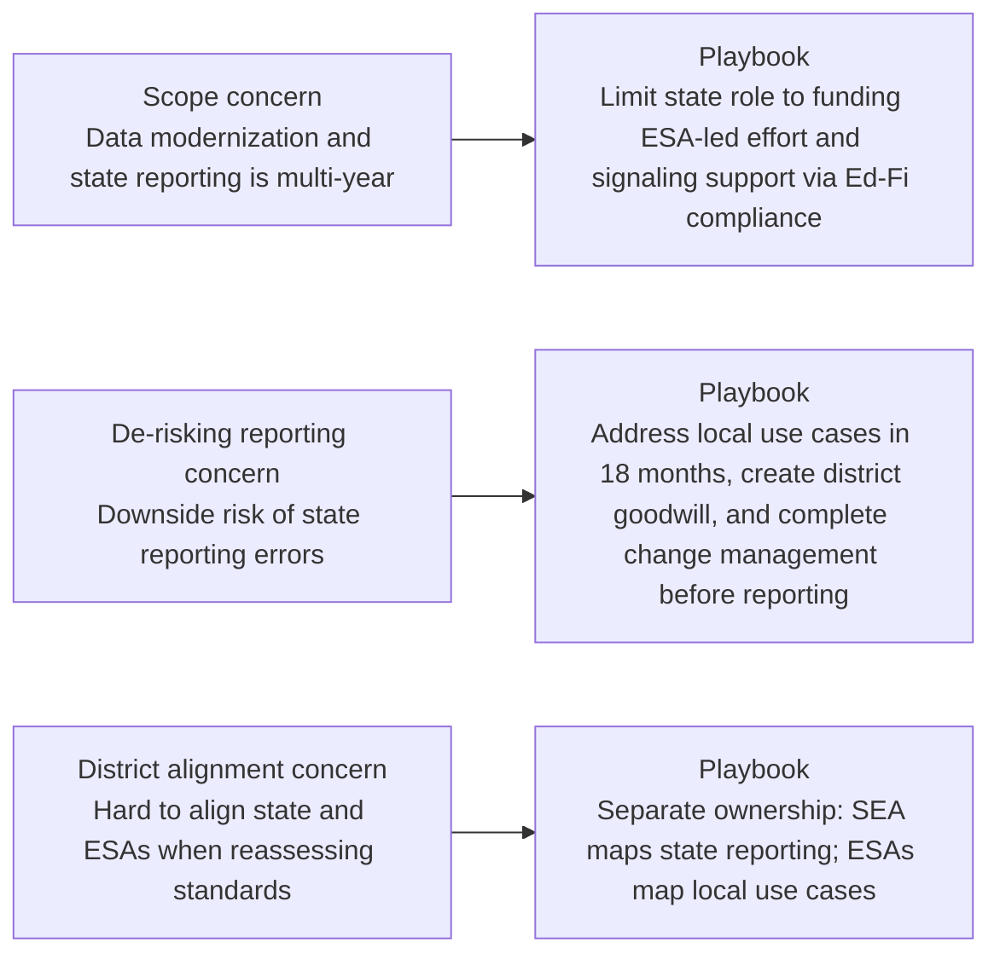

## Implementation

### The Four Stages

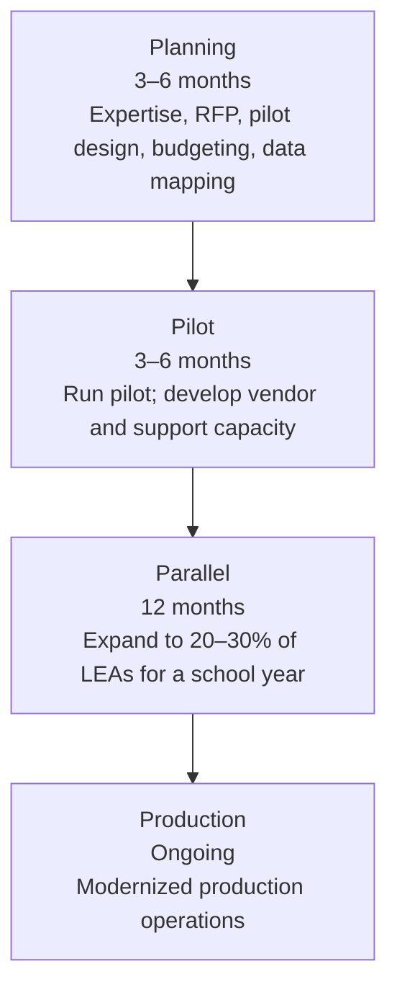

:::tip Key to Success
Best practice is to reach production within two years. A faster timeline reduces unnecessary
waste and builds team confidence. With vendor awareness, use of MSPs, and access to well-known
best practices, the timeline to production has become much more rapid than a few years ago.
:::

### Planning Phase (3–6 Months)

Stakeholder activities during planning:

- _SEA_ — Plan the project; assemble internal and external expertise; launch key communications
  with LEAs and vendors
- _LEAs_ — Understand the goals and impacts of the modernization project; initiate
  communications with their vendors
- _Vendors_ — Understand the goals and impacts; initiate communications with LEAs
- _ESAs (Data Hub)_ — Build business plans collaboratively with members; explore candidates
  for initial data services

SEA tasks proceed in three phases:

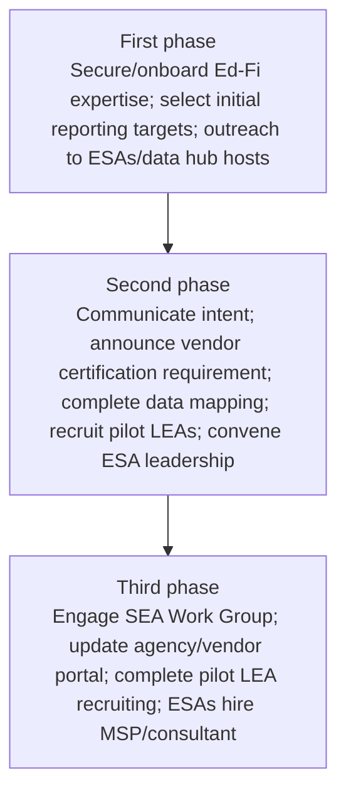

SEA goals: (1) Secure Ed-Fi expertise, (2) Align internal teams, (3) Launch key communications
with LEAs and vendors, (4) Prepare for the pilot phase.

#### Engage Ed-Fi Expertise

Hire a badged Ed-Fi Managed Service Provider (MSP) or consultant early.

- MSPs dramatically accelerate progress — they have done this many times and understand hosting
  options, maintaining current Ed-Fi products, debugging integrations, and providing vendor support
- If you have a preferred vendor list, SEAs have successfully asked those providers to
  sub-contract with an experienced Ed-Fi MSP
- The Ed-Fi Alliance maintains a list of badged MSPs and can provide references from other
  Ed-Fi states

#### Rethink SEA Processes

Moving from file-based to API-based collection requires process changes:

| Recommended | Not Recommended |
| ----------- | --------------- |
| Perform required data snapshots on SEA systems | Require LEA vendors to do "as-of" dates or data snapshots |
| Plan reporting around continuous integration of LEA data systems with the state | Reinforce "reporting window" patterns and milestones |
| Think in terms of software release cycles and follow Ed-Fi guidelines for publishing specifications | Release late changes to specifications that vendors cannot accommodate |

See [Recommended SEA Process Changes for API-based Data Collection](./project-planning/recommended-sea-process-changes-for-api-based-data-collection.md).

#### Select Initial Reporting Targets

- Start with "core" collections — enrollment counts/ADA, special services populations — and
  expand over time
- Choose enough scope to enable LEAs to transition from older systems and relieve burden
- Do not attempt all collections at once; scope can be added in later stages

#### Data Mapping and Specifications Development

| Recommended | Not Recommended |
| ----------- | --------------- |
| Use your MSP for mappings and creating initial data specifications | Do the Ed-Fi mappings on your own with staff new to Ed-Fi standards |
| Follow Ed-Fi Descriptor Guidance for code sets in your specifications | Use non-standard Descriptor values for elements critical to your collections |
| Train your staff on the Ed-Fi Data Standard using your MSP | Allow this process to take more than 2 months |

#### Reporting + Data Hub Planning Actions

The SEA's goal during this phase is to recruit ESA interest and identify data hub pilots.
ESAs should:

- Bring internal leadership on board
- Draft a business model
- Engage an Ed-Fi Managed Service Provider

### Pilot Phase (3–6 Months)

Stakeholder activities during the pilot:

- _SEA_ — Running a live pilot with 10–20 LEAs to support internal data system updates and
  external vendor and LEA development
- _LEAs_ — Pilot LEAs actively submitting data; attending trainings and using early support
  resources
- _Vendors_ — Working with 2–3 customers to develop Ed-Fi API capabilities against an early
  draft of state specifications
- _ESAs (Data Hub)_ — Selecting initial data services and securing funding; finalizing
  business plan

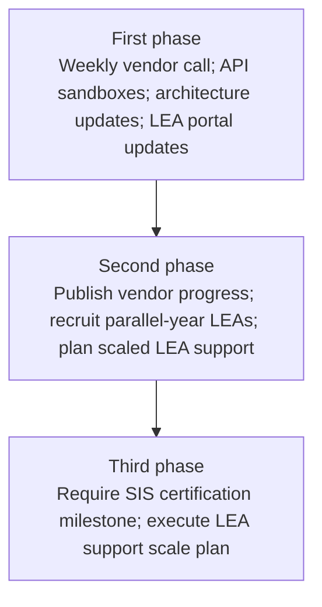

SEA goals: (1) Run a live pilot with 10–20 LEAs, (2) Develop initial vendor Ed-Fi capability,
(3) Plan for the Parallel Stage.

During this phase, development teams begin updating dependent systems: validations, ETL/ELT to
the data warehouse, and LEA reporting interfaces. Live data during a pilot dramatically
accelerates development team progress.

### Parallel Phase (12 Months)

Stakeholder activities during the parallel year:

- _SEA_ — Running data collections with 20–30% of LEAs; benchmarking new against current
  system outcomes
- _LEAs_ — 20–30% of LEAs actively submitting data; all LEAs attending trainings and taking
  local readiness actions
- _Vendors_ — Working to support the final data specifications
- _ESAs (Data Hub)_ — Launching initial data services; collecting initial revenue from LEAs;
  developing new data services

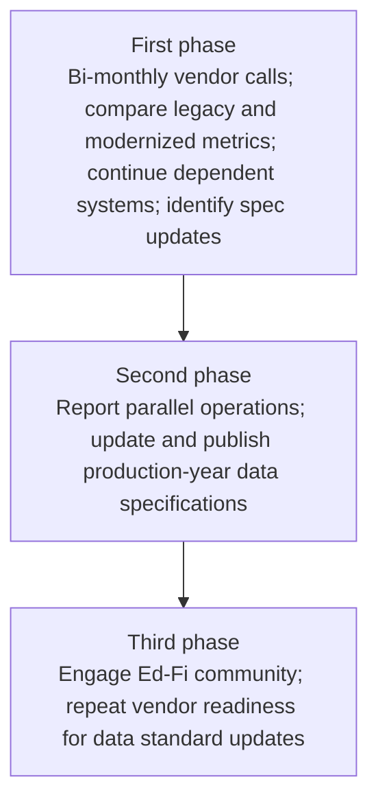

SEA goals: (1) Run parallel collections with 20–30% of LEAs to validate at scale, (2) Prepare
dependent systems for production, (3) Update data specifications for the production year,
(4) Invest in statewide LEA readiness.

### Production Phase (Ongoing)

Stakeholder activities in production:

- _SEA_ — Turn off the legacy system; establish an annual cadence for data specification
  updates; expand scope of modernized data collections
- _LEAs_ — Allocate staff time freed up by reduced reporting burden to other valuable
  data-related tasks
- _Vendors_ — Continue working with the state on the annual cadence of specification updates
- _ESAs (Data Hub)_ — Expand scope of services, moving from operational services toward
  instructional support services

## Implementation Best Practices

### Technical Task Assignment

### Vendor Communication

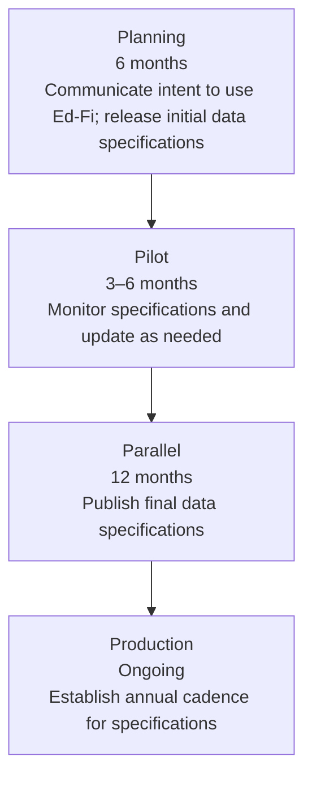

Lead time best practices from field work:

| Milestone | Lead Time |
| --------- | --------- |
| Inform vendors of decision to use Ed-Fi and share a public project timeline | 6 months before pilot begins |
| Share initial data specifications | 3 months before pilot go-live |
| Publish data specifications for the parallel year | 6 months before parallel go-live |
| All future specification updates | 6 months before go-live |

**Six Keys to Vendor Readiness:**

1. Provide a clear point of contact (person/email) for all SEA–vendor communications
2. Create weekly one-hour calls open to the vendor community for project updates and Q&A
3. Provide vendors public API sandboxes and other critical resources needed to build integrations
4. Create a public view of vendor readiness and progress during the pilot and parallel year
5. Provide vendors the Ed-Fi Alliance guidance on building API support and common error codes
6. Involve vendors in data specifications review before the specs go live — vendors will have
   feedback that improves data quality and reduces burden on both sides

See [Best Practices for Coordinating with Technology Providers](./project-planning/best-practices-for-coordinating-with-technology-providers.md).

### LEA Communication

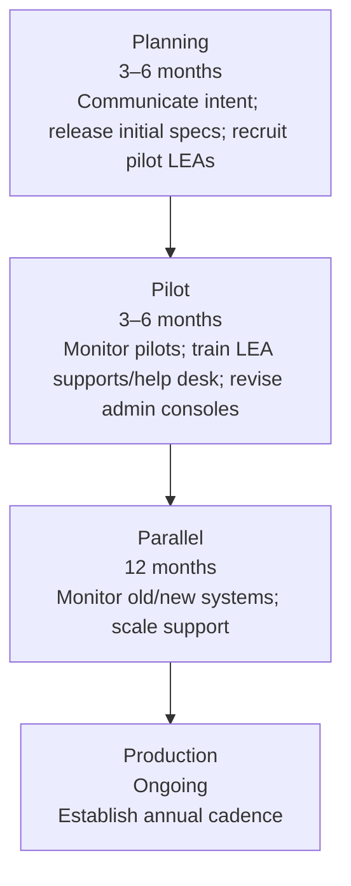

**Four Keys to LEA Readiness:**

1. Enlist organizations or groups that currently support state reporting or SIS operations
   (ESAs, SIS user groups, hand-picked districts)
2. Consolidate all Ed-Fi state reporting documentation into a single, easy-to-navigate website
   including links to vendor "how to" information
3. With LEA permission, provide access to API errors and performance data to allow LEAs to
   participate in the continuous improvement process
4. Publish guidance on API error codes and messages (same guidance as published for vendors)

See [LEA Support - Turning on the LEA Data and Avoiding the "Error Flood"](./support-plan/lea-support-turning-on-the-lea-data-and-avoiding-the-error-flood.md).

### State Data Portal

Allowing LEAs to see the data they publish to the state reduces support burden. SEAs should
publish data back to LEAs via a data portal.

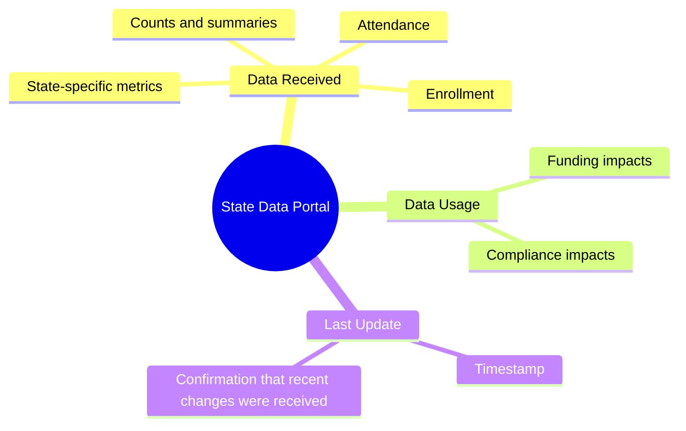

Critical portal components:

- _Data Received_ — summary of data received, including counts for key areas (attendance,
  enrollment, other state-specified metrics)
- _Data Usage_ — how the data will be used by the state: what are the impacts on funding or
  compliance?
- _Last Update_ — when the data was last updated so LEAs know if their most recent changes
  were received

See [Recommended SEA Process Changes for API-based Data Collection](./project-planning/recommended-sea-process-changes-for-api-based-data-collection.md).
