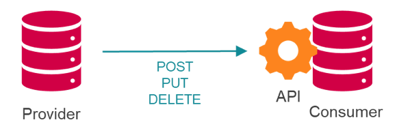

# Ed-Fi Domain API for Data Standard v5 Certification

Certification Name: Ed-Fi Assessment Outcomes API for Suite 3 \
Standards Referenced:\
   [Ed-Fi API Design & Implementation Guidelines    v3.1](https://edfi.atlassian.net/wiki/spaces/EFAPIGUIDE/overview)\
Technical
Suite: Suite 3\
Obsoletes: – \
Obsoleted By: – \
Status: Active

Certifying Organization: Ed-Fi Alliance \
Contact: [certification@ed-fi.org](mailto:certification@ed-fi.org) \
Publication Date: July 20, 2023 \
Certification Version: 1.0 \
Last Revision Date: –

## Overview and Purpose

The Ed-Fi Domain API for Suite 3 Certification verifies that a source system
(the provider) can manage a core set of domain data on a target system (the
consumer) using the RESTful APIs.

In this data exchange architecture, the provider implements an API client which
uses HTTP/S requests and RESTful patterns to manage API resources on the
consumer system, which implements the API definition itself (see Figure 1).

**Figure 1.** Conceptual data exchange architecture

The certification further aggregates normative requirements that have been found
by the Ed-Fi community to be critical to "real world" data exchange and
interoperability. These include requirements around error handling and recovery,
roster configurability, and others.

This conformance specification covers the provider certification *–* that is,
the responsibilities of the *API* *client* implementer and not the *API*
*consumer*. Given market demand, the Alliance will publish a consumer
conformance specification as well.  This certification is for data provider's
that can offer domain integration outside of what is covered in the Assessment
Outcomes certification and the Student Information System (SIS) certifications.
A domain certification will not be awarded to any domain already covered in the
other certifications.  It is possible for achieve this certification in addition
to another certification.  For example, a Student Information System (SIS) may
also receive a certification for HR or Finance domains.

## Overview of Requirements

This section provides an overview only; detailed, step-by-step requirements are
available in
the [Domain API Certification for Data Standard v5 - Steps](./certification-steps.md).

### Required Fields on API Resources

API domain certification tests only cover the domains and elements that are
specific expectations of the vendor's application to fulfill.  The certification
tests are scoped by the reasonable coverage of the Ed-Fi API that pertains to
the product's primary function and should provide a complete picture of the
product's operation.  Certification tests do not reflect the entire surface of
Ed-Fi's data standard.  Full visibility to the data standard can be found using
the following resources:

[https://api.ed-fi.org/](https://api.ed-fi.org/)

[Data Standard 5 handbook](https://schema.ed-fi.org/datahandbook-v500pre2/#/)

### Student ID Configuration

If the product uses a rostering standard or a similar de facto industry roster
specification (such as the Clever roster), and that standard contains multiple
possible student IDs, the certifying product MUST demonstrate the ability to
allow a user of the product to configure which student identifier to be used
within transactions for an education agency (configurability can be more
granular than education agency-level, but this level is the minimum required).

Such a capability has proven important in field work to date; for example, some
districts may align on state identifiers for various reasons (e.g., as they are
part of school district collaboratives) or use "student numbers" on occasion.

If the product uses multiple roster standards, it is only required to
demonstrate this capability with one standard.

### Operations

The provider MUST demonstrate the ability to perform create, update and delete
operations on API resources. For update, HTTP POST or PUT are both accepted.

### Error Handling

In field work, the ability to capture, display errors, and offer facilities to
re-try after error conditions are found, have proven to be essential to
interoperability. The certification testing ensures a basic level of such
functionality is in place.
