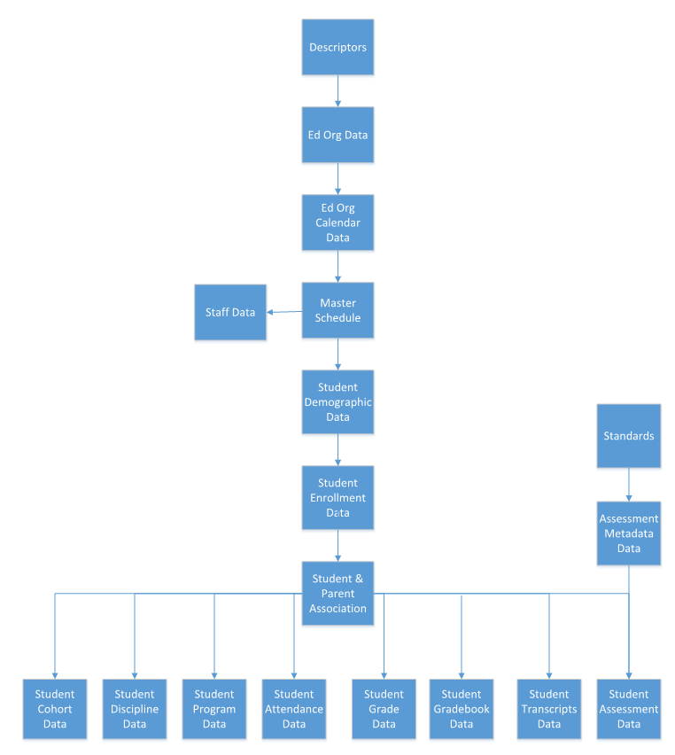

# Student Information Systems API v5 Certification - Test Scenarios

## Test Scenarios

### Local Descriptor Guidance

The Alliance recommendation is to source descriptor values from the list
governed by the project’s reporting context and place them in a namespace that
accurately captures that governing organization. Descriptor values shown in the
certification’s test scenarios use the Ed-Fi namespace for informational
purposes. Descriptor namespace should clearly indicate the organization that
governs the value.

### Transactional Test Cases

The certifying product is required to demonstrate the ability to perform all of
the test cases for API resources listed below under **Required API Resources.**

"Transactionally" means that API resource transactions / synchronization MUST
occur as changes are made during normal product usage. It is acceptable for
product to batch updates, but such batches MUST occur such that changes are
near-real time. See [Requirements - Testing
Requirements](../../../certification-for-data-providers/requirements-testing-requirements.md) for
more information.

### Batch Test Cases

Batch testing is intended to validate the ability of a system to perform an
initial synchronization with the API, rather than perform transactional
management. In field work, it is common for an agency or vendor to implement an
API surface during the school year when a lot of data already exists in the
system, and SIS systems must then synchronize existing data. This test validates
a product's ability to perform such an operation.

The system must demonstrate the ability to synchronize the state of the system
as a batch operation, by using the API resources in the chart below. The batch
test only tests the creation of API resources, and does not include update or
delete operations.

### Error Handling

The API client MUST be able to perform the following actions:

- Capture and log transport errors, including all applicable HTTP errors.

- Demonstrate the capability for re-delivery of API resources updates
    following failed transmissions. This re-delivery does not have to be
    immediate and it can require user intervention (e.g., surface an error to a
    user and ask the user if they want to retry).

- In the event that repeated delivery fails for the same resource update,
    surface error reports to a system user.

Field work within the Ed-Fi community has revealed that this application
behavior is a necessary condition of system interoperability.

Accordingly, the test scenarios may include situations in which an API resource
(or resources) will be made unavailable to the client, or in which the API
reports other errors due to resource availability (e.g., HTTP 500 error). The
client is expected to be able to handle successfully such situations.

### Enumeration Configuration

The API client MUST demonstrate the ability to download descriptors from the API
and allow mapping of local enumeration values (code sets) to those descriptors.
This capability MUST exist in order to allow a API host to customize code
sets/values, and it MUST exist for all descriptors included across all resources
in the API.

## Required API Resources

For each API resource field, the test cases and the required/optional status of
each field is provided in a tabular form, along with the sample data to be used
in testing. Use of the sample data is RECOMMENDED; other data MAY be used, but
the data MUST NOT be real or even derived from real data.

For each API resource element, the requirement status is marked as follows:

- **REQUIRED**: the element must be supplied. Note that the [Requirements -
    Testing
    Requirements](../../../certification-for-data-providers/requirements-testing-requirements.md)
    lists permitted workarounds for many cases where the element may be missing
    in the source system.

- **CONDITIONAL**: the element is required IF AND ONLY IF a standard
    installation of the product has this element. Providers not providing these
    elements will be required to submit proof that these elements are not
    present by default in their systems.

- **OPTIONAL**: these elements are optional.

Note that for some test cases additional data requirements are listed. This is
the case (for example) in some places where there are multiple common ways that
the same data concept is modeled.

| **Ed-Fi ODS / API Resource** | **Operations** |
| --- | --- |
| [School](./school-scenarios.md) | Create, Update |
| [Course](./course-scenarios.md) | Create, Update |
| [Program](./program-scenarios.md) | Create, Delete |
| [ClassPeriod](./class-period-scenarios.md) | Create, Update |
| [Location](./location-scenarios.md) | Create, Update |
| [Calendar](./calendar-scenarios.md) | Create, Update |
| [CalendarDate](./calendardate-scenarios.md) | Create, Update |
| [BellSchedule](./bellschedule-scenarios.md) | Create, Update |
| [GradingPeriod](./grading-period-scenarios.md) | Create, Update |
| [Session](./session-scenarios.md) | Create, Update |
| [Course Offering](./courseoffering-scenarios.md) | Create, Update |
| [Section](./section-scenarios.md) | Create, Update |
| [Staff](./staff-scenarios.md) | Create, Update |
| [StaffEducationOrganizationAssignmentAssociation](./staff-education-organization-assignment-association-scenarios.md) | Create, Update |
| [StaffSchoolAssociation](./staff-school-association-scenarios.md) | Create, Delete |
| [StaffSectionAssociation](./staff-section-association-scenarios.md) | Create, Update, Delete |
| [Student](./student-scenarios.md)\*\* | Create, Update |
| [GraduationPlan](./graduation-plan-scenarios.md) | Create, Update |
| [StudentSchoolAssociation](./student-school-association-scenarios.md) | Create, Update, Delete |
| [StudentEducationOrganizationAssociation](./student-ed-org-association-scenarios.md) | Create, Update |
| [StudentSectionAssociation](./student-section-association-scenarios.md) | Create, Update, Delete |
| [Parent](./contact-scenarios.md) | Create, Update |
| [StudentParentAssociation](./student-contact-association-scenarios.md) | Create, Update |
| [Cohort](./cohort-scenarios.md) | Create, Update |
| [StaffCohortAssociation](./staff-cohort-association-scenarios.md) | Create, Update, Delete |
| [StudentCohortAssociation](./student-cohort-association-scenarios.md) | Create, Update |
| [DisciplineIncident](./disciplineincident-scenarios.md) | Create, Update |
| [StudentDisciplineIncidentAssociation](#) | Create, Delete |
| [DisciplineAction](./disciplineaction-scenarios.md) | Create, Update, Delete |
| [StudentProgramAssociation](./student-program-association-scenarios.md) | Create, Update, Delete |
| [StudentCTEProgramAssociation](./student-cte-program-association-scenarios.md) | Create, Update |
| [StudentHomelessProgramAssociation](./student-homeless-program-association-scenarios.md) | Create, Update |
| [StudentLanguageInstructionProgramAssociation](./student-language-instruction-program-association-scenarios.md) | Create, Update |
| [StudentMigrantProgramAssociations](./student-migrant-program-association-scenarios.md) | Create, Update |
| [StudentNeglectedOrDelinquentProgramAssociations](./student-neglected-or-delinquent-program-association-scenarios.md) | Create, Update |
| [studentSchoolFoodServiceProgramAssociations](./student-school-food-services-program-association-scenarios.md) | Create, Update |
| [StudentSpecialEducationProgramAssociation](./student-special-education-program-association-scenarios.md) | Create, Update |
| [StudentTitleIPartAProgramAssociation](./student-titlei-parta-program-association-scenarios.md) | Create, Update |
| [StudentSchoolAttendanceEvent](./studentschool-attendance-event-scenarios.md) | Create, Update, Delete |
| [StudentSectionAttendanceEvent](./student-section-attendance-event-scenarios.md) | Create, Update, Delete |
| [Grade](./grade-scenarios.md) | Create, Update, Delete |
| [CourseTranscript](./coursetranscript-scenarios.md) | Create, Update |
| [StudentAcademicRecord](./student-academic-record-scenarios.md) | Create, Update |

\*\* A Student must be associated with a School via StudentSchoolAssociation
before a student record may be updated.

*Ed-Fi API Dependency Graph*
