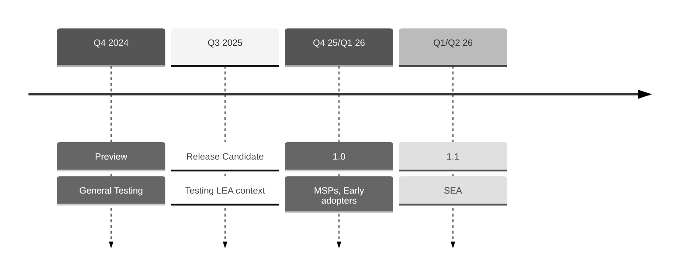

# Ed-Fi ODS/API and Data Management Service FAQ

The Ed-Fi Alliance is actively developing the
[Ed-Fi Data Management Service](https://github.com/Ed-Fi-Alliance-OSS/Data-Management-Service)
(DMS) to enhance data integration and management capabilities for educational
agencies. Designed to be robust and flexible, the DMS will address the evolving
needs of the Ed-Fi community. The Ed-Fi Alliance plans to fully replace the
current ODS/API Platform with the DMS by the 2029-2030 school year. In the
meantime, the Alliance remains committed to supporting the ODS/API Platform
through the 2028-2029 school year.

## Roadmap

### Q: What does the future look like for the legacy ODS/API Platform?

The Ed-Fi Alliance plans to continue support for the ODS/API Platform through
school year 2028-2029. In the table below, the label "patch" means that the
Ed-Fi Alliance will periodically release updates covering vulnerabilities,
urgent bugs, and dependency updates. The label "active" means that the Alliance
may add additional features.

<table align="center" width="80%">
  <thead>
    <tr>
      <th>Application</th>
      <th>'24-'25</th>
      <th>'25-'26</th>
      <th>'26-'27</th>
      <th>'27-'28</th>
      <th>'28-'29</th>
      <th>'29-'30</th>
    </tr>
  </thead>
  <tbody>
    <tr>
      <td>ODS/API 5.4</td>
      <td style={{ backgroundColor: 'var(--ifm-color-info-lightest)' }}>
        patch
      </td>
      <td colSpan={5}>&nbsp;</td>
    </tr>
    <tr>
      <td>ODS/API 6.2</td>
      <td
        colSpan={2}
        style={{ backgroundColor: 'var(--ifm-color-info-lightest)' }}
      >
        patch
      </td>
      <td colSpan={4}>&nbsp;</td>
    </tr>
    <tr>
      <td>ODS/API 7.3</td>
      <td
        colSpan={5}
        style={{ backgroundColor: 'var(--ifm-color-info-lightest)' }}
      >
        patch
      </td>
      <td>&nbsp;</td>
    </tr>
    <tr>
      <td>DMS 1.x</td>
      <td>&nbsp;</td>
      <td style={{ backgroundColor: 'var(--ifm-color-warning-lightest)' }}>
        testing
      </td>
      <td
        colSpan={4}
        style={{ backgroundColor: 'var(--ifm-color-info-lightest)' }}
      >
        active
      </td>
    </tr>
  </tbody>
</table>

As shown in the table above:

- ODS/API 5.4, released in summer 2024, will be supported for the school year
  2024-2025. The 5.x series was first released in 2020, for the 2021-2022 school
  year. It implements Data Standard 3 (current: 3.3).
- ODS/API 6.2, released in February 2024, implements Data Standard 4.0. No
  further feature enhancements are planned. It will be supported in production
  at least through the 2025-2026 school year;
- ODS/API 7.3.x will continue to receive annual feature enhancements (and bug
  fixes) for the next several years, including an update to .NET 10 in 2026.
  This version supports Data Standard versions 4 and 5, and will support Data
  Standard version 6. It will be fully supported at least through school year
  2028-2029.

### Q: When will the Data Management Service be available?

Goal timeline:

1. _Release candidate_ in summer 2025, with enough features to satisfy a typical
   deployment for a Local Education Agency. :exclamation:Only recommended for
   those who are engaged with the Project Tanager Technical Workgroup.
2. _Release 1.0_ Q4 of 2025 or Q1 of 2026, available for pilot / parallel usage
   in school year 2026-2027.

The first release candidate will be fully-compatible with the _must have_
requirements described in the
[Ed-Fi API Design and Implementation Guidelines, 4.0](../1-data-exchange/api-guidelines/readme.md).
The _release 1.0_ will expand further into the _should have_ and _optional_
requirements and features. State Education Agencies (SEA) frequently have more
detailed technical requirements for client authorization and for access to raw
data for warehousing and reporting. Tentatively, those features will be given a
longer timeline; this will provide more opportunity for co-development with the
SEA community. The SEA-oriented release 1.1 should be available for production
use in the 2027-2028 school year.

The 1.0 release will not have complete parity with the optional features in the
ODS/API Platform (see note below). The Project Tanager Technical Workgroup
and/or Technical Advisory Group (TAG) will help guide prioritization of
features.

:::note

An example of an ODS/API feature that is _not_ planned for the Data Management
Service: `link` elements in the `xyzReference` sections when retrieving a
resource with a `GET` request. See
[Deprecation of Links](../1-data-exchange/api-guidelines/design-and-implementation-guidelines/api-design-guidelines/rest-api-conventions/get-requests.md#deprecation-of-links)
for more information.

:::

## Technical Integrations

## Q: Will integrations built for the ODS/API continue to work with the new system?

The Data Management Service will be a fully compatible Ed-Fi API implementation.
Client applications that interact with the REST API will continue to work\*.

The backend data store will be very different from the ODS/API. Existing
database integrations will not be able to work directly with the core set of
database tables. The application will introduce new integration capabilities,
such as the use of streaming events in Kafka. However, we recognize that many
existing Ed-Fi installations have critical reporting and analytics systems that
currently integrate directly with the ODS database. We are committed to working
with the community to create a pathway that allows agencies to leverage their
existing data integrations.

:::note

The base URLs will be different in the Data Management Service compared to the
ODS/API. The differences between the two can easily be bridged if needed by
changing client code to query the root endpoint (Discovery API), or with special
redirection rules in an API Gateway application sitting in front of the Data
Management Service.

:::

## Q: Will integrations built for the Admin API continue to work with the new system?

Yes &mdash; if referring to the Management API
[specification](https://github.com/Ed-Fi-Alliance-OSS/Ed-Fi-API-Standards/blob/main/api-specifications/admin-api/admin-api-2.2.0.yaml).
No &mdash; if referring to the specific software application called "Admin API".
The Data Management Service will have a different database system than the
ODS/API, including restructuring of the data currently housed in the
`EdFi_Admin` and `EdFi_Security` databases. The project will introduce a new
application, called the DMS Configuration Service. The plan is to implement the
Management API specification (version 2), so that applications and scripts
developed on this specification can interact seamlessly either with the platform
of today or of tomorrow.

## Process

### Q: How can I / my team prepare for the upgrade

Start by identifying all direct ODS, Admin, and Security database integrations
in your environment:

- ETLs that extract from a metadata catalog and load into the ODS.
  - Replace with direct calls to the Ed-Fi API.
- ETLs that extract from the ODS and load into a data warehouse.
  - Replace with direct calls to the Ed-Fi API, using Change Queries.
- Data Validation procedures that run directly on ODS.
  - Replace with validation off of a data mart of data warehouse.
- Client credential management directly in the Admin database.
  - Deploy Admin API and replace with calls with calls to its implementation of
    the Ed-Fi Management API, which will be implemented in the Data Management
    Service.

Some of the functions may still work in the Data Management Service, depending
on the final data storage design, but direct database integration is
discouraged. Whenever possible, use the REST API to load or extract data. Doing
so both prepares you for the Data Management Service and helps you ensure data
integrity and security.

You can work with your Ed-Fi liaison to build a plan for transitioning ahead of
the 2028-2029 school year.

### Q: How can I / my team get involved?

The Ed-Fi Alliance is running a technical workgroup that will meet regularly
until the 1.0 release, helping with prioritization, review, and testing of the
software.

Anyone wishing to contribute at the level of design or application code level is
invited to review the
[Project Tanager design repository](https://github.com/Ed-Fi-Alliance-OSS/Project-Tanager)
to understand current and upcoming work. Please see
[How to Contribute](https://github.com/Ed-Fi-Alliance-OSS/Project-Tanager/CONTRIBUTING.md)
for more information.

## Technical Design

### Q: How does the Data Management Service enforce data integrity?

All data storage designs in the Data Management Service will be based on
ACID-level transactions, ensuring that data operations are processed reliably
and maintain data integrity. All data will be stored in a relational database
(PostgreSQL or Microsoft SQL Server), and referential integrity is enforced
through the use of foreign keys.

This is different than the earlier experimentation in "Project Meadowlark",
which used MongoDB as the storage engine. The Data Management Service will not
use a NoSQL database for the core data store. Instead, it will use a relational
database to ensure that data integrity is maintained, and that the data model is
consistent with the Ed-Fi Data Standard.

### Q: Can I run the system without Kafka and OpenSearch?

Yes, the Data Management Service can run without Kafka and OpenSearch. In the
release candidate (July 2025), the PostgreSQL-only mode is not well optimized
and not recommended for high performance settings. The development team
continues to work on improving the performance of the "RDBMS-only" mode, and it
is expected that by the end of Q1 2026, it will be a viable option for many use
cases.

### Q: When will Microsoft SQL Server be supported?

The release candidate (July 2025) will supports PostgreSQL as the primary data
store, and Microsoft SQL Server will be added as an alternative data store in
the 1.0 release (Q4 2025 or Q1 2026). This will allow agencies to use their
existing SQL Server infrastructure to run the Data Management Service.

### Q: You promised a compatibility layer. When will it be available?

Please stay tuned for more information on the compatibility layer, as it is
still under design. The goal is to provide a way for existing ODS-databases to
migrate to the new Data Management Service with minimal disruption, for example
by having tables or views that nearly match those defined in the ODS database.
