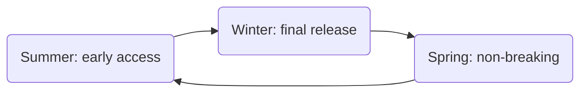

# Ed-Fi Data And API Standard Release Cadence

## Overview

This document explains general principles that the Ed-Fi Alliance follows in
planning its software releases. It is intended to help community members
understand assumptions and expectations with regards to upgrade and management
of their Ed-Fi-based infrastructure.

The Alliance may deviate from this plan if unforeseen needs or other conditions
arise, and any changes affecting specific products will be included in the
[Ed-Fi Technology Roadmap](./roadmap.mdx).

:::tip

Each release of a Data Standard is implicitly a release of a new API Standard,
which is represented through an Open API specification. References to "Data
Standard" below also imply release of the API Standard, which exists apart from
a specific implementation. As of 2023, the Alliance has decoupled the Data and
API Standards from the ODS/API application versioning. This document refers to
the support of a given Data Standard / API Standard major version.

:::

## Goals of this Pattern

The goals of this release cadence are to balance change with stability:

* **Allow the Data Standard and API to evolve over time**. In particular, the
  plan seeks to avoid large breaks that could be disruptive to the ecosystem.
* **Maximize stability for adopters of the standards and of the Ed-Fi
  platform.** This was generally seen as limiting the requirement to take
  breaking changes and/or create multiple years of stability on major versions,
  and to not force changes during the school year.
* **Minimize the support burden on vendors.** The cadence provides a template
  that &mdash; with support of the community &mdash; can limit vendor support to
  2 major API / Data Standard versions.
* **Allow agencies and vendors to plan and budget for significant changes.**

## Versioning

The Alliance uses [semantic versioning](https://www.semver.org) for assigning
version numbers for its software releases. For more information, see [Ed-Fi
Software
Versioning](/community/sdlc/code-contribution-guidelines/software-versioning).

:::tip

A "major" release may contain "breaking changes" that are not backwards
compatible with prior versions.

:::

## Roadmap

The Alliance publishes its roadmap at [Ed-Fi Technology Roadmap](./roadmap.mdx).
Organizations using Ed-Fi software products are advised to follow the roadmap
and look for changes. The roadmap will describe important updates, such as
product release dates and major feature sets, product end-of-life, or school
year targeting (i.e., notes indicating assumptions as to when the community will
deploy target releases in production).

## Key Notes on the Cadence

The cadence is shown below as a chronological diagram.

* Major Data Standard versions are supported for four school years.
* Major Data Standard releases will occur on alternating years.
* Consequence: there will be two years of overlapping support for major
  versions.
* Between major releases, there may still be a minor releases to provide
  non-breaking changes to a supported major version.
* The release cadence assumes that users will maintain the same major version of
  the Data Standard throughout the whole school year. This follows the general
  cadence for systems upgrades at education agencies, where major changes are
  generally made between school years. Note this does not mean that all upgrade
  work is undertaken during the summer, only that major data standard changes to
  users are typically presented to users at a school year boundary.
* The Ed-Fi Alliance will attempt to confine major version changes to the Data
  Standard to particular areas or domains of the standard. By limiting changes
  to fewer domains in each major version, the plan supports heathy evolution of
  Data Standard and API and provides predictability for education agencies,
  platform hosts and vendors to plan their roadmaps.
* Bug fixes and minor data standard releases will generally be delivered via the
  latest ODS / API release vehicle.
* The Alliance will target a Summer release for early access versions (versions
  for feedback) and Fall/Winter for versions intended for deployment at the
  following school year (see section below on "Calendar pattern").

:::tip

Colloquially, we refer to this as the "break-rest-break-rest" release pattern.

:::

## More on Support Policy

The cornerstone of the release strategy is to support each major release for
four school years from the initial target school year. During this period, minor
non-breaking Data Standard improvements and bug fixes may be provided to active
major releases. Triage and initial investigation support is provided for all
active versions during support period.

To the extent possible, security fixes may be provided for older minor releases,
but such fixes and patch fixes may only be provided only to the latest minor
releases of active major release, and agencies needing these fixes will be asked
to update to a later minor point version. We recommend that all implementations
run the latest available minor release for a major version.

## Decoupling Data Standard and Platform Releases

To support more frequent evolution of Ed-Fi Data Standard and the Ed-Fi ODS/API
Platform and to support the longer support window, API Platform versions are
decoupled from Data Standard and API versions, allowing the API Platform to
seamlessly work with different Data Standard and API versions. This allows
implementations to receive technology updates more frequently without upgrading
to a major Data Standard version during the school year. It also allows the
Alliance to deliver minor Data Standard updates with the most current
technology. (i.e. Ed-Fi ODS / API v7.x may be used to deliver minor data
standard update to data standard version v4.x as well as v5.x)

## What Constitutes a Breaking Data Standard / API Change?

Please consult [Ed-Fi Data Standard Versioning and
Releases](/docs/reference/1-data-exchange/versioning-and-releases.md)

## General Calendar Pattern for Releases

The following diagram shows the historical cadence. In the break-rest-break
paradigm, the "winter" release would contain non-breaking changes only. Please
consult the roadmap for specific information about releases.

* **Summer - Early access release(s)**: releases that highlight new features
  intended to support a future school year, i.e. a major version release in July
  2023 would typically be targeting the 2024-25 school year.
* **Winter - Final release**: indended for deployment in the following school
  year, i.e. a major release in November 2023 would be targeting the 2024-25
  school year.
* **Spring - Non-breaking**: improvements to the releases intended for hte
  following school year. Users should consult the roadmap to understand if these
  improvements provide value and/or if the release should be picked up.

:::note

In 2025, the Alliance will experiment with early release of the _specification_
for Data Standard 6 without production-ready _implementation_, giving the community
more time for feedback on the changes.

:::

## Upgrade Recommendations

The community is encouraged to upgrade to the API Platform version that delivers
the latest major Data Standard version at the beginning of the school year. If
that is not a possibility, implementations should upgrade to platform version
that delivers the latest minor release of the currently deployed major version.
Minor data standard version upgrades are intended to be non-breaking to vendors,
so they can also be applied during the school year even if the platform release
vehicle for it has a different major version than currently deployed platform.
In such a case, agencies are still advised to look closely at the change log to
detect possible issues.
