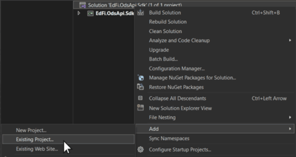
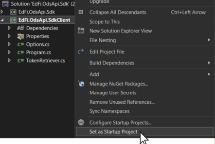
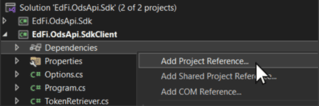
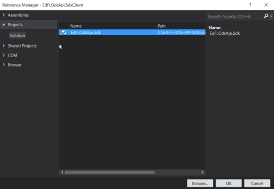
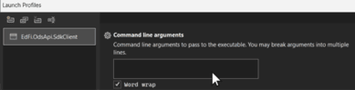
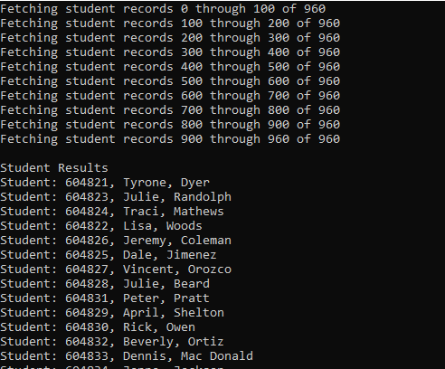

# Using Code Generation to Create an SDK

This section outlines how to use code generation to create an Ed-Fi ODS / API
Client SDK using a Windows environment targeting C#.

:::warning

ODS / API v7.2 metadata endpoints return documents adhering to the OpenApi
v3.0.1 specification by default. A client can request OpenApi v2.0 metadata
documents using the **query string parameter** `**version=2**`. OpenApi CodeGen
can consume metadata in either version and generate the SDK. e.g.
[https://api.ed-fi.org/v7.2/api/metadata/data/v3/swagger.json?version=2](https://api.ed-fi.org/v7.2/api/metadata/data/v3/swagger.json?version=3)
for OpenApi v2.0
[https://api.ed-fi.org/v7.2/api/metadata/data/v3/swagger.json?version=3](https://api.ed-fi.org/v7.2/api/metadata/data/v3/swagger.json?version=3)
or
[https://api.ed-fi.org/v7.2/api/metadata/data/v3/swagger.json](https://api.ed-fi.org/v7.2/api/metadata/data/v3/swagger.json)
for OpenApi v3.0

:::

The high-level steps are:

- [Using Code Generation to Create an SDK](#using-code-generation-to-create-an-sdk)
  - [Step 1. Install Latest Version of Java](#step-1-install-latest-version-of-java)
  - [Step 2. Download the OpenApi Codegen JAR File](#step-2-download-the-openapi-codegen-jar-file)
  - [Step 3. Generate the SDK Source Files](#step-3-generate-the-sdk-source-files)
    - [Resources, Descriptors and Extensions](#resources-descriptors-and-extensions)
    - [Ed-Fi Core Resources and Descriptors](#ed-fi-core-resources-and-descriptors)
  - [Step 4. Use the SDK in a Sample C# Program](#step-4-use-the-sdk-in-a-sample-c-program)

Each step is outlined in detail below.

## Step 1. Install Latest Version of Java

If you don't already have Java installed, navigate
to [https://www.oracle.com/java/technologies/downloads/](https://www.oracle.com/java/technologies/downloads/) and
download the latest installer (Java v11 or later) and run it. In case you're
wondering: the code generation leverages Java, but it does output C# code.

## Step 2. Download the OpenApi Codegen JAR File

Download the latest version of the OpenApi Codegen JAR 7.2.0. Windows users can
use Invoke-WebRequest in PowerShell 3.0+.

```powershell
Invoke-WebRequest -OutFile openApi-codegen-cli.jar https://repo1.maven.org/maven2/org/openapitools/openapi-generator-cli/7.2.0/openapi-generator-cli-7.2.0.jar
```

For more information and download options visit
[https://github.com/OpenAPITools/openapi-generator](https://github.com/OpenAPITools/openapi-generator).

:::info

When generating an SDK using the OpenApi CodeGen resources in a
language other than C# or Java and there are profiles defined in the OpenAPI
specification file, be sure to verify that the proper contentTypes were
created during the code generation.

:::

## Step 3. Generate the SDK Source Files

The SDK source files are generated using Swagger metadata via a few simple
PowerShell commands. You can see the available metadata endpoints for SDK
generation
at [https://api.ed-fi.org/v7.2/api/metadata?sdk=true](https://api.ed-fi.org/v7.2/api/metadata?sdk=true).

```bash
java -jar <openapi-generator-jar-path> generate -g csharp -i <swagger-json-url> --additional-properties targetFramework=net8.0,netCoreProjectFile=true --skip-validate-spec
```

A detailed description of the switch options can be found
at [https://github.com/OpenAPITools/openapi-generator](https://github.com/OpenAPITools/openapi-generator).

To generate SDK source files, navigate to the folder containing
openapi-codegen-cli.jar and run the following commands in PowerShell 3.0+ to
generate C# SDK source files. You can use the unified SDK generation endpoints
to combine resources, descriptors, and extensions under one namespace/directory
in the generated SDK.

### Resources, Descriptors and Extensions

```bash
java -jar openApi-codegen-cli.jar generate -g csharp -i https://api.ed-fi.org/v7.2/api/metadata/data/v3/swagger.json --api-package Apis.All --model-package Models.All -o ./csharp --additional-properties packageName=EdFi.OdsApi.Sdk,targetFramework=net8.0,netCoreProjectFile=true --global-property modelTests=false --global-property apiTests=false --skip-validate-spec
```

### Ed-Fi Core Resources and Descriptors

```bash
java -jar openApi-codegen-cli.jar generate -g csharp -i https://api.ed-fi.org/v7.2/api/metadata/data/v3/ed-fi/swagger.json --api-package Apis.All --model-package Models.All -o ./csharp --additional-properties packageName=EdFi.OdsApi.Sdk,targetFramework=net8.0,netCoreProjectFile=true --global-property modelTests=false --global-property apiTests=false --skip-validate-spec
```

Alternatively, you can generate SDK with segregated namespaces for resources,
descriptors, enrollment composites, and Identity API endpoints as follows:

```bash
java -jar openApi-codegen-cli.jar generate -g csharp -i https://api.ed-fi.org/v7.2/api/metadata/data/v3/resources/swagger.json --api-package Api.Resources --model-package Models.Resources  -o ./csharp --additional-properties packageName=EdFi.OdsApi.Sdk,targetFramework=net8.0,netCoreProjectFile=true --global-property modelTests=false --global-property apiTests=false --skip-validate-spec

java -jar openApi-codegen-cli.jar generate -g csharp -i https://api.ed-fi.org/v7.2/api/metadata/composites/v1/ed-fi/enrollment/swagger.json --api-package Api.EnrollmentComposites --model-package Models.EnrollmentComposites -o ./csharp --additional-properties packageName=EdFi.OdsApi.Sdk,targetFramework=net8.0,netCoreProjectFile=true --global-property modelTests=false --global-property apiTests=false --skip-validate-spec

java -jar openApi-codegen-cli.jar generate -g csharp -i https://api.ed-fi.org/v7.2/api/metadata/identity/v2/swagger.json --api-package Api.Identities --model-package Models.Identities -o ./csharp --additional-properties packageName=EdFi.OdsApi.Sdk,targetFramework=net8.0,netCoreProjectFile=true --global-property modelTests=false --global-property apiTests=false --skip-validate-spec

java -jar openApi-codegen-cli.jar generate -g csharp -i https://api.ed-fi.org/v7.2/api/metadata/data/v3/descriptors/swagger.json --api-package Api.Descriptors --model-package Models.Descriptors -o ./csharp --additional-properties packageName=EdFi.OdsApi.Sdk,targetFramework=net8.0,netCoreProjectFile=true --global-property modelTests=false --global-property apiTests=false --skip-validate-spec
```

Wait for the Swagger CodeGen to finish generating code. A Visual Studio Solution
named **EdFi.OdsApi.Sdk.sln** will be created with the SDK artifacts.

## Step 4. Use the SDK in a Sample C# Program

1. **Open** the generated EdFi.OdsApi.Sdk.sln in Visual Studio.
2. **Download** the sample Console Application project and place it in your
    solution directory. The download link is in the panel on the right.

3. In the **Solution Explorer,** **right-click** on the solution and add a
    reference to the sample project that you downloaded in the previous step.

    

4. **Right-click** on **Edfi.OdsApi.SdkClient** \> **Set as Startup Project**..
    

5. **Right-click EdFi.OdsApi.SdkClient Dependencies node** and click **Add
    Project Reference**.
    

6. In the **Add Reference** > **Projects** tab, select **EdFi.OdsApi.Sdk**, and
    then click **OK**.
    

7. **Right-click EdFi.OdsApi.SdkClient > Properties > Debug** \> **Open debug
    launch profiles UI** and set the command line arguments that will be used
    while debugging the application. Use the template below. For this example
    you can use our hosted sandbox environment; the URL, client key and secret
    are in the Downloads panel on the right.

    

    ```bash
    --url <ODS API Base URL> --key <client key> --secret <client secret>
    ```

8. Run the application and you should see the following results:
    

With that, you're done!

This exercise leveraged a publicly available instance of the API, which contains
the surface for a core implementation. If you're working with a specific
platform host, a great next step is to use these same techniques to generate an
SDK for that platform. If the platform host has extended the data model, your
new code will automatically include those structures in the data access
components in the generated code.

:::note

[Sample Console Application
project](https://github.com/Ed-Fi-Alliance-OSS/Ed-Fi-ODS-Implementation/tree/v7.2/Examples/Using%20the%20ODS%20API%20SDK).
**Sandbox environment** API base
URL: [https://api.ed-fi.org/v7.2/api/](https://api.ed-fi.org/v7.2/api/) Client
key: RvcohKz9zHI4 Client secret: E1iEFusaNf81xzCxwHfbolkC

:::
