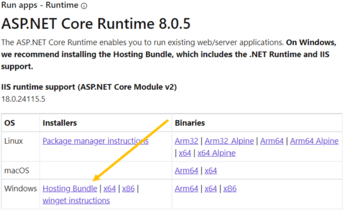

# Getting Started - Binary Installation

This section describes how to set up the Ed-Fi ODS / API v7.2 using the release
binaries listed in [Binary
Releases](./readme.md). This is a
recommend approach for implementations that have no requirement to extend or
customize the source code of the Ed-Fi ODS / API.

Before binary installation, install the prerequisites listed in the following
steps:

## Step 1. Install and Configure Windows Components

### Database Server

Ensure that the following components are installed:

* **PowerShell 5.0,7.2,7.3.** PowerShell is used by the database deployment
    scripts.

* **.NET 8.0 SDK.** Required by the [Database Deploy
    Tool](../../platform-dev-guide/utilities/database-deploy-tool.md)
    used in the database deployment scripts.

    <details>
      <summary>View detail...</summary>

    **PowerShell 5.0**

    Verify that PowerShell 5.0 or above is installed:

    1. Press the **Windows key** 

         on your keyboard, type **PowerShell**, select **Windows PowerShell**,
         and press **Enter**.

    2. Type **$PSVersionTable.PSVersion**, and press **Enter**.

        

    3. If the required version is not installed, download [Windows Management
        Framework
        5.0](https://www.microsoft.com/en-us/download/details.aspx?id=50395), which
        includes PowerShell 5.0.

    **.NET 8.0 SDK**

    Download and install the latest release of the [.NET 8.0
    SDK](https://dotnet.microsoft.com/en-us/download/dotnet/8.0)

    
    </details>

### Web Server

Ensure that the following components are installed:

* **Internet Information Services.** IIS is the web server that will run the
    ODS / API.

* **.NET 8.0 Hosting Bundle.** The .NET 8.0 Hosting Bundle is required for
    running the API on IIS. Must be installed after IIS.

    <details>
      <summary>View detail...</summary>

    **Internet Information Services**

    1. Press the **Windows key** 

         on your keyboard, type "features", select **Turn Windows features on or
         off**, press **Enter**.

    2. Check the box next to Internet Information Services. The default
        selections will be good for most cases.

    3. Click **OK**.

    

    **.NET 8.0 Hosting Bundle**

    Download and install [.NET Hosting Bundle
    8.0](https://dotnet.microsoft.com/en-us/download/dotnet/8.0).

    

    </details>

## Step 2. Install and Configure Required Software

Ensure that the following software is installed and configured on the database
server:

* **Microsoft SQL Server 2019.** Microsoft SQL Server is used to store the
    data for the Ed-Fi ODS / API. Standard, Developer, or Enterprise Editions
    are supported.
* Alternative PostgreSQL datastore: **PostgreSQL 13.x.** can be used as the
    datastore for Ed-Fi ODS / API instance instead of Microsoft SQL Server.
  * **[Microsoft Visual C++ 2015
        Redistributable](https://www.microsoft.com/en-us/download/details.aspx?id=52685).**
        Required by some of the PostgreSQL Binary tools.

<details>
  <summary>View detail...</summary>

### PostgreSQL Installation (Optional)

Install PostgreSQL 13.x on port 5432 if you intend to use PostgreSQL as a
backing datastore for the ODS / API.

### PostgreSQL Visualization Tool

Unlike SQL Server, PostgreSQL does not include a GUI to visualize the database
(commands are executed via the command line using psql). Below is a list of
various tools that work:

* [pgAdmin](https://www.pgadmin.org/download/)
* [DBeaver](https://dbeaver.com/download/)
* [DataGrip](https://www.jetbrains.com/datagrip/download)

### Install PostgreSQL

Installation of PostgreSQL can be done either using the binaries or using
Docker. The recommended solution is to use the docker install using Linux
containers.

<details>
  <summary>Installation using PostgreSQL Installer</summary>

Installation using PostgreSQL Installer

* Install using the
    PostgreSQL [installer](https://www.enterprisedb.com/downloads/postgres-postgresql-downloads).
    Version 13.x is compatible with the ODS / API.
  * Note the installer includes pgAdmin as an option.
  * The [PostgreSQL installation
        guide](https://www.enterprisedb.com/docs/supported-open-source/postgresql/installer/) has
        details.


Download the version 13.x installer.


Click **Next**.


Click **Next**.


If you want to install only the tools uncheck PostgreSQL Server, pgAdmin 4 and
Stack Builder.

Click **Next**.


Enter a password for the Postgres superuser.

Click **Next**.


Enter port **5432** (default).

Click **Next**.


Click **Next**.


Click **Next**.


Click **Next** to finish the installation.

</details>

<details>
  <summary>PostgreSQL Installation with Docker</summary>

## Installation with Docker

Initial setup with Docker:

* Install Docker using
    this [guide](https://docs.docker.com/docker-for-windows/install/).
* Create a Docker Compose file.

### Run PostgreSQL with Docker in Linux Containers

Create a Docker Compose file (name: `docker-compose.yml`) to bootstrap
PostgreSQL using Linux containers. More information on the Docker Compose file
can be found [on the Docker documentation
site](https://docs.docker.com/compose/).

```yaml
version: '3.7'
services:
    pg13:
        image: postgres:13-alpine
        container_name: pg13
        volumes:
            - pg13-database:/var/lib/postgresql/data
        ports:
            - 5432:5432
        environment:
            - POSTGRES_PASSWORD=${PG_PASSWORD}
        restart: on-failure
volumes:
    pg13-database:
        driver: local
        name: pg13-database
```

Create an environment file (name: `.env`) to be consumed by Docker Compose. By
default the environment file needs to be in the same folder as the Docker
Compose file.

```ini
PG_PASSWORD=P@ssw0rd
```

Sample files for these can be downloaded from the download panel on the right.

### Data Retention and Docker Compose

Once you have set up your docker-compose.yml and .env files and placed them in a
folder (e.g., C:\\PGDockerSetup), navigate to that folder in PowerShell and run
[docker-compose](https://docs.docker.com/compose/). This utility reads
the docker-compose.yml configuration file and runs all of the containers
described in that file.

To bring up the environment:

```shell
C:\PGDockerSetup>docker-compose up -d
```

To stop the volumes and containers:

```shell
C:\PGDockerSetup>docker-compose down
```

To stop the services and remove them, but retain the data in separate volumes:

```shell
C:\PGDockerSetup>docker-compose down -v
```

</details>

### Configure pgpass.conf

A **[pgpass.conf](https://www.postgresql.org/docs/13/libpq-pgpass.html)** file
must be set up to store passwords in a location accessible by IIS. It is
required by database deployment scripts for the ODS / API. Additionally, a
[PGPASSFILE](https://www.postgresql.org/docs/13/libpq-envars.html) environment
variable should be setup to specify the location of pgpass.conf file.

Create a pgpass.conf file. Note that the password should be your Postgres
superuser password and if you are deploying Postgres via Docker, it should match
the password in your environment file.

```ini
localhost:5432:*:postgres:P@ssw0rd
```

Set the environment variable PGPASSFILE to the location of the pgpass file that
was created, which is the recommended approach. Optionally, the file can be
saved in `%APPDATA%/postgresql/pgpass.conf.`


You can test the environment variable setup using:  

```shell
get-item env:pgpassfile

Name                           Value
----                           -----
PGPASSFILE                     C:\PGDockerSetup\pgpass.conf
```

</details>

## Step 3. Install and Configure ODS / API

PowerShell installers released with the ODS / API provide varied configuration
options. The primary ODS / API install use cases are provided as examples below.
Choose the option that suits your need and customize parameters as needed.

* [Sandbox Installation
    Steps](./sandbox-installation-steps.md)
* [Single/Multi Tenant Installation
    Steps](./singlemulti-tenant-installation-steps.md)

:::note

The following link contains sample docker setup files for PostgreSQL
[PGDockerSetup.zip](https://edfi.atlassian.net/wiki/download/attachments/23298153/PGDockerSetup.zip?version=1&modificationDate=1708470911443&cacheVersion=1&api=v2)

:::
