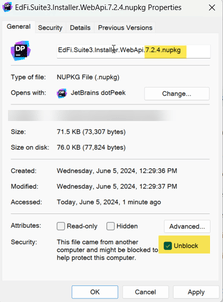
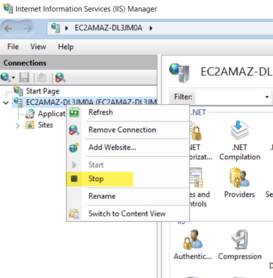
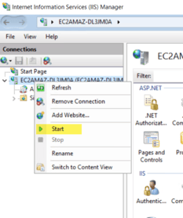

# Sandbox Installation Steps

This section describes how to set up the Ed-Fi ODS / API for sandbox support.
Before you proceed, make sure you have installed prerequisites listed
in [Getting Started - Binary
Installation](./readme.md).

## Step 1. Download the Ed-Fi ODS / API Installer Packages

The Ed-Fi ODS / API installation packages can be downloaded from the following
links:

### Package Links

The required release packages to install the Ed-Fi ODS / API can be found at the
links below. We recommend you stay current with the latest patch update that has
been promoted to
[release](https://dev.azure.com/ed-fi-alliance/Ed-Fi-Alliance-OSS/_packaging?_a=feed&feed=EdFi@Release).

* [EdFi.Suite3.Installer.WebApi](https://dev.azure.com/ed-fi-alliance/Ed-Fi-Alliance-OSS/_artifacts/feed/EdFi@Release/NuGet/EdFi.Suite3.Installer.WebApi/versions/7.2.4)
* [EdFi.Suite3.Installer.SwaggerUI](https://dev.azure.com/ed-fi-alliance/Ed-Fi-Alliance-OSS/_artifacts/feed/EdFi@Release/NuGet/EdFi.Suite3.Installer.SwaggerUI/versions/7.2.6)
* [EdFi.Suite3.Installer.SandboxAdmin](https://dev.azure.com/ed-fi-alliance/Ed-Fi-Alliance-OSS/_artifacts/feed/EdFi@Release/NuGet/EdFi.Suite3.Installer.SandboxAdmin/versions/7.2.7)
* [EdFi.Suite3.RestApi.Databases.Standard.5.1.0](https://dev.azure.com/ed-fi-alliance/Ed-Fi-Alliance-OSS/_artifacts/feed/EdFi@Release/NuGet/EdFi.Suite3.RestApi.Databases.Standard.5.1.0/versions/7.2.1201)

For each of the downloads, **right-click** and select "Properties." Update the
file extension (from .nupkg to .zip). Remove the version number (optional).
Check the box next to **Unblock** (this will prevent PowerShell from asking for
permission to load every module in the installer) and click **OK**.



:::info Enable TLS 1.2

You may need to configure TLS while running the installation scripts
described in steps below.
`[Net.ServicePointManager]::SecurityProtocol +=
[Net.SecurityProtocolType]::Tls12`

:::

:::info Long Paths

File paths can become lengthy within the ODS/API package components.
In Windows, this may cause errors during deployment. To mitigate this,
consider extracting the packages close to the root directory (e.g., `C:\temp`)
while running the installation steps below. Doing so minimizes the risk of
encountering excessively long file paths. Alternatively, you can enable long
paths in Windows.

:::

## Step 2. Install the Ed-Fi Databases

Extract the contents of the EdFi.Suite3.RestApi.Databases package. The paths in
these instructions assume that the package was extracted to a folder with the
name of the package (e.g., C:\\temp\\EdFi.Suite3.RestApi.Databases).

### Edit the configuration.json File

The basic settings for Microsoft SQL Server deployment are provided in
configuration.json and the basic settings for PostgreSQL deployment are provided
in configuration.postgreSQL.json file. If deploying to PostgreSQL, you can
delete configuration.json file; you can delete configuration.postgreSQL.json
when deploying to a Microsoft SQL Server. Update the settings in the file to fit
your needs.

:::note

<details>
<summary>SQL Server</summary>

```json
  "ConnectionStrings": {
      "EdFi_Admin": "server=(local);trusted_connection=True;database=EdFi_Admin;Application Name=EdFi.Ods.WebApi",
      "EdFi_Security": "server=(local);trusted_connection=True;database=EdFi_Security;persist security info=True;Application Name=EdFi.Ods.WebApi",
      "EdFi_Master": "server=(local);trusted_connection=True;database=master;Application Name=EdFi.Ods.WebApi"
  },
  "InstallType": "Sandbox",
  "ApiSettings": {
      "Engine": "SQLServer",
      ...
      "MinimalTemplateScript": "TPDMCoreMinimalTemplate",
      "PopulatedTemplateScript": "TPDMCorePopulatedTemplate"
  }
```

</details>

<details>
<summary>PostgreSQL</summary>

```json
  "ConnectionStrings": {
      "EdFi_Admin": "host=localhost;port=5432;username=postgres;database=EdFi_Admin;Application Name=EdFi.Ods.WebApi",
      "EdFi_Security": "host=localhost;port=5432;username=postgres;database=EdFi_Security;Application Name=EdFi.Ods.WebApi",
      "EdFi_Master": "host=localhost;port=5432;username=postgres;database=postgres;Application Name=EdFi.Ods.WebApi"
  },
  "InstallType": "Sandbox",
  "ApiSettings": {
      "Engine": "PostgreSQL",
      ...
      "MinimalTemplateScript": "TPDMCorePostgreSqlMinimalTemplate",
      "PopulatedTemplateScript": "TPDMCorePostgreSqlPopulatedTemplate"
  }
```

</details>

:::

:::info

ODS connection strings are now managed with the ODS instance definitions in the
EdFi_Admin database but they can also be overridden using configuration settings
(including external configuration sources such as AWS Systems Manager Parameter
Store).

:::

### Run Installation Script

After you edit the configuration.json file, open a PowerShell window in
Administrator mode and navigate to the EdFi.Suite3.RestApi.Databases package
folder.

Run the following PowerShell command to load modules for installation:

```shell
Import-Module .\Deployment.psm1
```

Then, execute the following command in PowerShell:

```shell
Initialize-DeploymentEnvironment
```

## Step 3. Install WebApi

Extract the contents of the EdFi.Suite3.Installer.WebApi package. The paths in
these instructions assume that the package was extracted to a folder with the
name of the package (e.g., C:\\temp\\EdFi.Suite3.Installer.WebApi).

### Prepare Installation script

Open a PowerShell window in Administrator mode and navigate to the
EdFi.Suite3.Installer.WebApi package folder and run the following PowerShell
command to load modules for installation:

```shell
Import-Module .\Install-EdFiOdsWebApi.psm1
```

The WebApi installer can take a number of parameters to tailor the installation
experience (more examples can be found in the Install-EdFiOdsWebApi.psm1 file).
At a minimum, database connection information is required.

Copy and modify the following parameter code to fit your connection information:

:::note

<details>
<summary>SQL Server</summary>

```powershell
$parameters = @{
    PackageVersion = "7.2.1201"
    PackageName = "EdFi.Suite3.Ods.WebApi.Standard.5.1.0"
    DbConnectionInfo = @{
        Engine="SqlServer"
        Server="localhost"
        UseIntegratedSecurity=$true
    }
    IsSandbox = $true
    UnEncryptedConnection = $true
}
```

</details>

<details>
<summary>PostgreSQL</summary>

```powershell
$parameters = @{
    PackageVersion = "7.2.1201"
    PackageName = "EdFi.Suite3.Ods.WebApi.Standard.5.1.0"
    DbConnectionInfo = @{
        Engine="PostgreSQL"
        Server="localhost"
        Username="postgres"
    }
    IsSandbox = $true
}
```

</details>

:::

:::info Use of UnEncryptedConnection parameter

While deploying to SQL Server, `UnEncryptedConnection = $true` will add
`Encrypt=false` to the connection strings to mitigate a breaking change in
the [Microsoft.Data.SqlClient](https://www.nuget.org/packages/Microsoft.Data.SqlClient/)
library. This setting is not recommended for production environments; for
production environments, it is recommended to follow the steps to [Install a
valid certificate on the
server.](https://learn.microsoft.com/en-us/sql/database-engine/configure-windows/enable-encrypted-connections-to-the-database-engine)

:::

:::info ODS Connection String Encryption

By default, an Encryption key will be generated using member
New-AESKey from Install-EdFiOdsWebApi.psm1 module. If you need to override the
value with an specific key, add OdsConnectionStringEncryptionKey parameter.
Key must be 256 bits and base 64 encoded.

:::

Paste the modified parameter code into your PowerShell window and hit Enter.

### Run the Installation Script

Next, run the following command in the PowerShell window:

```shell
Install-EdFiOdsWebApi @parameters
```

## Step 4. Install Swagger

Extract the contents of the EdFi.Suite3.Installer.SwaggerUI package. The paths
in these instructions assume that the package was extracted to a folder with the
name of the package (e.g., C:\\temp\\EdFi.Suite3.Installer.SwaggerUI).

### Prepare Installation Script

Open a PowerShell window in Administrator mode and navigate to
the EdFi.Suite3.Installer.SwaggerUI folder and run the following PowerShell
command to load modules for installation:

```shell
Import-Module .\Install-EdFiOdsSwaggerUI.psm1
```

The Swagger UI installer can take a number of parameters to tailor the install
experience (more examples can be found in the Install-EdFiOdsSwaggerUI.psm1
file). At a minimum, WebAPI connection information is required.

Copy and modify the following parameter code to add your site name:

```powershell
$parameters = @{
    PackageVersion = "7.2.1201"
    WebApiVersionUrl = "https://YOUR_SITE_OR_SERVER_NAME_HERE/WebApi"
 PrePopulatedKey = "YOUR_POPULATED_KEY_HERE"
    PrePopulatedSecret = "YOUR_POPULATED_SECRET_HERE"
}
```

:::info

The PrePopulatedKey and PrePopulatedSecret can be optionally set as parameters
to explicitly set the default authorization key and secret used by Swagger to
connect to the Populated Sandbox Instance created by the Sandbox Admin App.

:::

Paste the modified parameter into your PowerShell window and execute the code.

### Run the Installation Script

Then, run the following command in the PowerShell window:

```shell
Install-EdFiOdsSwaggerUI @parameters
```

## Step 5. Install SandboxAdmin (for Sandbox Support Only)

Extract the contents of the EdFi.Suite3.Installer.SandboxAdmin package. The
paths in these instructions assume that the package was extracted to a folder
with the name of the package (e.g.,
C:\\temp\\EdFi.Suite3.Installer.SandboxAdmin).

### Prepare Installation Script

Open a PowerShell window in Administrator mode and navigate to the
EdFi.Suite3.Installer.SandboxAdmin folder and run the following PowerShell
command to load modules for installation:

```shell
Import-Module .\Install-EdFiOdsSandboxAdmin.psm1
```

The SandboxAdmin installer can take a number of parameters to tailor the install
experience (more examples can be found in the Install-EdFiOdsSandboxAdmin.psm1
file). At a minimum, OAuthUrl information is required.

Copy and modify the following parameter code to add your site name:

:::note

<details>
<summary>SQL Server</summary>

```powershell
$parameters = @{
    PackageVersion = "7.2.1201"
    Settings = @{ OAuthUrl = "https://YOUR_SITE_OR_SERVER_NAME_HERE/WebApi" }
    PrePopulatedKey = "YOUR_POPULATED_KEY_HERE"
    PrePopulatedSecret = "YOUR_POPULATED_SECRET_HERE"
    UnEncryptedConnection = $true
}
```

</details>

<details>
<summary>PostgreSQL</summary>

PostgreSQL

```powershell
$parameters = @{
    PackageVersion = "7.2.1201"
    Settings = @{ OAuthUrl = "https://YOUR_SITE_OR_SERVER_NAME_HERE/WebApi" }
    Engine="PostgreSQL"
    PrePopulatedKey = "YOUR_POPULATED_KEY_HERE"
    PrePopulatedSecret = "YOUR_POPULATED_SECRET_HERE"
}
```

</details>

:::

:::info

The PrePopulatedKey and PrePopulatedSecret can be optionally set as parameters
to explicitly set the default authorization key and secret used by the Populated
Sandbox Instance created by the Sandbox Admin App. If not present, the key and
secret will be set to random strings.

:::

Paste the modified parameter into your PowerShell window and execute the code.

### Run the Installation Script

Next, run the following command in the PowerShell window:

```shell
Install-EdFiOdsSandboxAdmin @parameters
```

## Step 6. Restart your Website

Just a few more tasks to complete your installation:

* Open IIS (Press the **Windows key** 

     on your keyboard, type **IIS**, select **Internet Information Services
     (IIS)**, and press **Enter**.
* **Right-click** on the server (alternatively, you can right-click the EdFi
    web site), and select **Stop**.



* **Right-click** the server (or EdFi website) again and select **Start**.



You are now ready to use the Ed-Fi ODS / API. The following URLs are available:

| Website | URL |
| --- | --- |
| Ed-Fi ODS / API | [https://YOUR\_SERVER\_NAME\_HERE/WebApi/](https://YOUR_SERVER_NAME_HERE/WebApi/) |
| Sandbox Administration (for Sandbox Support Only) | [https://YOUR\_SERVER\_NAME\_HERE/SandboxAdmin](https://YOUR_SERVER_NAME_HERE/SandboxAdmin) |
| Ed-Fi ODS / API Documentation | [https://YOUR\_SERVER\_NAME\_HERE/SwaggerUI](https://YOUR_SERVER_NAME_HERE/SwaggerUI) |
