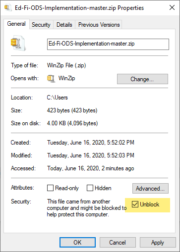
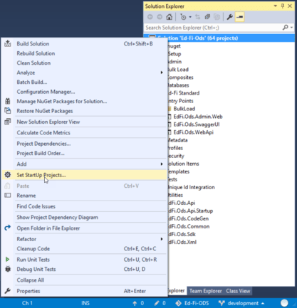
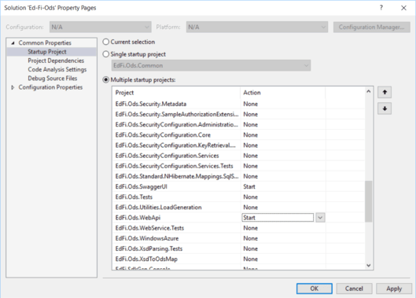
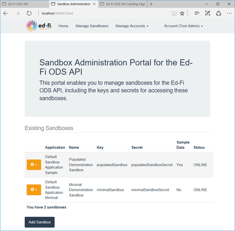
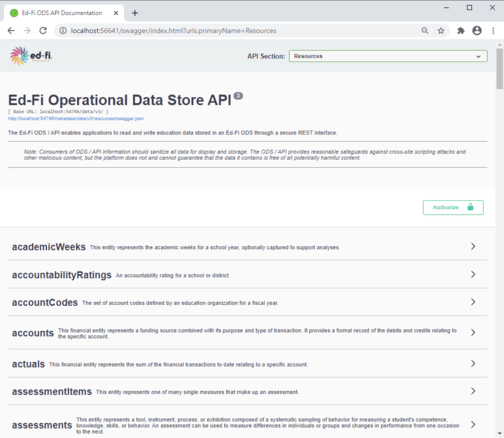

# Getting Started - Source Code Installation

This section describes how to set up the Ed-Fi ODS / API source code on a
development machine. For those interested in getting an Ed-Fi ODS / API instance
up and running quickly, but do not have developer tools or experience we
recommend you to consult [Getting Started - Binary
Installation](../binary-installation/readme.md).

The steps can be summarized as:

* [Step 1. Install and Configure Windows
    Components](#step-1-install-and-configure-windows-components)
* [Step 2. Install and Configure Required
    Software](#step-2-install-and-configure-required-software)
* [Step 3. Download the Ed-Fi ODS / API v7.2
    Code](#step-3-download-the-ed-fi-ods-api-v72-code)
* [Step 4. Prepare the Development
    Environment](#step-4-prepare-the-development-environment)
* [Step 5. Build the Visual Studio
    Solution](#step-5-build-the-visual-studio-solution)
* [Step 6. Set Startup Projects](#step-6-set-startup-projects)
* [Step 7. Run the Solution](#step-7-run-the-solution)

Detail on each step follows.

## Step 1. Install and Configure Windows Components

Ensure that the following components are installed:

* **PowerShell 5.0,7.2,7.3.** PowerShell is used to initialize the development
    environment.
* **.NET 8.0 SDK**. The .NET 8.0 Software Developer Kit is required for
    compiling the solution.

<details>
<summary>View detail...</summary>

## PowerShell

Verify that PowerShell 5.0 or above is installed. If you are on Windows, most
likely you have PowerShell 5.0 pre-installed.

1. Press the **Windows key** 

     on your keyboard, type **PowerShell**, select **Windows PowerShell**, and
     press **Enter**.
2. Type **$PSVersionTable.PSVersion**, and press **Enter**.


If the required version is not installed, download and install [PowerShell 5.0
or
above](https://learn.microsoft.com/en-us/powershell/scripting/install/installing-powershell?view=powershell-5.1).

## .NET 8.0 SDK

Download and install the latest [.NET SDK 8.0 (Compatible with Visual Studio
2022)](https://dotnet.microsoft.com/en-us/download/dotnet/8.0).


</details>

## Step 2. Install and Configure Required Software

Ensure that the following software is installed and configured:

* **Visual Studio 2022.** Visual Studio 2022 (Community, Professional, or
    Enterprise edition) or **JetBrains Rider version 2021.3+** (an alternative
    development environment that can be used instead of Visual Studio 2022).

* **Microsoft SQL Server 2019.** Microsoft SQL Server is used to store the data
    for the Ed-Fi ODS / API. Local installation of Standard, Developer, or
    Enterprise Editions are supported.
* Optional PostgreSQL datastore:
  * **PostgreSQL 13.x.** PostgreSQL can be used as the datastore for and Ed-Fi
        ODS / API instance instead of Microsoft SQL Server.

<details>
<summary>View detail...</summary>

## Microsoft SQL Server 2019

Install Microsoft SQL Server 2019:


1. When prompted, select the following features:

  

2. Use the default instance named **MSSQLSERVER**.
  

3. Select either **Windows Authentication Mode** or **Mixed Mode.**
  

    :::warning

    Mixed Mode may be preferred if you also intend to install the
    [Ed-Fi
    Dashboards](https://edfi.atlassian.net/wiki/display/DASH20/Ed-Fi+Dashboards+v2.0).
    Mixed Mode can be enabled later by following the [Change Server
    Authentication
    Mode](https://msdn.microsoft.com/en-us/library/ms188670.aspx)
    instructions.

    :::

4. In Specify SQL Server administrator, click **Add Current User**.

Install SQL Server Management Studio:


## Visual Studio 2022

Visual Studio 2022(Community edition or higher) is required for a development
environment.

### Installing Visual Studio 2022

The instructions below are based on the Visual Studio 2022 Community Installer.

1. Launch the installer and make sure the following features are selected:

* In the **Workloads Tab**
  * **.NET Desktop development**, and select the following components:
  * **ASP.NET and web development**


2\. Restart your computer (if prompted)

3\. Open **Developer Command Prompt for VS2022** as an Administrator**,** at the
command prompt type **gacutil -l envdte** to verify EnvDTE is registered in GAC.
If no listings are found, run the following command to add EnvDTE to GAC.

**gacutil -i "%COMMONPROGRAMFILES(x86)%\\microsoft
shared\\MSEnv\\PublicAssemblies\\envdte.dll"**

:::warning

After installing, check the **Visual Studio Start Page** and **Windows Update**
for Visual Studio updates.

:::

## PostgreSQL Installation (Optional)

Install PostgreSQL 13.x on port 5432 if you intend to use PostgreSQL as a
backing datastore for the ODS / API.

### PostgreSQL Visualization Tool

Unlike SQL Server, PostgreSQL does not include a GUI to visualize the database
(commands are executed via the command line using psql). Below is a list of
various tools that work:

* [pgAdmin](https://www.pgadmin.org/download/)
* [DBeaver](https://dbeaver.com/download/)
* [DataGrip](https://www.jetbrains.com/datagrip/download)

### Install PostgreSQL

Installation of PostgreSQL can be done either using the binaries or using
Docker. The recommended solution is to to use the docker install using Linux
containers.

<details>
<summary>Option 1. Installation using PostgreSQL Installer</summary>

Installation using PostgreSQL Installer

* Install using the
    PostgreSQL [installer](https://www.enterprisedb.com/downloads/postgres-postgresql-downloads).
    Version 13.x is compatible with the ODS / API.
  * Note the installer includes pgAdmin as an option.
  * The [PostgreSQL installation
        guide](https://www.enterprisedb.com/docs/supported-open-source/postgresql/installer/) has
        details.


Download the version 13.x installer.


Click **Next**.


Click **Next**.


If you want to install only the tools uncheck PostgreSQL Server, pgAdmin 4 and
Stack Builder.

Click **Next**.


Enter a password for the postgres superuser.

Click **Next**.


Enter port **5432** (default).

Click **Next**.


Click **Next**.


Click **Next**.


Click **Next** to finish the installation.

</details>

<details>
<summary>Option 2. PostgreSQL Installation with Docker</summary>

Installation with Docker

Initial setup with Docker:

* Install Docker using
    this [guide](https://docs.docker.com/docker-for-windows/install/).
* Create a Docker Compose file.

#### Run PostgreSQL with Docker in Linux Containers

Create a Docker Compose file (name: `docker-compose.yml`) to bootstrap
PostgreSQL using Linux containers. More information on the Docker Compose file
can be found [on the Docker documentation
site](https://docs.docker.com/compose/).

```yaml
version: '3.7'
services:
    pg13:
        image: postgres:13-alpine
        container_name: pg13
        volumes:
            - pg13-database:/var/lib/postgresql/data
        ports:
            - 5432:5432
        environment:
            - POSTGRES_PASSWORD=${PG_PASSWORD}
        restart: on-failure
volumes:
    pg13-database:
        driver: local
        name: pg13-database
```

Create an environment file (name: `.env`) to be consumed by Docker Compose. By
default the environment file needs to be in the same folder as the Docker
Compose file.

```ini
PG_PASSWORD=P@ssw0rd
```

Sample files for these can be downloaded from the download panel on the right.

#### Data Retention and Docker Compose

Once you have set up your docker-compose.yml and .env files and placed them in a
folder (e.g., C:\\PGDockerSetup), navigate to that folder in PowerShell and run
[docker-compose](https://docs.docker.com/compose/). This utility reads
the docker-compose.yml configuration file and runs all of the containers
described in that file.

To bring up the environment:

```shell
C:\PGDockerSetup>docker-compose up -d
```

To stop the volumes and containers:

```shell
C:\PGDockerSetup>docker-compose down
```

To stop the services and remove them, but retain the data in separate volumes:

```shell
C:\PGDockerSetup>docker-compose down -v
```

</details>

### Configure pgpass.conf

A **[pgpass.conf](https://www.postgresql.org/docs/13/libpq-pgpass.html)** file
must be setup to store passwords in a location accessible by IIS. It is required
by database deployment scripts for the ODS/API. Additionally, a
[PGPASSFILE](https://www.postgresql.org/docs/13/libpq-envars.html) environment
variable should be setup to specify the location of pgpass.conf file.

Create a pgpass.conf file. Note that the password should be your Postgres
superuser password and if you are deploying Postgres via Docker, it should match
the password in your environment file.

```ini
localhost:5432:*:postgres:P@ssw0rd
```

Set the environment variable PGPASSFILE to the location of the pgpass file that
was created, which is the recommended approach. Optionally, the file can be
saved in `%APPDATA%/postgresql/pgpass.conf.`


You can test the environment variable setup using:

```shell
C:\> get-item env:pgpassfile

Name                           Value
----                           -----
PGPASSFILE                     C:\PGDockerSetup\pgpass.conf
```

</details>

## Step 3. Download the Ed-Fi ODS / API v7.2 Code

The Ed-Fi ODS / API source code is contained in two Ed-Fi repositories hosted
by GitHub.

### Source Code Links

The Ed-Fi ODS / API can be found in the repository links below:

* [Ed-Fi-ODS/v7.2](https://github.com/Ed-Fi-Alliance-OSS/Ed-Fi-ODS/tree/v7.2)

* [Ed-Fi-ODS-Implementation/v7.2](https://github.com/Ed-Fi-Alliance-OSS/Ed-Fi-ODS-Implementation/tree/v7.2)

Use a Git client (such as [GitHub Desktop](https://desktop.github.com/)) or a
Git command line tool to Git Clone each of the repository links described above.
It is important that both repositories are extracted to the same root directory
(for example C:\\Source). When both repositories have been cloned, there will be
two folders for the ODS / API source code as shown below:


:::info
File paths can become lengthy within the ODS/API source code. In
Windows, this may cause errors during Git Clone. To mitigate this, consider
extracting the packages close to the root directory (e.g., C:\\Source) Doing
so minimizes the risk of encountering excessively long file paths.
Alternatively, you can enable long paths in Windows and configure git for long
file paths. To configure windows for long file paths:

* Run `regedit`
* Navigate to `HKLM:\SYSTEM\CurrentControlSet\Control\FileSystem`
* Set `LongPathsEnabled = 1` To configure git for long file paths:

To configure git for long file paths:

* Run  `git config --global core.longpaths true`

:::

:::info
When you clone a repository, ensure that you have the correct tag checked out in your client before you proceed.

```shell
git checkout tags/v7.2 -b <branch>
```

:::

:::info

If you download the code via a ZIP file, ensure that you check Unblock in the
file's Properties dialog to allow the contents of the contained scripts to
execute properly.



:::

<details>
<summary>View detail and options...</summary>

## Accessing Daily Source

The links above are for the stable release of the ODS / API v7.2. You can
download the links to the very latest daily source code in the development
branch:

* [Ed-Fi-ODS/main](https://github.com/Ed-Fi-Alliance-OSS/Ed-Fi-ODS/tree/main)

* [Ed-Fi-ODS-Implementation/main](https://github.com/Ed-Fi-Alliance-OSS/Ed-Fi-ODS-Implementation/tree/main)

## Alternate Method for Code Download

Some developers prefer simply to download the code rather than perform a Git
Clone. You can do so by following these instructions:

1. Navigate to each of the repository links described above (for latest release
    or daily source) and use the **Download ZIP** button to download the
    repository to your local drive.

    

2. In Windows Explorer, right-click on each of the downloaded ZIP files and
    select Extract All… Enter C:\\ for the target folder. (You can extract the
    files to any directory, but these instructions assume you've extracted to
    C:\\.) The ZIP files contain an embedded folder ending in "-v7.2" (or
    "-main" if downloading latest daily source). For example, the "Ed-Fi ODS
    ZIP" archive contents will be extracted into C:\\Ed-Fi-ODS-v7.2.

3. After the extractions are complete, rename the folders to remove
    the -v7.2 (or "-main") from the folder names. For example, change
    C:\\Ed-Fi-ODS-v7.2 to C:\\Ed-Fi-ODS.

4. When the extraction and renaming are complete, there should be two folders
    for the ODS / API source code as shown below:

    

## Troubleshooting the File Extract

The steps above work for most users. However, depending on your Windows security
settings, you might get a warning or error when attempting to extract the
downloaded ZIP files. If this happens to you, the fix is easy:

In Windows Explorer, right-click each of the downloaded ZIP files and
select **Properties**. On the **General** tab, check **Unblock** to allow the
contents of the contained scripts to execute properly.


The dialog box above is from Windows 10. Previous versions of Windows have an
"Unblock" button in the same location.

</details>

## Step 4. Prepare the Development Environment

To prepare the development environment, you'll need to follow the procedures
described below.

### Configure StandardVersion

ODS/API 7.x supports building and deploying APIs that adhere to either the Ed-Fi
Data Standard v4 or Ed-Fi Data Standard v5. By default, Visual Studio is set up
to build using Ed-Fi Data Standard v5. However, if you are building for Ed-Fi
Data Standard v4, you must ensure that the “StandardVersion” environment
variable is properly configured.

To set the "StandardVersion" variable:

1. Press the **Windows key**

     on your keyboard, type **Environment Variables**, select **Edit the system
     environment variables**, and press **Enter.** This brings up **System
     Properties**. Under **Advanced**, select **Environment Variables**.
     (Alternatively, right-click the **Start Menu**

    , select **System**, and click on the **Advanced system settings**.
    Under **Advanced**, select **Environment Variables**.)
2. Under **System variables**, select **New...**

    

3. For **Variable name**, enter **StandardVersion**
4. For **Variable value**, enter **4.0.0,** and press **OK**.

    

## Verify PowerShell Script Permissions

When opening PowerShell, ensure that **Run as Administrator** is selected. You
may need to change the execution policy for unsigned PowerShell scripts to run
on your machine to run the scripts. This can be done by opening a PowerShell
console and typing the following command:

```shell
Set-ExecutionPolicy Unrestricted
```

## Initialize PowerShell Scripts for Development

There are several databases that must be successfully deployed. PowerShell
scripts that initialize all necessary development databases are included in the
Visual Studio solution. These scripts are enabled for use within Visual Studio
when the Ed-Fi-ODS solution is opened. They may also be loaded for use within a
PowerShell console window by running the initialize PowerShell for development
script located at:

```shell
C:\Ed-Fi-ODS-Implementation\Initialize-PowershellForDevelopment.ps1
```

When the scripts are loaded, you should see the results shown below:


## Initialize the Development Environment

Once the PowerShell scripts for development have been loaded and a development
certificate has been installed, the development environment may be initialized
by navigating to the Ed-Fi-ODS-Implementation folder.

For a SQL Server backing datastore, type the following into a PowerShell command
prompt:

```shell
initdev
```

For a PostgreSQL backing datastore, use the following:

```shell
initdev -Engine PostgreSQL
```

For building Data Standard 4.0, use the following:

```shell
initdev -StandardVersion 4.0.0
```

To get full details on initdev parameter options, use the following:

```shell
get-help initdev -detailed
```

:::info Use of UnEncryptedConnection parameter

When executing the `initdev` module, an appsettings.Development.json file is
generated, adding Encrypt=false to the connection strings to mitigate a breaking
change in the
[Microsoft.Data.SqlClient](https://www.nuget.org/packages/Microsoft.Data.SqlClient/)
library. This setting is not recommended for production environments; for
production environments, it is recommended to follow the steps to [Install a
valid certificate on the
server.](https://learn.microsoft.com/en-us/sql/database-engine/configure-windows/enable-encrypted-connections-to-the-database-engine)

:::

:::info ODS Connection String Encryption

The appsettings.Development.json file includes the
`OdsConnectionStringEncryptionKey` setting. If you need to deploy to a
production environment or require a specific key, ensure that the
`OdsConnectionStringEncryptionKey` setting in the appsettings.json file is
updated with a valid key. This key must be 256 bits in size and encoded in
base64. You can execute the `New-AESKey` command to generate a valid key.

:::


This command creates databases, generates code templates, and compiles projects
in the solution. Some considerations while running the script:

* The `initdev` script may not finish with a command prompt when it is
    automatically loaded with the solution in Visual Studio in some
    circumstances. Simply press **Enter**, and ignore any messages that appear
    in the console window.
* Initializing the development environment will take several minutes to
    complete. Some developers report encountering an error during the
    initialization process the first time it is run. This is due to an
    intermittent timing issue. The issue generally resolves itself when
    the `initdev` process is run a second time.

A successful `initdev` execution will display the tasks executed and their
duration as shown below:


## Step 5. Build the Visual Studio Solution

To build the solution from within Visual Studio:

1. Start Visual Studio. Within Visual Studio, open the "Ed-Fi-Ods.sln" solution
    file from the C:\\Ed-Fi-ODS-Implementation\\Application directory.
2. Select **Build** > **Build Solution** (or press **Ctrl**+**Shift**+**B**).

<details>
<summary>View detail and options...</summary>

## Code Generation During Build

The following diagram shows how MeatEd generated artifacts are used to create
the API for the Ed-Fi ODS using code generators within the solution. Code
generation uses Api Model JSON file to understand the structure that it uses to
generate data access code. Code generation also depends on the
DatabaseViews.generated.json which is generated one time using the
"EdFi\_Ods\_Empty" database and subsequently provided by the source code
repository.


## Alternatively Building from the Developer Command Prompt

When the “EdFi\_Ods\_Empty” database has been created (by running the `initdev`
PowerShell command in the previous step), there are two ways to build the
solution. The solution can be built from Visual Studio, as described above, or
from a Developer Command Prompt for Visual Studio using the Windows start menu.

To do a clean build from the command prompt:

1. Open the Developer Command Prompt for Visual Studio.

    

2. Navigate to your C:\\Ed-Fi-ODS-Implementation\\Application directory.
3. Issue a command similar to the following:

```shell
Msbuild /nr:false /t:clean;build Ed-Fi-Ods.sln
```

</details>

## Step 6. Set Startup Projects

The Visual Studio Solution for the Ed-Fi ODS / API consists of several "Startup
Projects" that work together. Each of these projects needs to be running for the
system to be fully functional.

To set the Startup Projects:

1. Select the **Set StartUp Projects…** context menu by right-clicking on the
    solution file in the Solution Explorer. 

2. Within the Startup Project property page, select the **Multiple startup
    projects** radio button and enable the following projects:

    * EdFi.Ods.SandboxAdmin
    * EdFi.Ods.SwaggerUI
    * EdFi.Ods.WebApi

    

3. Click **OK** to accept the changes to your local development settings.

## Step 7. Run the Solution

The projects in the Ed-Fi-ODS-Implementation repository are configured to run
the desktop version of Internet Information Server (i.e., IIS Express). This
server is installed with Visual Studio and facilitates easy debugging with
minimal configuration. After the startup projects are set, you are ready to run
or debug the Ed-Fi ODS / API.

### Running the solution

* To run the Ed-Fi ODS / API without debugging, press **Ctrl**+**F5.**
* To interactively debug the Ed-Fi ODS / API solution, press **F5** (or
    press **Start** in the Standard Toolbar).


### Notes on Running the Solution

* The solution builds and starts each of the projects that were added to the
    startup projects list. Each web application starts an instance of IIS
    Express. By default, the websites are configured according to the following
    table:

| Website | Project | URL |
| --- | --- | --- |
| Ed-Fi ODS API | EdFi.Ods.WebApi | [http://localhost:54746/](http://localhost:54746/) |
| Sandbox Administration | EdFi.Ods.SandboxAdmin | [http://localhost:38928/](http://localhost:38928/) |
| Ed-Fi ODS API Documentation | EdFi.Ods.SwaggerUI | [http://localhost:56641/](http://localhost:56641/) |

* At this point, you're ready to explore the system.

<details>
<summary>View detail about the applications...</summary>

Follow these steps to finish configuring the solution:

1. Visiting the API Sandbox Administration Portal and logging in with the Test
    User Account
2. Reviewing the Ed-Fi ODS API Documentation

### The Sandbox Administration Portal

The Sandbox Administration Portal is a web application used to create sandbox
databases containing data that can be accessed through the Ed-Fi ODS / API.

Login to Sandbox Administration Portal with Test Admin Account. Login details
can be found in
**Ed-Fi-ODS-Implementation\\Application\\EdFi.Ods.SandboxAdmin\\appsettings.json**
or alternatively in **appsettings.Development.json** file. We recommend that you
change your password as soon as you log in.



As the name implies, Sandbox Administration Portal is useful for development
machines and sandbox instances of the ODS / API, but should not be present on
production instances. See the [Platform Developers' Guide -
Deployment](../../platform-dev-guide/deployment/readme.md) section
for details.

## The Ed-Fi ODS / API Documentation Web Page

The ODS / API Documentation Web Page provides an overview of the ODS / API, and
links to more detailed API documentation.


The REST interface to the Ed-Fi ODS / API exposes metadata describing the
exposed resources as well as the inputs, HTTP verbs, and schema of the exposed
entities. This metadata enables a user interface (based on
the [Swagger](http://swagger.io/) framework) to display API documentation.

The Swagger-based documentation web page uses a key and secret (typically the
same one used for the Sandbox Administration Portal) to access the data that has
been placed in the corresponding sandbox.

To view the data in your sandbox, click **Authorize** and enter the key and
secret in the appropriate fields and retrieve a token (the key and secret values
for the default sandbox are pre-populated). This token is used throughout your
session to access your sandbox. This is the same process used by other
applications to access their data.



Similar to the Sandbox Administration Portal, the ODS / API Documentation Web
Page is useful for development machines and sandbox instances of the ODS / API,
but is generally not present on production instances. See the [Platform
Developers' Guide -
Deployment](../../platform-dev-guide/deployment/readme.md) section
for details.

</details>

:::note

The following link contains sample docker setup files for PostgreSQL
[PGDockerSetup.zip](https://edfi.atlassian.net/wiki/download/attachments/23298387/PGDockerSetup.zip?version=1&modificationDate=1708470913300&cacheVersion=1&api=v2)

:::
