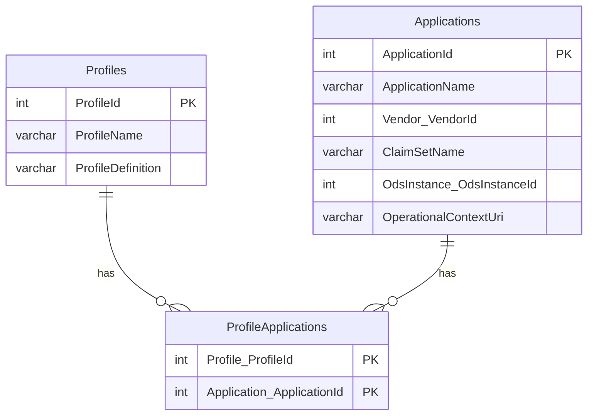

# How To: Add Profiles to the Ed-Fi ODS / API

This example outlines the steps necessary to integrate and activate Ed-Fi
Profile definitions for use in an Ed-Fi ODS / API. To be able to update profile
definitions at run-time without rebuild and redeployment, it is preferred to
configure profile definitions in the EdFi\_Admin database. Alternatively, you
can define profile via embedded resource in a C# project as described in
[Appendix
A](#appendix-a-adding-profiles-using-the-visual-studio-profiles-project-template).

## Step 1. Add Profiles via the EdFi\_Admin Database

API Profiles can be configured and assigned through the EdFi\_Admin database.
This database stores the data required to manage API keys and secrets, Education
Organizations, Profile assignments, and Profile definitions.

The tables related to this process are shown below.



API Profiles can be directly inserted into the Profiles table and then assigned
to Applications via the ProfileApplications table. When making changes in the
Profiles table, be aware that only one Profile can be stored per row. As such,
the XML in the `ProfileDefintion column` should use `<Profile>` as the root element
rather than the `<Profiles>` root element defined in the
Ed-Fi-ODS-API-Profiles.xsd.

:::info

The XML schema of API Profile definitions can be validated using the schema
definition file included in the Ed-Fi-ODS repository at
Ed-Fi-ODS\\Application\\EdFi.Ods.Common\\Metadata\\Schemas\\Ed-Fi-ODS-API-Profiles.xsd.

:::

Profiles in the EdFi\_Admin database are refreshed dynamically by the Ed-Fi ODS
/ API each time the profiles cache expires. The expiration time for the
profiles cache can be adjusted in the `appsettings.json` file, as shown below.

```json
"Caching": {
    ...
    "Profiles": {
        "AbsoluteExpirationSeconds": 1800
    }
}
```

## Step 2. Verify that the API Profiles feature is enabled

Ensure that the API Profiles feature is enabled by looking at the
`appsettings.json` file in the WebApi project, which can be found under the “Entry
Points” folder in the solution.

```json
"Features": [
    {
        "Name": "Profiles",
        "IsEnabled": true
    },
    ...
]
```

## Step 3. Verify that the Profile endpoints are visible

Verify that the new Profile endpoints are visible in the swagger or via metadata
endpoint.

:::info

You may have to clear your browser cache in order for Swagger UI to display the
new resource.

:::


```json title="Discovery API metadata listing (partial)
[
    ...
    {
        "name": "Test-Profile-Resource-Exclude-Only",
        "endpointUri": "http://localhost/metadata/data/v3/profiles/test-profile-resource-excludeonly/swagger.json",
        "prefix": "Profiles"
    },
    {
        "name": "Test-Profile-Resource-Include-All",
        "endpointUri": "http://localhost/metadata/data/v3/profiles/test-profile-resource-includeall/swagger.json",
        "prefix": "Profiles"
    },
    {
        "name": "Test-Profile-Resource-Include-Only",
        "endpointUri": "http://localhost//metadata/data/v3/profiles/test-profile-resource-includeonly/swagger.json",
        "prefix": "Profiles"
    },
    {
        "name": "Test-Profile-Resource-Nested-Child-Collection-Filtered-To-Exclude-Only-Specific-Types-And-Descriptors",
        "endpointUri": "http://localhost//metadata/data/v3/profiles/test-profile-resource-nested-child-collection-filtered-to-exclude-only-specific-types-and-descriptors/swagger.json",
        "prefix": "Profiles"
    },
    {
        "name": "Test-Profile-Resource-Nested-Child-Collection-Filtered-To-Include-Only-Specific-Types-And-Descriptors",
        "endpointUri": "http://localhost//metadata/data/v3/profiles/test-profile-resource-nested-child-collection-filtered-to-include-only-specific-types-and-descriptors/swagger.json",
        "prefix": "Profiles"
    },
    {
        "name": "Test-Profile-Resource-Read-Only",
        "endpointUri": "http://localhost/metadata/data/v3/profiles/test-profile-resource-readonly/swagger.json",
        "prefix": "Profiles"
    },
    {
        "name": "Test-Profile-Resource-References-Exclude-Only",
        "endpointUri": "http://localhost/metadata/data/v3/profiles/test-profile-resource-references-excludeonly/swagger.json",
        "prefix": "Profiles"
    }
]
```

## Step 4. Confirm Profile Settings

Profile settings are flexible. With this flexibility comes some complexity — so
platform hosts will want to confirm that the deployed API Profiles behave as
expected, exposing exactly the right resources. This can be done manually or
using an SDK created by code generation techniques.

## Appendix A: Adding Profiles Using the Visual Studio Profiles Project Template

An alternative method for adding API Profiles to an ODS / API is using the
Visual Studio Profiles Project Template to add a Profiles Project to the ODS /
API solution. When a Profiles Project is used, the profile definitions are added
to the Profiles Project, stored as an embedded resource when the project is
built, and then the ODS / API reads and applies the Profiles definitions in that
embedded resource at runtime. The assumption is that the Ed-Fi ODS / API has
been successfully set up and is running in a local environment per the
instructions in the [Getting
Started](https://edfi.atlassian.net/wiki/display/ODSAPIS3V70/Getting+Started)
documentation.

Detail on each step follows.

### Step 1. Create the Profiles Project

**Add a Profiles Project Using the Visual Studio Project Template.** Visual
Studio Project Template can be installed by following steps in [Project
Templates
Installation](../getting-started/source-code-installation/project-templates-installation.md)
section of this documentation.

1. Add the Profiles project, right-click on the "Profiles" folder and
  select **File > Add > New Project...**

  

1. In the "Add New Project" dialog, find and select the "Ed-Fi API Profiles
   Project Template" entry as shown below. Click **Next**.
1. Enter the project name for the new project and click **Create**. The
  suggested naming convention for this type of project is something like
  **EdFi.Ods.Profiles.MyProfiles**.
1. **Review and modify Profiles.xml file**. The Visual Studio Project Template
   creates a sample **Profiles.xml** file. You should open it and modify it to
   meet the needs of your Profile. Consult [API
   Profiles](../platform-dev-guide/security/api-profiles.md)
   for guidance.
1. **Save** the Project.

### Step 2. Integrate Profiles into the Solution

To integrate the Profiles into the solution, add a reference to the Profiles
project you constructed in the previous step in the **EdFi.Ods.WebApi** project
(located in the "Entry Points" folder).

### Step 3. Rebuild the Solution and Verify Changes

Clean and then rebuild the ODS Visual Studio Solution. This can be done through
the Visual Studio or in PowerShell by running
`Initialize-PowershellForDevelopment.ps1` script followed by
`Invoke-RebuildSolution`. Then run the application and view the Ed-Fi ODS / API
using Swagger.

:::info

When the API is initialized, the names of the Profiles configured into the API
will be published to the Profiles table in the EdFi_Admin database. This process
performs one-way publishing and will not remove existing Profile names that are
no longer contained within the API configuration. Profiles added to the Ed-Fi
Visual Studio Solution using the Profiles Visual Studio Project Template will
have their name published in the EdFi_Admin database, but the ProfileDefinition
column in the profiles table remains empty because the XML definition for the
profile is provided as an embedded resource. Only Profiles configured directly
in the EdFi_Admin database have their definitions stored in the
ProfileDefinition column.

:::

:::note

The following GitHub link contains source files for this Profile
sample: [ODS/API
7.2](https://github.com/Ed-Fi-Alliance-OSS/Ed-Fi-ODS/tree/v7.2/Samples/Project-Profiles-Template)

:::
