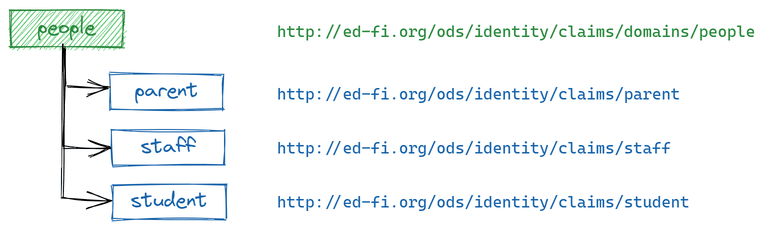
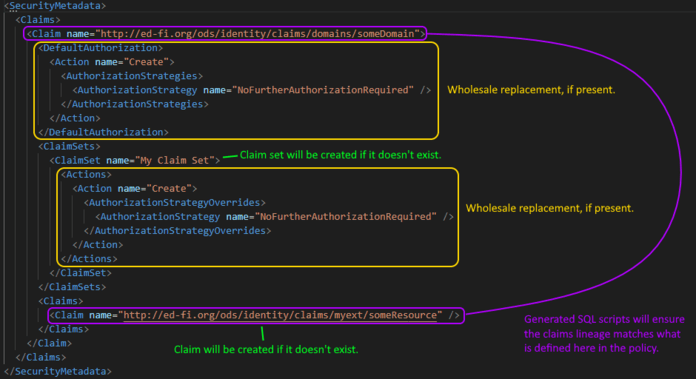

# How To: Create and Manage API Security Metadata using Declarative Security Policies

## Introduction

The Ed-Fi ODS API security metadata is stored in the EdFi\_Security database and
is logically organized into a taxonomy. The [Admin
API](https://edfi.atlassian.net/wiki/spaces/ADMINAPI/pages/21300937/Endpoints+in+Admin+API+2.x)
provides a endpoints for managing this taxonomy. Another alternative is to
author SQL scripts from scratch to affect the desired changes in the
EdFi\_Security database's relational tables used to model the hierarchical
structure – a tedious and often challenging exercise. Refer to [How To:
Configure Claim Sets](../how-to-guides/how-to-configure-claim-sets.md) for
examples for authoring SQL scripts to setup security metadata.

This article discusses an alternative approach to generating the necessary
idempotent SQL scripts based on a declarative security policy format expressed
in XML.

:::info

XML was chosen over more modern (and succinct) formats like JSON or YAML due to
the availability of XSLT processors to transform the metadata into SQL scripts
for use with SQL Server and PostgreSQL.

:::

## Security Metadata Overview

In this section, the building blocks for defining a security policy are
introduced, along with their XML representations.

### Managing the Claims Taxonomy

Individual API resources are represented as "leaf nodes" (aka _resource claims_)
that are grouped under higher level _domain claims,_ as depicted in the image
below.



The XML representation of this structure is as follows:

```xml
<SecurityMetadata>
  <Claims>
    <Claim name="http://ed-fi.org/ods/identity/claims/domains/people">
      <Claims>
        <Claim name="http://ed-fi.org/ods/identity/claims/parent">
        <Claim name="http://ed-fi.org/ods/identity/claims/staff" />
        <Claim name="http://ed-fi.org/ods/identity/claims/student" />
      </Claims>
    </Claim>
  </Claims>
</SecurityMetadata>
```

:::info

In general, when adding new claims to the taxonomy, it is best to define _domain
claims_ that organize the _resource claims_ according to their business-oriented
domains rather than according to the similarities in the authorization approach.

:::

### Default Authorization Metadata

Each claim _may_ have default authorization metadata associated with it, which
tells the API which _authorization strategy_ (or strategies) to use when
authorizing API requests that are performing specific _actions_ (i.e. CRUD
operations). This default authorization metadata applies to all descendants in
the taxonomy unless overridden for a specific _claim set_ (aka "role") and
domain/resource claim.

The out-of-the-box default authorization metadata for the "people" claim is
represented in XML as follows:

```xml
<SecurityMetadata>
  <Claims>
    <Claim name="http://ed-fi.org/ods/identity/claims/domains/people">
      <DefaultAuthorization>
        <Action name="Create">
          <AuthorizationStrategies>
            <AuthorizationStrategy name="NoFurtherAuthorizationRequired" />
          </AuthorizationStrategies>
        </Action>
        <Action name="Read">
          <AuthorizationStrategies>
            <AuthorizationStrategy name="RelationshipsWithEdOrgsAndPeople" />
          </AuthorizationStrategies>
        </Action>
        <Action name="Update">
          <AuthorizationStrategies>
            <AuthorizationStrategy name="RelationshipsWithEdOrgsAndPeople" />
          </AuthorizationStrategies>
        </Action>
        <Action name="Delete">
          <AuthorizationStrategies>
            <AuthorizationStrategy name="NoFurtherAuthorizationRequired" />
          </AuthorizationStrategies>
        </Action>
        <Action name="ReadChanges">
          <AuthorizationStrategies>
            <AuthorizationStrategy name="RelationshipsWithEdOrgsAndPeopleIncludingDeletes" />
          </AuthorizationStrategies>
        </Action>
      </DefaultAuthorization>
    </Claim>
  </Claims>
</SecurityMetadata>
```

Essentially, this security metadata tells the API that unless otherwise
specified, it should use the "NoFurtherAuthorizationRequired" authorization
strategy for Create and Delete operations, the
"RelationshipsWithEdOrgsAndPeople" authorization strategy for Read and Update
operations, and the "RelationshipsWithEdOrgsAndPeopleIncludingDeletes" for the
Change Queries _/deletes_ and _/keyChanges_ endpoints (which is what uses the
"ReadChanges" action).

:::caution

Once established and in use by descendant resource claims, great care should be
taken when modifying the default authorization strategies. Changes at this level
will affect all descendant resource claims that haven't specified explicit
authorized strategies because of the presence of these defaults. The intent of
default authorization metadata is to reduce the amount of metadata that must be
created and managed by preventing unnecessary redundancy, so you must be careful
not to introduce unintended side-effects when changing default authorization
metadata already in use.

:::

### Claim Set Permissions

Claim sets are the "roles" of the API, to which API clients are assigned. You
can assign permissions to claim sets on either domain or resource claims, but
the goal is to organize the taxonomy so that most assignments are made to domain
claims because those permission will then apply to all the descendant resource
claims as well.

The out-of-the-box SIS Vendor claim set is granted full CRUD permissions for all
people (including the descendant resource claims of parent, staff and student).
This is represented in XML as follows:

```xml
<SecurityMetadata>
  <Claims>
    <Claim name="http://ed-fi.org/ods/identity/claims/domains/people">
      <ClaimSets>
        <ClaimSet name="SIS Vendor">
          <Actions>
            <Action name="Create" />
            <Action name="Read" />
            <Action name="Update" />
            <Action name="Delete" />
          </Actions>
        </ClaimSet>
       </ClaimSets>
     </Claim>
  </Claims>
</SecurityMetadata>

```

### Claim Set Authorization Strategy Overrides

In some cases, it may be necessary to override the authorization strategies used
to authorize specific requests for API clients assigned to a particular claim
set.

For example, consider the case of an SEA-level implementation where multiple
vendors may have the ability to create data that is visible to other vendors but
the creator should be the only one able to update and/or delete the data. In
this case, there is an "Ownership-based" authorization strategy available (via a
plug-in to the API) that can be used.

The out-of-the-box default authorization metadata for the
"relationshipBasedData" domain claim applies the general-purpose
relationship-based authorization to all actions.

The XML representation of this default authorization metadata and out-of-the-box
SIS vendor claim set is as follows:

```xml
<SecurityMetadata>
  <Claims>
    <Claim name="http://ed-fi.org/ods/identity/claims/domains/relationshipBasedData">
      <DefaultAuthorization>
        <Action name="Create">
          <AuthorizationStrategies>
            <AuthorizationStrategy name="RelationshipsWithEdOrgsAndPeople" />
          </AuthorizationStrategies>
        </Action>
        <Action name="Read">
          <AuthorizationStrategies>
            <AuthorizationStrategy name="RelationshipsWithEdOrgsAndPeople" />
          </AuthorizationStrategies>
        </Action>
        <Action name="Update">
          <AuthorizationStrategies>
            <AuthorizationStrategy name="RelationshipsWithEdOrgsAndPeople" />
          </AuthorizationStrategies>
        </Action>
        <Action name="Delete">
          <AuthorizationStrategies>
            <AuthorizationStrategy name="RelationshipsWithEdOrgsAndPeople" />
          </AuthorizationStrategies>
        </Action>
        <Action name="ReadChanges">
          <AuthorizationStrategies>
            <AuthorizationStrategy name="RelationshipsWithEdOrgsAndPeopleIncludingDeletes" />
          </AuthorizationStrategies>
        </Action>
      </DefaultAuthorization>
      <ClaimSets>
        <ClaimSet name="SIS Vendor">
          <Actions>
            <Action name="Create" />
            <Action name="Read" />
            <Action name="Update" />
            <Action name="Delete" />
          </Actions>
        </ClaimSet>
      </ClaimSets>
    </Claim>
  </Claims>
</SecurityMetadata>
```

However, for this use case, the SIS Vendor claim set should only grant the
vendor permissions to manage data that they have created (i.e. the Update and
Delete actions should be restricted to data related to their associated
education organization(s) _and_ which they created).

The XML representation for this security policy would be as follows:

```xml
<SecurityMetadata>
  <Claims>
    <Claim name="http://ed-fi.org/ods/identity/claims/domains/relationshipBasedData">
      <ClaimSets>
        <ClaimSet name="SIS Vendor">
          <Actions>
            <Action name="Create" />
            <Action name="Read" />
            <Action name="Update">
              <AuthorizationStrategyOverrides>
                <AuthorizationStrategy name="RelationshipsWithEdOrgsAndPeople" />
                <AuthorizationStrategy name="OwnershipBased" />
              </AuthorizationStrategyOverrides>
            </Action>
            <Action name="Delete">
              <AuthorizationStrategyOverrides>
                <AuthorizationStrategy name="RelationshipsWithEdOrgsAndPeople" />
                <AuthorizationStrategy name="OwnershipBased" />
              </AuthorizationStrategyOverrides>
            </Action>
          </Actions>
        </ClaimSet>
      </ClaimSets>
    </Claim>
  </Claims>
</SecurityMetadata>
```

:::info

Notice that in the security policy above that the Create and Read actions
granted to the updated SIS Vendor claim set are making use of the default
authorization metadata defined for the "relationshipBasedData" claim (to use the
"RelationshipWithEdOrgsAndPeople" authorization strategy) rather than also
defining the metadata locally, which would be redundant.

:::

### Building a Security Policy

Each of the examples in the previous section actually represent complete and
valid security policies, and they cover all aspects of the elements supported.
However, for reference, a sample security policy containing all supported
elements in a single document is depicted in the image below. Additionally,
there are some aspects of the format that have specific behaviors that you must
be aware of while authoring policies, and those are discussed next.



### Create New Claims and Claim Sets

Claims and claim sets will be created if they do not yet exist in the
EdFi\_Security database – authorization strategies and actions cannot be created
through a security policy document (errors will occur during SQL script
execution).

### Manage the Claims Taxonomy

Security policies can also be used to _reorganize_ the claims taxonomy (i.e.
change individual claims' parent references). Thus, when defining security
metadata for a claim, the claim's entire lineage must be specified. If not, the
claim's parent reference will be cleared, effectively moving it to the top of
the hierarchy as a root node.

For example, in order to apply read permissions to a parent portal application
claim set for just the "parents" and "students" resource claims, the security
policy would look like the following (note the inclusion of the "people" claim
as the parent to retain the existing hierarchy):

```xml
<SecurityMetadata>
  <Claims>
    <Claim name="http://ed-fi.org/ods/identity/claims/domains/people">
      <Claims>
        <Claim name="http://ed-fi.org/ods/identity/claims/parent">
          <ClaimSets>
            <ClaimSet name="Amazing Parent Portal App">
              <Actions>
                <Action name="Read" />
              </Actions>
            </ClaimSet>
          </ClaimSets>
        </Claim>
        <Claim name="http://ed-fi.org/ods/identity/claims/student">
          <ClaimSets>
            <ClaimSet name="Amazing Parent Portal App">
              <Actions>
                <Action name="Read" />
              </Actions>
            </ClaimSet>
          </ClaimSets>
        </Claim>
       </Claims>
    </Claim>
  </Claims>
</SecurityMetadata>
```

### Clearing Security Metadata

When you include a `DefaultAuthorization` element, a wholesale replacement
occurs – all existing `Actions`  and their contained `AuthorizationStrategies`
are first cleared before the newly defined metadata is created. If the
`DefaultAuthorization`  element is empty, the existing metadata will be deleted.

```xml
<SecurityMetadata>
  <Claims>
    <Claim name="http://ed-fi.org/ods/identity/claims/domains/someDomain">
      <DefaultAuthorization /> <!-- Delete existing default authorization metadata -->
    </Claim>
  </Claims>
</SecurityMetadata>
```

This behavior also applies to actions under a claim set. When you include an
`Actions`  element under a `ClaimSet` all existing `Actions`  and
`AuthorizationStrategyOverrides`  are first cleared before the newly defined
metadata is created. If the `Actions` element is empty, the existing claim set
permissions will be deleted.

```xml
<SecurityMetadata>
  <Claims>
    <Claim name="http://ed-fi.org/ods/identity/claims/domains/people">
      <Claims>
        <Claim name="http://ed-fi.org/ods/identity/claims/student">
          <ClaimSets>
            <ClaimSet name="Parent Portal App">
              <Actions /> <!-- Delete all existing permissions explicitly defined for student -->
            </ClaimSet>
          </ClaimSets>
        </Claim>
       </Claims>
    </Claim>
  </Claims>
</SecurityMetadata>
```

:::info

The clearing behavior does not apply to the `Claims`  or `ClaimSets` collection
elements. Providing those elements as empty will have no effect on the existing
security metadata.

:::

### Generating SQL Scripts for the Security Policy

In order to apply the security policy to the EdFi\_Security database, you must
generate SQL scripts for your target database engine (SQL Server and PostgreSQL
are supported). The zip archive provided in the download panel on the
right contains the following artifacts:

* an XSLT stylesheet that consumes the security policy and transforms it into
    a SQL script to produce the declared end state of the security policy
* a PowerShell script (transform.ps1) that installs the Saxon XSLT processor
    and invokes the XSLT transformation
* SQL scripts (for SQL Server and PostgreSQL) to export the full metadata from
    the EdFi\_Security database in the security policy XML format (which can be
    very useful for diagnostic purposes, or as a reference for writing new
    security policies)

:::info

The GitHub link provided in the downloads section of this article includes SQL
scripts for exporting the existing security metadata from the EdFi\_Security
database, providing support for both SQL Server and PostgreSQL. However, the
original export script was authored and developed exclusively for SQL Server.
The PostgreSQL version is far less widely used, and the resulting content
apparently requires some manual manipulation to assemble into an XML document.

:::

The basic usage of the transformation script is as follows:

```powershell
.\transform.ps1 .\Security-Policies\MySecurityPolicy.xml .\Generated\MySecurityPolicy-Postgres.sql -DatabaseEngine PostgreSql
.\transform.ps1 .\Security-Policies\MySecurityPolicy.xml .\Generated\MySecurityPolicy-SqlServer.sql -DatabaseEngine SqlServer
```

The resulting SQL scripts are idempotent and can be executed against the
EdFi\_Security database.

:::note

The following GitHub links contain the PowerShell script that installs
the Saxon XSLT processor and invokes the XSLT transformation. The XSLT
stylesheet consumes the security policy you define and transforms it into a
SQL script to produce the declared end state of the security policy. The
archive also contains SQL scripts (for SQL Server and PostgreSQL) to export
the full metadata from the EdFi\_Security database in the security policy XML
format (which can be very useful for diagnostic purposes, or as a reference
for writing new security policies). [Security Metadata
Scripts](https://github.com/Ed-Fi-Alliance-OSS/Ed-Fi-ODS-Implementation/tree/v7.2/SecurityMetadata)

:::
