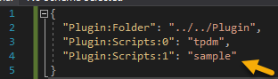
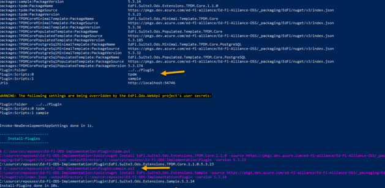
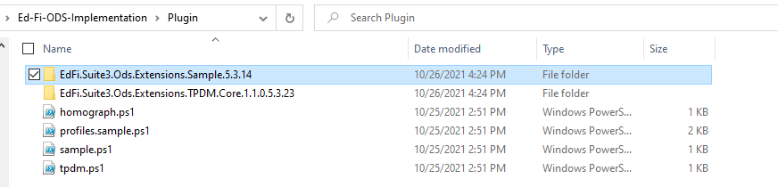
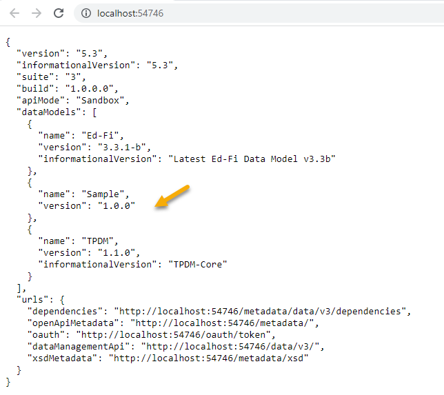
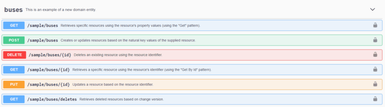
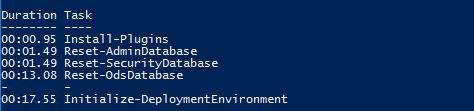
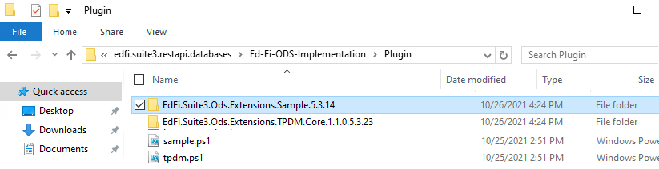
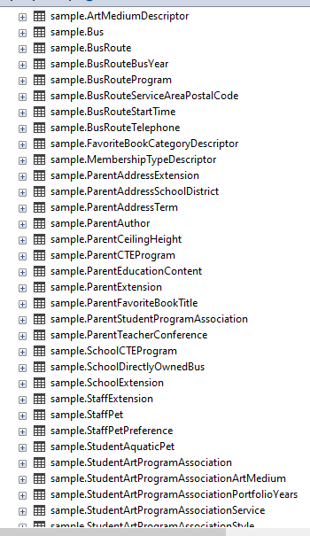
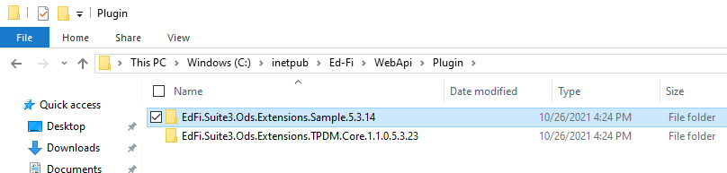

# How To: Deploy an Extension Plugin

In this example, you will learn how to install a pre-published extension plugin
in your local development environment as well as in your production deployment
environment. For details on how to create and publish extension plugin see [How
To: Create an Extension
Plugin](./how-to-create-an-extension-plugin.md).

The steps can be summarized as:

- [How To: Deploy an Extension Plugin](#how-to-deploy-an-extension-plugin)
  - [Install Sample extension in Development Environment](#install-sample-extension-in-development-environment)
    - [Import the Initiallize Development Module](#import-the-initiallize-development-module)
  - [Install Sample Extension in an Existing Production Environment](#install-sample-extension-in-an-existing-production-environment)
    - [Deploy Sample Extension Database Artifacts](#deploy-sample-extension-database-artifacts)
      - [Step 1. Download EdFi.Suite3.RestApi.Databases](#step-1-downloadedfisuite3restapidatabases)
      - [Step 2. Update configuration.json](#step-2update-configurationjson)
      - [Step 3. Run Deployment.psm1 with Dynamic Plugins](#step-3-run-deploymentpsm1-with-dynamic-plugins)
    - [Deploy Sample Extension Binaries to Web Server](#deploy-sample-extension-binaries-to-web-server)
      - [Step 4. Download EdFi.Suite3.Ods.Extensions.Sample](#step-4-download-edfisuite3odsextensionssample)
      - [Step 5. Verify API Landing Page in Browser](#step-5-verify-api-landing-page-in-browser)

Each step is outlined in detail, below.

## Install Sample extension in Development Environment

Assuming that the Ed-Fi ODS / API has been successfully downloaded and is
running in a local development environment per the instructions in the [Getting
Started](../getting-started/source-code-installation/readme.md) documentation,
pre-published Sample extension is now ready to be installed in your development
environment. Note that ODS / API comes preconfigured with TPDM Core dynamic
extension.

:::info

You may have to enable long path on your development environment to use this
option.

:::

appsettings to load sample plugin along with the default TPDM extension.

### Import the Initiallize Development Module

```powershell
PS C:\OSS-Workspace\Ed-Fi-ODS-Implementation\Application\EdFi.Ods.WebApi\> dotnet user-secrets set "Plugin:Folder"  "../../Plugin"
Successfully saved Plugin:Folder = ../../Plugin to the secret store.
PS C:\OSS-Workspace\Ed-Fi-ODS-Implementation\Application\EdFi.Ods.WebApi\> dotnet user-secrets set "Plugin:Scripts:0"  "tpdm"
Successfully saved Plugin:Scripts:0 = tpdm to the secret store.
PS C:\OSS-Workspace\Ed-Fi-ODS-Implementation\Application\EdFi.Ods.WebApi\> dotnet user-secrets set "Plugin:Scripts:1"  "sample"
Successfully saved Plugin:Scripts:1 = sample to the secret store.
```

To do so, simply open PowerShell and navigate to "`<source
directory>`\\Ed-Fi-ODS-Implementation" folder and run:

```powershell
.\Initialize-PowershellForDevelopment.ps1
Initdev
```

This will execute configured script from _**secret.json**_ to download sample
extension plugin and deploy the plugin artifacts to local database.





After the successful execution of initdev, you will find the sample extension in
`<source directory>`\\Ed-Fi-ODS-Implementation\\Plugin folder.



Run the "Ed-Fi-Ods.sln" solution from Visual Studio and verify that the sample
data models are listed in your API landing page.



You can also verify the Sample API endpoints in the Swagger UI documentation:



## Install Sample Extension in an Existing Production Environment

### Deploy Sample Extension Database Artifacts

#### Step 1. Download EdFi.Suite3.RestApi.Databases

* Download the EdFi.Suite3.RestApi.Databases from [Binary
    Releases](https://edfi.atlassian.net/wiki/display/ODSAPIS3V53/Binary+Releases).
* Change package extension from nupkg to zip.
* Right-click the zip file, click **unblock** and unzip the package.

#### Step 2. Update configuration.json

* Update configuration.json, for plugin settings as shown below:

    ```json
     "Plugin": {
            "Folder": "../../Plugin",
            "Scripts": [ "tpdm", "sample" ]
        }
    ```

#### Step 3. Run Deployment.psm1 with Dynamic Plugins

* From PowerShell, navigate to the download directory and run the following
    command to install sample extension on your existing ODS database:

    ```powershell
    Import-Module .\Deployment.psm1
    Initialize-DeploymentEnvironment
    ```

    

    

* After the successful execution, you will find sample schema tables in the
    deployed ODS database.

    

### Deploy Sample Extension Binaries to Web Server

#### Step 4. Download EdFi.Suite3.Ods.Extensions.Sample

* Download the EdFi.Suite3.Ods.Extensions.Sample package from [Binary
    Releases](https://dev.azure.com/ed-fi-alliance/Ed-Fi-Alliance-OSS/_packaging?_a=package&feed=EdFi%40Release&view=overview&package=EdFi.Suite3.Ods.Extensions.Sample&protocolType=NuGet).
* Change extension from nupkg to zip.
* Right-click the zip, click unblock, and unzip the package.
* Copy the extracted folder and paste it in C:\\inetpub\\Ed-Fi\\WebApi\\Plugin
    in your WebAPI directory.

    

* Update appsettings.json, for plugin settings as shown below:

    ```json
     "Plugin": {
            "Folder": "./Plugin",
            "Scripts": [ "tpdm", "sample" ]
        }
    ```

* Restart your IIS instance.

#### Step 5. Verify API Landing Page in Browser

* Browse to the API landing page and verify that sample data models are listed.


* You can also verify the Sample extension API endpoints in the Swagger UI
    documentation.


