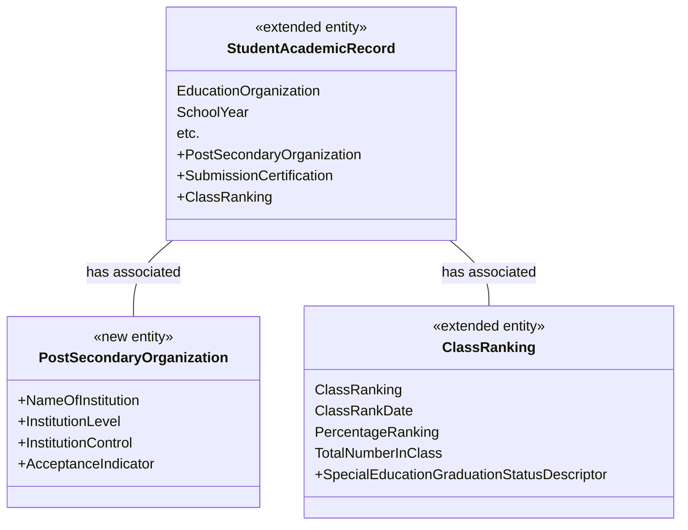

# How To: Extend the Ed-Fi ODS / API - Student Transcript Example

In this example, we will create a new domain entity called Student Transcript.
This entity will be exposed in Ed-Fi ODS / API through a new API resource
called **studentTranscripts.**

Before you begin:

* This example uses MetaEd to generate extended artifacts and documentation.
    MetaEd is a free tool developed by the Ed-Fi Alliance, and is the
    recommended way to add new fields to the Ed-Fi ODS / API. You
    should [download and install MetaEd](/reference/metaed) before beginning.
    If you prefer to generate extended artifacts manually instead of using
    MetaEd, steps are listed in [Appendix
    A](#appendix-a-adding-manually-created-extensions) of this page.
* This example assumes knowledge of the basic concepts described in the [How
    To: Extend the ODS / API - Alternative Education Program
    Example](./how-to-extend-the-ed-fi-ods-api-alternative-education-program-example.md).
    If you're new to the Ed-Fi technology stack, or if you haven't used MetaEd
    before, then we suggest you run through that example first.
* This example assumes that the Ed-Fi ODS / API has been successfully
    downloaded and is running in a local development environment per the
    instructions in the [Getting
    Started](../getting-started/source-code-installation/readme.md) documentation.
* Back up any existing code or scripts, either in source control or on your
    file system. This is important if you or your team have performed these
    steps before. The MetaEd deployment feature replaces existing files, some of
    which may contain hand-crafted customizations (e.g., to define an
    authorization strategy).

## Step 1. Design Your Extension

In a real project, you would take the preliminary step of designing your
extension, and analyzing how your needs map to the Ed-Fi ODS / API data model.
We'll propose a design.

This example will create a new Student Transcript entity, which will carry
information about where students enroll in college after graduation, a new
element indicating whether graduates were part of a special education program,
and some additional information about whether a transmitted record is an
official or unofficial submission.

Based on our needs, we require a new entity (to contain information about
postsecondary institutions) and we need to add some elements to existing
entities. The following diagram is a sketch showing the additional entity
and the new elements we're bolting on to existing Ed-Fi entities.



You'll notice that a few elements are shown with a type of "descriptor." The
Ed-Fi Descriptor is analogous to an enumeration. It's an Ed-Fi-specific design
pattern that allows for enumeration-like definition and validation within an
operational context, but may vary between contexts. We'll see more about how
these are implemented below.

This example is somewhat complex, but illustrates most of the advanced concepts
required to extend the Ed-Fi ODS / API. Let's continue with the mechanics.

## Step 2. Author Your Extension Using MetaEd

In this step, we'll create a new project in MetaEd, and author our new entity.
You do need to [download and install
MetaEd](https://edfi.atlassian.net/wiki/spaces/METAED20/pages/23710221/Getting+Started+with+the+MetaEd+IDE)
to do this step. Do that now if you haven't already.

### Step 2a. Set or Confirm MetaEd Target Version

MetaEd allows you to target different versions of the Ed-Fi technology stack and
data model. Confirm that your MetaEd IDE is targeting v7.2 by following the
instructions in the [Version
Targeting](https://edfi.atlassian.net/wiki/spaces/METAED20/pages/23709491/MetaEd+IDE+-+Creating+and+Maintaining+Your+Extension#MetaEdIDE-CreatingandMaintainingYourExtension-Step4.AddtheCorrectDataModelProject)
documentation for the MetaEd IDE.

The desired model for the latest ODS / API is "ed-fi-model-5.1".

### Step 2b. Create a New Extension Project

Create a new extension by following the steps in [MetaEd IDE - Creating and
Maintaining Your
Extension](https://edfi.atlassian.net/wiki/display/METAED20/MetaEd+IDE+-+Creating+and+Maintaining+Your+Extension).
In this example our extension is in a folder called "StudentTranscript"

<details>
<summary>Listing of files</summary>

```none
StudentTranscript/
├─ Association/
├─ Choice/
├─ Common/
├─ Descriptor/
├─ Domain/
├─ DomainEntity/
├─ Enumeration/
├─ Interchange/
├─ Shared/
├─ package.json
```

</details>

### Step 2c. Update the package.json File

Open the package.json file by double-clicking on the file in the tree view to
the left and provide an appropriate name for your project. In this case we will
call it "SampleStudentTranscript".

Click "Save" under the "File" menu or press **Ctrl + S** to save your changes.

```json
{
  "metaEdProject": {
    "projectName": "SampleStudentTranscript",
    "projectVersion": "1.0.0"
  }
}
```

### Step 2d. Add MetaEd Source Files to Your Project

We're going to add seven new .metaed source files to the project we just
created. You'll recall that MetaEd files are required to be organized into
subfolders named after their entity type. The core ed-fi-model project provides
examples of subfolder naming.

#### 2d.1. Add Domain Entities

Now we'll add two MetaEd source files to the DomainEntity folder.
**Right-click** on the folder **DomainEntity**, and select New File.

Name the new file **PostSecondaryOrganization.metaed** to match the name of the
new entity to be created.

Note the new file appears in the tree view to the left. **Double-click** on the
file in the tree view to open it. Type or copy and paste the code listing below
into your MetaEd file:

Note that errors will be listed in the linter panel until the referenced
Descriptors are created in a future step.

<details>
<summary>MetaEd Source for PostSecondaryOrganization Entity</summary>

```none
Domain Entity PostSecondaryOrganization
    documentation "PostSecondaryOrganization"
    shared string EdFi.NameOfInstitution
        documentation "The name of the institution."
        is part of identity
    descriptor InstitutionLevel
        documentation "The level of the institution."
        is required
    descriptor InstitutionControl
        documentation "The type of control of the institution (i.e., public or private)."
        is required
    bool AcceptanceIndicator
        documentation "An indication of acceptance."
        is required
```

</details>

We'll now create a Domain Entity source file, called
**StudentAcademicRecordExtension**, to add our new elements to the existing
Student Academic Record entity. Note that we can extend an existing entity using
the `additions` keyword (line 1 in the example below).

<details>
<summary>MetaEd Source for StudentAcademicRecordExtensions Entity</summary>

```none
Domain Entity EdFi.StudentAcademicRecord additions
    domain entity PostSecondaryOrganization
        documentation "A reference to the postsecondary organization."
        is optional
    descriptor SubmissionCertification
        documentation "The type of submission certification."
        is optional
    common extension EdFi.ClassRanking
        documentation "Class Ranking Extension"
        is optional
```

</details>

#### 2d.2. Extend the Class Ranking

In this step, we'll extend the Class Ranking entity to add our new
Special Education Graduation Status element. The steps are generally the same as
the ones you used to add the domain entities above.

**Right-Click** on the Common folder, select **New File**. Name your new file
**ClassRankingExtension.metaed**.

Similar to how you extended the Student Academic Record domain entity above,
you'll extend the Class Ranking entity with the keyword `additions`. Replace the
template text in your new Common source file with the following code.

<details>
<summary>MetaEd Source for ClassRankingExtensions Common Type</summary>

```none
Common EdFi.ClassRanking additions
    descriptor SpecialEducationGraduationStatus
        documentation "The graduation status for special education."
        is required
```

</details>

#### 2d.3. Add the new Ed-Fi Descriptor entities

If you're new to Ed-Fi technology, it's worth understanding the Ed-Fi Descriptor
pattern because it occurs throughout the model. In essence, Descriptors provide
states, districts, vendors, and other platform hosts with the flexibility to use
their own enumerations and code sets. A Descriptor is consistent within an
operational context such as a single district, but may be different in another
operational context.

**Right-click** on the Descriptor folder, select **New File**. We'll be adding
four Descriptor files in total. Name your first file
**InstitutionControl.metaed**.

Replace the template text in your new Descriptor source file with the following
code.

<details>
<summary>MetaEd Source for InstitutionControl Descriptor</summary>

```none
Descriptor InstitutionControl
    documentation "The type of control for an institution (e.g., public or private)."
```

</details>

Voilà! Almost done. Follow the steps above and add the remaining three
Descriptors.

Add an **InstitutionLevel.metaed** file.

<details>
<summary>MetaEd Source for InstitutionLevel Descriptor</summary>

```none
Descriptor InstitutionLevel
    documentation "The typical level of postsecondary degree offered by the institute."
```

</details>

Add a **SpecialEducationGraduationStatus.metaed** file.

<details>
<summary>MetaEd Source for SpecialEducationGraduationStatus Descriptor</summary>

```none
Descriptor SpecialEducationGraduationStatus
    documentation "The graduation status for special education."
```

</details>

Add a **SubmissionCertification.metaed** file.

<details>
<summary>MetaEd Source for SubmissionCertification Descriptor</summary>

```none
Descriptor SubmissionCertification
    documentation "The type of submission certification."
```

</details>

#### 2d.4. Add the new Interchange file

If you want to bulk load this extension, you need to create an interchange
file.

**Right-click** on the Interchange folder, select **New File**. Name your file
**StudentTranscript.metaed**. Replace the template text in your new Interchange
source file with the following code.

<details>
<summary>MetaEd Source for StudentTranscript Interchange</summary>

```none
Interchange EdFi.StudentTranscript additions
  domain entity PostSecondaryOrganization
```

</details>

At this point, your project in the MetaEd IDE should look like the following:

<details>
<summary>Listing of files</summary>

```none
StudentTranscript/
├─ Association/
├─ Choice/
├─ Common/
| ├─ ClassRankingExtensions.metaed
├─ Descriptor/
| ├─ InstitutionControl.metaed
| ├─ InstitutionLevel.metaed
| ├─ SpecialEducationGraduationStatus.metaed
| ├─ SubmissionCertification.metaed
├─ Domain/
├─ DomainEntity/
| ├─ PostSecondaryOrganizations.metaed
| ├─ StudentAcademicRecordExtension.metaed
├─ Enumeration/
├─ Interchange/
| ├─ StudentTranscript.metaed
├─ Shared/
├─ package.json
```

</details>

## Step 3. Generate Extended Technical Artifacts Using MetaEd

In this step, we'll build our new MetaEd project. This is fairly
straightforward.

### Step 3a. Build Your Project

**Click** **Build** in the **VS Code** menu to generate artifacts.

Artifacts build successfully.

### Step 3b. View MetaEd Output

You can expand the project in the tree view and click "MetaEdOutput" to explore
generated artifacts. The artifacts include technical output such as SQL scripts
and XSD used by the code generation, but also updated documentation such as data
dictionaries that add your extension definitions to the ODS / API documentation.

<details>
<summary>Listing of files</summary>

```none
StudentTranscript/
├─ Association/
├─ Choice/
├─ Common/
| ├─ ClassRankingExtensions.metaed
├─ Descriptor/
| ├─ InstitutionControl.metaed
| ├─ InstitutionLevel.metaed
| ├─ SpecialEducationGraduationStatus.metaed
| ├─ SubmissionCertification.metaed
├─ Domain/
├─ DomainEntity/
| ├─ PostSecondaryOrganizations.metaed
| ├─ StudentAcademicRecordExtension.metaed
├─ Enumeration/
├─ Interchange/
| ├─ StudentTranscript.metaed
├─ MetaEdOutput/                            <----- NEW DIRECTORY
| ├─ Documentation/
| ├─ EdFi/
| ├─ SampleStudentTranscript/
|   ├─ ApiMetadata/
|     ├─ ApiModel-EXTENSION.json
|   ├─ Database/
|   ├─ Interchange/
|   ├─ XSD/
├─ Shared/
├─ package.json
```

</details>

We'll look at how to use this MetaEd output in your code below. First, we'll
need to set up our extension project in Visual Studio.

## Step 4. Create Extension Project in ODS / API Solution

This step will create the C# Extension files necessary to build your extended
solution. This step assumes you've successfully downloaded and can run the ODS /
API in a local development environment per the instructions in the [Getting
Started](../getting-started/readme.md) documentation.
Do that now if you haven't already.

### Step 4a. Set Up the C# Project Template

Visual Studio Project Templates can be installed by following steps in [Project
Templates
Installation](../getting-started/source-code-installation/project-templates-installation.md) section
of this documentation.

### Step 4b. Create new Extension Project

#### 4b.1. Add a project to your Ed-Fi-Ods Visual Studio Solution

To add a project to your Ed-Fi-Ods Visual Studio Solution, **right-click** on the
Ed-Fi Extensions Folder. Select **Add** > **New Project**.

#### 4b.2

Search and select the **Ed-Fi API Extensions Project Template** option
and Click **Next**.


 In the Project Name field,
 enter **EdFi.Ods.Extensions.SampleStudentTranscript** and click **Create**.

:::info

To ensure MetaEd outputs are correctly deployed to ODS / API extension project,
the last section of the project name should match the namespace you provided in
Step 2.c with the first character in upper case.

:::

### Step 4c. Rename the "Marker" Interface file

#### 4c.1. Rename the "Marker" Interface file

**Right-click** on the **Marker\_EdFi\_Ods\_Extensions\_ExtensionName.cs** file
in newly created **EdFi.Ods.Extensions.SampleStudentTranscript** project and
Rename the file to **Marker\_EdFi\_Ods\_Extensions\_SampleStudentTranscript.cs**.
file to **Marker\_EdFi\_Ods\_Extensions\_SampleStudentTranscript.cs**.

**4c.2.** When prompted choose to rename all references to the code
element **Marker\_EdFi\_Ods\_Extensions\_ExtensionName**.

### Step 4d. Integrate Extension into the Solution

In this step, we'll integrate the extension into the solution.

#### 4d.1

Locate the **EdFi.Ods.WebApi** project, within the "Entry Points"
folder. **Right-click**, select **Add** > **Project Reference...**, then select
the **EdFi.Ods.Extensions.SampleStudentTranscript** project.


#### 4d.2

Locate any profile projects in the
solution. **Right-click**, select **Add** > **Project** **Reference...**, then
select the **EdFi.Ods.Extensions.SampleStudentTranscript** project. This step is
needed only if any of the Profile resources in the Profiles.xml document are
extended, or extension entities are being constrained by a particular Profile.

## Step 5. Deploy your Extended Artifacts to the ODS / API Solution

In this step, we'll use the MetaEd "Deploy" feature and integrate the files
you've generated with the ODS / API Solution. The MetaEd IDE can deploy the
generated artifacts necessary for an ODS / API build of an extension project.
These include the generated SQL, generated XSD, and other material.

You can easily configure the MetaEd IDE to copy the generated files to the
correct locations for the ODS / API project.

### Step 5a. Confirm MetaEd Deployment Settings

Ensure that your Ed-Fi ODS / API source directory is set properly in the MetaEd
Extension settings. In VS Code open Settings **Ctrl+,** and switch to the
Workspace tab, find the MetaEd extension and update the "Ods Api Deployment
Directory" to point to the folder that contains the Ed-Fi-ODS and
Ed-Fi-ODS-Implementation folders.

### Step 5b. Deploy Your Extended Artifacts

:::caution
As noted above, deployment will remove existing SQL scripts —
including modifications to establish the authorization strategy as described
in the next step. Verify that you have a source control copy or file backup of
previous work before running deployment.
:::

Deploy by clicking the **Deploy** button in the upper right corner of the window
(must have a file open, otherwise the button is not displayed).

This will run a new build of all artifacts, and the artifacts required for your
Extended ODS / API project will be copied over to the correct locations.

For instructions on how to perform the steps manually, see [Appendix
A](#appendix-a-adding-manually-created-extensions), below.

## Step 6. Configure Security

The Ed-Fi ODS / API is secure by default. One implication of this design
principle is that new entities and elements may not be accessed until an
authorization strategy is applied. This prevents accidental release of
confidential information, but does require active steps on the part of system
developers to enable access to Extensions.

PostSecondaryOrganization has no relationship to people or education
organizations and therefore has no authorization strategy that can be applied to
it. In effect, it is a standalone table and will need an authorization strategy
of "NoFurtherAuthorizationRequired" for API requests to be made against it. If
security is desired, another authorization strategy could be implemented to
handle this entity.

To enable NoFurtherAuthorizationRequired, first create a security SQL script
called **0001-PostSecondaryOrganization\_No\_Further\_Auth\_Required.sql** and
place it in
the Ed-Fi-ODS-Implementation\\Application\\EdFi.Ods.Extensions.SampleStudentTranscript\\Versions\\1.0.0\\Standard\\5.1.0\\Artifacts\\MsSql\\Data\\Security folder
(Create 'Security' folder if it does not exist). Copy the contents of the
following SQL DML script into the newly created file and save.

<details>
<summary>0001-PostSecondaryOrganization\_No\_Further\_Auth\_Required.sql</summary>

```sql
DECLARE @SystemDescriptorsId INT

SELECT @SystemDescriptorsId = resourceclaimid
FROM   [dbo].[resourceclaims]
WHERE  resourcename = 'systemDescriptors'

INSERT INTO [dbo].[resourceclaims]
            ([resourcename],
             [claimname],
             [parentresourceclaimid])
VALUES      ('institutionControlDescriptor',
'http://ed-fi.org/ods/identity/claims/sample-student-transcript/institutionControlDescriptor',
@SystemDescriptorsId)

INSERT INTO [dbo].[resourceclaims]
            ([resourcename],
             [claimname],
             [parentresourceclaimid])
VALUES      ('institutionLevelDescriptor',
              'http://ed-fi.org/ods/identity/claims/sample-student-transcript/institutionLevelDescriptor',
              @SystemDescriptorsId)

INSERT INTO [dbo].[resourceclaims]
            ([resourcename],
             [claimname],
             [parentresourceclaimid])
VALUES      ('specialEducationGraduationStatusDescriptor',
'http://ed-fi.org/ods/identity/claims/sample-student-transcript/specialEducationGraduationStatusDescriptor',
@SystemDescriptorsId)

INSERT INTO [dbo].[resourceclaims]
            ([resourcename],
             [claimname],
             [parentresourceclaimid])
VALUES      ( 'submissionCertificationDescriptor',
'http://ed-fi.org/ods/identity/claims/sample-student-transcript/submissionCertificationDescriptor',
@SystemDescriptorsId )

INSERT INTO [dbo].[ResourceClaims] (
     [ResourceName]
    ,[ClaimName]
    ,[ParentResourceClaimId])
VALUES (
    'postSecondaryOrganization'
    ,'http://ed-fi.org/ods/identity/claims/sample-student-transcript/postSecondaryOrganization'
    ,NULL
    )

--Setup Authorization Strategy

DECLARE @AuthorizationStrategyId INT
DECLARE @ResourceClaimId INT

SELECT @AuthorizationStrategyId = AuthorizationStrategyId
FROM AuthorizationStrategies
WHERE AuthorizationStrategyName = 'NoFurtherAuthorizationRequired'

SELECT @ResourceClaimId = resourceclaimid
FROM ResourceClaims
WHERE ResourceName = 'postSecondaryOrganization'

INSERT INTO [dbo].[ResourceClaimActions] (
    [ResourceClaimId]
    ,[ActionId]
    ,[ValidationRuleSetName]
    )
SELECT ResourceClaimId, a.ActionId, null
FROM [dbo].[ResourceClaims]
CROSS APPLY (
    SELECT ActionId
    FROM [dbo].[Actions]
    WHERE ActionName IN ('Create', 'Read', 'Update', 'Delete', 'ReadChanges')) AS a
WHERE ResourceClaimId = @ResourceClaimId

INSERT INTO [dbo].[ResourceClaimActionAuthorizationStrategies] (
    [ResourceClaimActionId]
    ,[AuthorizationStrategyId]
    )
SELECT ResourceClaimActionId, @AuthorizationStrategyId
FROM [dbo].[ResourceClaimActions] rca
INNER JOIN [dbo].[ResourceClaims] rc
    ON rca.[ResourceClaimId] = rc.[ResourceClaimId]
INNER JOIN [dbo].[Actions] a
    ON rca.ActionId = a.Actionid
        AND a.ActionName IN ('Create','Read','Update','Delete', 'ReadChanges')
WHERE rc.ResourceClaimId = @ResourceClaimId

--Add to SIS Vendor and Ed-Fi Sandbox claim sets
INSERT INTO [dbo].[ClaimSetResourceClaimActions]
SELECT [ClaimSetId]
    ,[ResourceClaimId]
    ,[ActionId]
    ,NULL
FROM Actions a
    ,ClaimSets c
    ,ResourceClaims r
WHERE r.ResourceName = 'postSecondaryOrganization'
    AND (
        c.ClaimSetName = 'SIS Vendor'
        OR c.ClaimSetName = 'Ed-Fi Sandbox'
        )
    AND NOT EXISTS (
        SELECT 1
        FROM ClaimSetResourceClaimActions csrca
        WHERE csrca.ActionId = a.ActionId
            AND csrca.ClaimSetId = c.ClaimSetId
                 AND csrca.ResourceClaimId = r.ResourceClaimId
        )
```

</details>

### Preventing Resource Name Conflicts

With MetaEd 2+, it is possible to create extension resources that use the same
name as an Ed-Fi standard resource. The authorization metadata supports this
through a change in behavior so it no longer uses just the resource name to
identify the resource, but instead uses the ClaimName. To prevent possible
naming conflicts, the claim name's URI value should include the schema
representation, using the following format:

`<http://ed-fi.org/ods/identity/claims/{schema}/{resourceName}>`

The URI representation of the schema name should be derived by splitting the
terms in the name of the extension, inserting hyphens and converting to lower
case. For example, "SampleStudentTranscript" would be separated into "Sample",
"Student" and "Transcript" and then combined with hyphens and converted to lower
case as "sample-student-transcript".

The resource name should be the camel-cased (also known as "medial capitals"),
singularized name of the resource (e.g., "postSecondaryOrganization" not
"PostSecondaryOrganization" or "postSecondaryOrganizations").

Note that in 0001-PostSecondaryOrganization\_No\_Further\_Auth\_Required.sql
script above, the resulting ClaimName value is
`"http://ed-fi.org/ods/identity/claims/sample-student-transcript/postSecondaryOrganization"`

## Step 7. Run Code Generation and Verify Changes

Save all modified files, close Ed-Fi-ODS.sln, and re-run the code generation
steps outlined in the [Getting Started
Guide](../getting-started/source-code-installation/readme.md) (i.e.,
from a PowerShell prompt run `Initialize-PowershellForDevelopment.ps1` script,
followed by the `initdev` command). Then, run the application and view the Ed-Fi
ODS / API in the Swagger UI.

The new postSecondaryOrganizations API resource should be visible, as well as
the **postSecondaryOrganizationReference** in
the **studentAcademicRecord** resource.


## Next Steps & Further Information

Congratulations, you've successfully extended an instance of the Ed-Fi ODS /
API.

The Ed-Fi Extension in this example is fairly simple. It's a good place to
start, but most enterprise users have more complicated needs. [The MetaEd
Cookbook](/reference/metaed/cookbook)
documentation provides excellent additional examples of common scenarios, from
the simple to very complex.

## Appendix A: Adding Manually Created Extensions

### Step A1. Set Up the C# Project Template

Visual Studio Project Templates can be installed by following steps in [Project
Templates
Installation](../getting-started/source-code-installation/project-templates-installation.md)
section of this documentation.

### Step A2. Create new Extension Project

#### A2.1

To add a project to your Ed-Fi-Ods Visual Studio Solution, **right-click** on
the Ed-Fi Extensions Folder. Select **Add** > **New Project**.

#### A2.2

Search and select the **Ed-Fi API Extensions Project Template** option and
click **Next**.


In the Project Name field,
enter ****EdFi.Ods.Extensions.SampleStudentTranscript**** and
click ****Create****.

### Step A3. Rename the "Marker" Interface File

**3.1.** **Right-click** on
the **Marker\_EdFi\_Ods\_Extensions\_ExtensionName.cs** file in newly
created **EdFi.Ods.Extensions.SampleStudentTranscript** project and Rename the
file to **Marker\_EdFi\_Ods\_Extensions\_SampleStudentTranscript.cs**.

**3.2.** When prompted choose to rename all references to the code
element **Marker\_EdFi\_Ods\_Extensions\_ExtensionName**.

### Step A4. Integrate Extension into the Solution

In this step, we'll integrate the extension into the solution.

#### A4.1

Locate the **EdFi.Ods.WebApi** project, within the "Entry Points"
folder. **Right-click**, select **Add** > **Reference...**, then select
the **EdFi.Ods.Extensions.SampleStudentTranscript** project.


#### A4.2

Locate any profile projects in the solution. **Right-click**, select
**Add** > **Project** **Reference...**, then select the
**EdFi.Ods.Extensions.SampleStudentTranscript** project. This step is needed
only if any of the Profile resources in the Profiles.xml document are extended,
or extension entities are being constrained by a particular Profile.

### Step A5. Add Extension Metadata

If you chose to generate Extension artifacts manually, copy them to Artifacts
folder of Extension project you created in the previous step. For the purpose of
this example we can use MetaEd Generated Extension Artifacts from the Download
section.

Open command prompt and navigate to root of the ODS / API repository on your
local drive. This is the folder that contains both Ed-Fi-ODS
and Ed-Fi-ODS-Implementation repositories. Run the following copy commands:

```powershell
xcopy /y "Ed-Fi-ODS\Samples\Extensions\StudentTranscript\StudentTranscriptMetaEd\MetaEdOutput\SampleStudentTranscript\Database\SQLServer\ODS\Structure" `
  "Ed-Fi-ODS-Implementation\Application\EdFi.Ods.Extensions.SampleStudentTranscript\Versions\1.0.0\Standard\5.1.0\Artifacts\MsSql\Structure\Ods\*"

xcopy /y "Ed-Fi-ODS\Samples\Extensions\StudentTranscript\StudentTranscriptMetaEd\MetaEdOutput\SampleStudentTranscript\Database\PostgreSQL\ODS\Structure" `
  "Ed-Fi-ODS-Implementation\Application\EdFi.Ods.Extensions.SampleStudentTranscript\Versions\1.0.0\Standard\5.1.0\Artifacts\PgSql\Structure\Ods\*"

xcopy /y "Ed-Fi-ODS\Samples\Extensions\StudentTranscript\StudentTranscriptMetaEd\MetaEdOutput\SampleStudentTranscript\ApiMetadata" `
  "Ed-Fi-ODS-Implementation\Application\EdFi.Ods.Extensions.SampleStudentTranscript\Versions\1.0.0\Standard\5.1.0\Artifacts\Metadata\*"

xcopy /y "Ed-Fi-ODS\Samples\Extensions\StudentTranscript\StudentTranscriptMetaEd\MetaEdOutput\SampleStudentTranscript\XSD" `
  "Ed-Fi-ODS-Implementation\Application\EdFi.Ods.Extensions.SampleStudentTranscript\Versions\1.0.0\Standard\5.1.0\Artifacts\Schemas\*"

xcopy /y "Ed-Fi-ODS\Samples\Extensions\StudentTranscript\StudentTranscriptMetaEd\MetaEdOutput\SampleStudentTranscript\Interchange" `
  "Ed-Fi-ODS-Implementation\Application\EdFi.Ods.Extensions.SampleStudentTranscript\Versions\1.0.0\Standard\5.1.0\Artifacts\Schemas\*"
```

### Step A6. Configure Security

The Ed-Fi ODS / API is secure by default. One implication of this design
principle is that new entities and elements may not be accessed until an
authorization strategy is applied. This prevents accidental release of
confidential information, but does require active steps on the part of system
developers to enable access to Extensions.

PostSecondaryOrganization has no relationship to people or education
organizations and therefore has no authorization strategy that can be applied to
it. It is in effect a standalone table and will need an authorization strategy
of "NoFurtherAuthorizationRequired" for API requests to be made against it. If
security is desired, another authorization strategy could be implemented to
handle this entity.

To enable NoFurtherAuthorizationRequired, first create a security SQL script
called **0001-PostSecondaryOrganization\_No\_Further\_Auth\_Required.sql** and
place it in the `Ed-Fi-ODS-Implementation/Application/
EdFi.Ods.Extensions.SampleStudentTranscript/Versions/1.0.0/Standard/5.1.0/Artifacts/MsSql/Data/Security` folder
(Create 'Security' folder if it does not exist). Copy the contents of the
following SQL DML script into the newly created file and save.

<details>
<summary>0001-PostSecondaryOrganization\_No\_Further\_Auth\_Required.sql</summary>

```sql
DECLARE @SystemDescriptorsId INT

SELECT @SystemDescriptorsId = resourceclaimid
FROM   [dbo].[resourceclaims]
WHERE  resourcename = 'systemDescriptors'

INSERT INTO [dbo].[resourceclaims]
            ([resourcename],
 = 'NoFurtherAuthorizationRequired'

SELECT @ResourceClaimId = resourceclaimid
FROM ResourceClaims
WHERE ResourceName = 'postSecondaryOrganization'

INSERT INTO [dbo].[ResourceClaimActions] (
    [ResourceClaimId]
    ,[ActionId]
    ,[ValidationRuleSetName]
    )
SELECT ResourceClaimId, a.ActionId, null
FROM [dbo].[ResourceClaims]
CROSS APPLY (
    SELECT ActionId
    FROM [dbo].[Actions]
    WHERE ActionName IN ('Create', 'Read', 'Update', 'Delete', 'ReadChanges')) AS a
WHERE ResourceClaimId = @ResourceClaimId

INSERT INTO [dbo].[ResourceClaimActionAuthorizationStrategies] (
    [ResourceClaimActionId]
    ,[AuthorizationStrategyId]
    )
SELECT ResourceClaimActionId, @AuthorizationStrategyId
FROM [dbo].[ResourceClaimActions] rca
INNER JOIN [dbo].[ResourceClaims] rc
    ON rca.[ResourceClaimId] = rc.[ResourceClaimId]
INNER JOIN [dbo].[Actions] a
    ON rca.ActionId = a.Actionid
        AND a.ActionName IN ('Create','Read','Update','Delete', 'ReadChanges')
WHERE rc.ResourceClaimId = @ResourceClaimId

--Add to SIS Vendor and Ed-Fi Sandbox claim sets
INSERT INTO [dbo].[ClaimSetResourceClaimActions]
SELECT [ClaimSetId]
    ,[ResourceClaimId]
    ,[ActionId]
    ,NULL
FROM Actions a
    ,ClaimSets c
    ,ResourceClaims r
WHERE r.ResourceName = 'postSecondaryOrganization'
    AND (
        c.ClaimSetName = 'SIS Vendor'
        OR c.ClaimSetName = 'Ed-Fi Sandbox'
        )
    AND NOT EXISTS (
        SELECT 1
        FROM ClaimSetResourceClaimActions csrca
        WHERE csrca.ActionId = a.ActionId
            AND csrca.ClaimSetId = c.ClaimSetId
                 AND csrca.ResourceClaimId = r.ResourceClaimId
        )
```

</details>

### Step 7. Run Initdev

Save all modified files, close Ed-Fi-ODS.sln, and re-run the code generation
steps outlined in the [Getting Started
Guide](../getting-started/source-code-installation/readme.md) (i.e.,
from a PowerShell prompt run `Initialize-PowershellForDevelopment.ps1` script,
followed by the `initdev` command). Then, run the application and view the Ed-Fi
ODS / API in the Swagger UI. The following new API resource should be visible:


:::note
The following GitHub links contain source files for this extensibility sample.

* [Student Transcript MetaEd Source](https://github.com/Ed-Fi-Alliance-OSS/Ed-Fi-ODS/tree/v7.2/Samples/Extensions/StudentTranscript/StudentTranscriptMetaEd)
* [Student Transcript Generated Artifacts](https://github.com/Ed-Fi-Alliance-OSS/Ed-Fi-ODS/tree/v7.2/Samples/Extensions/StudentTranscript/StudentTranscriptMetaEd/MetaEdOutput/SampleStudentTranscript)

:::
