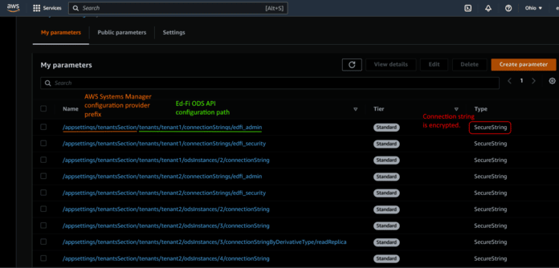
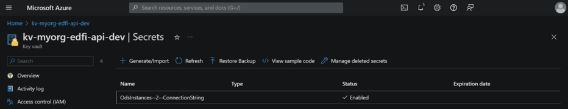

# External Configuration of ODS Connection Strings

While the primary source for .NET configuration information is the
_appsettings.json_ file in the _EdFi.Ods.WebApi_ project, the .NET configuration
architecture is highly extensible through the addition of custom configuration
sources. This article provides an example of how to use additional .NET
configuration sources for externalizing the configuration of the ODS connection
strings used by the Ed-Fi ODS API, including the use of AWS Systems Manager
Parameter Store.

## Alternative Connection String Sources

While the EdFi\_Admin database holds information about the available ODS
instances and their connection strings, the Ed-Fi ODS/API also supports sourcing
the ODS connection strings for the ODS instances through the configuration
architecture. Examples of the applicable configuration formats are shown below
(represented here in JSON format).

:::caution
When you are using a configuration-based source for the ODS instance connection
strings, be sure to set the ConnectionString column of the records in the
OdsInstances table in the EdFi\_Admin database to `null`.
:::

### Single-Tenant Configuration

In a single-tenant configuration, the overrides for ODS connection strings can
be defined in the "OdsInstances" section of the configuration, keyed by the
OdsInstanceId (as defined in the EdFi\_Admin database). Note that in the example
below, it shows an explicit database segmentation approach based on school year
provided by the API client in the base route of the API.

#### appsettings\_odsinstances.json

```json
"OdsInstances": {
  "3": {
    "ConnectionString": "Server=(local); Database=EdFi_Ods_2022; Encrypt=False; Trusted_Connection=True; Application Name=EdFi.Ods.WebApi;",
    "ContextValueByKey": {
      "schoolYearFromRoute": "2022"
    },
    "ConnectionStringByDerivativeType": {
      "Snapshot": "Server=(local); Database=EdFi_Ods_2022_Snapshot; Encrypt=False; Trusted_Connection=True; Application Name=EdFi.Ods.WebApi;"
    }
  },
  "4": {
    "ConnectionString": "Server=(local); Database=EdFi_Ods_2023; Encrypt=False; Trusted_Connection=True; Application Name=EdFi.Ods.WebApi;",
    "ContextValueByKey": {
      "schoolYearFromRoute": "2023"
    }
  }
}
```

### Multi-Tenant Configuration

In a multi-tenant configuration, the overrides for ODS connection strings are
defined in an "OdsInstances" section under the "Tenants" section of the
configuration, keyed by tenant-specific OdsInstanceId (as defined in the
tenant's EdFi\_Admin database), as follows:

#### appsettings\_tenants.json

```json
"Tenants": {
  "Tenant1": {
    "ConnectionStrings": {
      "EdFi_Admin": "Server=(local); Database=EdFi_Admin_Tenant1; Encrypt=False; Trusted_Connection=True; Application Name=EdFi.Ods.WebApi;",
      "EdFi_Security": "Server=(local); Database=EdFi_Security_Tenant1; Encrypt=False; Trusted_Connection=True; Persist Security Info=True; Application Name=EdFi.Ods.WebApi;"
    },
    "OdsInstances": {
      "3": {
        "ConnectionString": "Server=(local); Database=EdFi_Ods_Tenant1_2022; Encrypt=False; Trusted_Connection=True; Application Name=EdFi.Ods.WebApi;",
        "ContextValueByKey": {
          "schoolYearFromRoute": "2022"
        },
        "ConnectionStringByDerivativeType": {
          "Snapshot": "Server=(local); Database=EdFi_Ods_Tenant1_2022_Snapshot; Encrypt=False; Trusted_Connection=True; Application Name=EdFi.Ods.WebApi;"
        }
      },
      "4": {
        "ConnectionString": "Server=(local); Database=EdFi_Ods_Tenant1_2023; Encrypt=False; Trusted_Connection=True; Application Name=EdFi.Ods.WebApi;",
        "ContextValueByKey": {
          "schoolYearFromRoute": "2023"
        }
      }
    }
  },
  "Tenant2": {
    ...
  }
}
```

## Examples

There are a variety of external configuration providers available and the
concepts and approach should be similar to the examples below. Primarily you
must understand the structure of the configuration values expected by the API
(as documented above), and how to correctly represent these values with the
external configuration source of your choosing so that they integrate correctly
into the logical configuration hierarchy.

### JSON Configuration Files

To add JSON files to the API configuration, include the file alongside the
existing _appsettings.json_ file (ensuring that it is copied to the output
directory on build), and modify the host configuration in the _Program.cs_ file
of the _EdFi.Ods.WebApi_ project as follows:

```cs
var hostBuilder = Host.CreateDefaultBuilder(args)
    .ConfigureLogging(ConfigureLogging)
    .UseServiceProviderFactory(new AutofacServiceProviderFactory())
    .ConfigureAppConfiguration(c =>
    {
        c.AddJsonFile("appsettings_tenants.json", optional: false, reloadOnChange: true);
    })
    .ConfigureWebHostDefaults(...)
    ...
```

### AWS Systems Manager Parameter Store

To add AWS configuration support to the API, first add the
[Amazon.Extensions.Configuration.SystemsManager](https://www.nuget.org/packages/Amazon.Extensions.Configuration.SystemsManager)
nuget package to the _EdFi.Ods.WebApi_ project. Then modify the host
configuration in the _Program.cs_ file to register this as an additional
configuration source using the ConfigureAppConfiguration extension method (with
a hard-coded 10-minute refresh period in this example):

```cs
var hostBuilder = Host.CreateDefaultBuilder(args)
    .ConfigureLogging(ConfigureLogging)
    .UseServiceProviderFactory(new AutofacServiceProviderFactory())
    .ConfigureWebHostDefaults(...)
    .ConfigureAppConfiguration(c =>
    {
        c.AddSystemsManager("/appsettings/tenantsSection", TimeSpan.FromMinutes(10));
    })
    ...
```

Finally, you'll need to create and maintain the necessary configuration entries
in the AWS Systems Manager Parameter Store. The image below shows the
configuration of secure connection strings for tenant-specific EdFi\_Admin,
EdFi\_Security and EdFi\_ODS databases in a multi-tenant configuration. Note the
use of the same prefix on the individual item names as the first argument passed
to the `AddSystemsManager` call in the code sample above.



:::info

In order for this code to work, you must perform some initialization
of the AWS SDK so that it has the necessary information to authenticate with
your AWS account. That information is outside the scope of this documentation.

:::

### Azure Key Vault

To add Azure Key Vault support to the API, first add the
[Azure.Extensions.AspNetCore.Configuration.Secrets](https://www.nuget.org/packages/Azure.Extensions.AspNetCore.Configuration.Secrets)
nuget package to the _EdFi.Ods.WebApi_ project. Then modify the host
configuration in the _Program.cs_ file as shown below to register this as an
additional configuration source using the `ConfigureAppConfiguration` extension
method. This example shows how to add the key vault information to the
_appsettings.json_ file and configure it with a 10-minute refresh period.

```cs
var hostBuilder = Host.CreateDefaultBuilder(args)
    .ConfigureLogging(ConfigureLogging)
    .UseServiceProviderFactory(new AutofacServiceProviderFactory())
    .ConfigureWebHostDefaults(...)
    .ConfigureAppConfiguration(
        (configurationBuilder) =>
        {
            // Make configuration values accessible now
            var configuration = configurationBuilder.Build();
            string keyVaultName = configuration["ApiSettings:Services:AzureKeyVault:KeyVaultName"];
            string reloadIntervalText = configuration["ApiSettings:Services:AzureKeyVault:ReloadIntervalSeconds"];

            var keyVaultUri = new Uri($"https://{keyVaultName}.vault.azure.net/");
            var secretClient = new SecretClient(keyVaultUri, new DefaultAzureCredential());

            var options = new AzureKeyVaultConfigurationOptions()
            {
                ReloadInterval = int.TryParse(reloadIntervalText, out var intervalSeconds)
                    ? TimeSpan.FromSeconds(intervalSeconds)
                    : null,
            };

             configurationBuilder.AddAzureKeyVault(secretClient, options);
         });
    ...
```

Add the supporting Azure Key Vault configuration information under the Services
section in _appsettings.json_:

```json
{
    "ApiSettings": {
        "Services": {
            "AzureKeyVault": {
                "KeyVaultName": "kv-myorg-edfi-api-dev",
                "ReloadIntervalSeconds": 600
            }
        },
    }
}
```

Ultimately, it is essential to create and manage the required configuration
entries in Azure Key Vault, ensuring that the identity accessing the vault has
the necessary permissions. The configuration for a secure connection string to
an EdFi\_ODS database (with `OdsInstanceId = 2`) in a single-tenant setup is
depicted below. Note the use of an API-specific key vault and the use of double
hyphens (`--`) to separate the segments of the configuration hierarchy.



:::info

To run this code locally, you need to initialize the Azure SDK with
the required information for Azure authentication. Details on setting up the
Azure client and granting your application the necessary permissions to access
key vault secrets are outside the scope of this documentation.

:::
