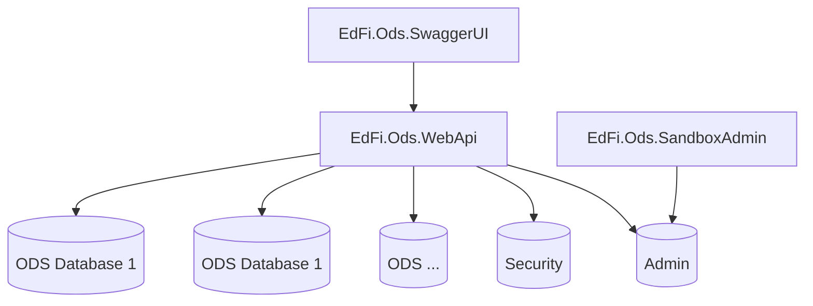
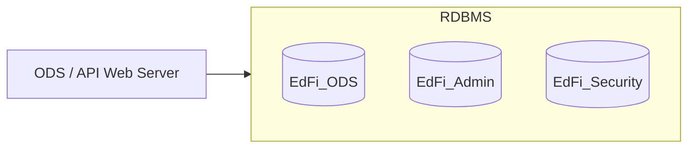

# Sandbox Deployment

This section describes the particulars of deploying a Sandbox instance of the
Ed-Fi ODS / API in an on-premises configuration. Although a Sandbox instance
should mirror a Production environment as closely as possible, the Sandbox is
different from a Production deployment in a few important ways:

* The data accessed is test data that is fully disconnected from production
    data.

* The API documentation resides on the Sandbox instance.

* The Sandbox instance includes a Sandbox Administration Portal that should
    not be part of a Production deployment.
* The hardware and platform requirements are typically lower than with a
    Production deployment.

A Sandbox environment is generally used to support API client developers in
developing client applications. It is not intended to be a staging environment
for the platform host.

## Sandbox Fundamentals

This section outlines the basic information you’ll need to know to get a Sandbox
instance up and running.

### API Sandbox Components

There are several websites and databases that work together to provide primary
and supporting functions for a Sandbox instance:

* **Websites**

  * **Ed-Fi ODS API.** The REST endpoint for client applications.

  * **Swagger Documentation UI.** A hosted, web-based Ed-Fi ODS / API client
        that allows a user to interactively explore the API and read API
        documentation.

  * **Sandbox Administration UI.** This website provides administrative
        functions for managing sandboxes, including the keys and secrets for
        accessing sandboxes.

* **Databases**

  * **EdFi\_ODS\_\*.** Databases used as templates and test data stores for
        a Sandbox installation of the Ed-Fi-ODS / API.

  * **EdFi\_Admin.** A database containing authentication information for
        API clients.

  * **EdFi\_Security.** A database containing authorization information for
        API clients.

## Sandbox Security

The Sandbox system is, by definition, a test system so it has a different
security profile than a production system. The following are a few guidelines
applicable to Sandbox instances:

* Client applications should be assigned different OAuth key/secret pairs for
    the Sandbox than are used in production.
* Use test data. If you plan to use a copy of production data, scramble or
    otherwise de-identify the data before use in the Sandbox.
* The use of HTTPS and SSL certificates is required for production application
    instances, so the Sandbox instance should mimic that approach.
* Similar to production systems, Sandbox instances should use non-default
    service accounts configured for minimal privileges. However, note
    that Sandbox instances create and drop databases as part of administrative
    operations, which requires elevated SQL privileges.
* It is not recommended that production platforms or servers share hosting
    duties with Sandbox instances.

## Logical Configuration

At its most basic level, the Ed-Fi ODS / API platform consists of two logical
servers: a web server (for the ODS / API), a database server (for the ODS
database). A diagram showing a typical configuration follows:



These logical functions may be combined into one or more physical (or virtual)
machines depending upon the scale and preferences of the hosting organization.

The ODS / API is the only component of this system that interacts outside of the
firewall, and only over HTTP(S) (ports 80 and 443). The database server only
uses local networking, and should not be exposed to internet traffic.

A single-server configuration does not violate the logical design of the system.
We application and the database may all be installed on a single machine; in
this case the internal network traffic becomes communication between services on
a single computer.

:::info

In this document we are discussing deployment to Internet Information Server
(IIS) on a Windows Server and using SQL Server for the database. However the web
applications, being a .NET 8 application, can run cross-platform and PostgreSQL
is another choice for database.

:::

### ODS / API Server

This logical server requires Internet Information Server (IIS) to be installed
as well as the [ASP.NET Core Hosting
Bundle](https://dotnet.microsoft.com/en-us/download/dotnet/8.0).

### ODS Database Server

Microsoft SQL Server 2019 (Development, Standard, or Enterprise) is required for
this logical server. Logins to the database may use either Windows
authentication or SQL authentication. If the SQL databases are on a single
server with the ODS / API or the servers are on the same domain, Windows
Authentication is the recommended approach.

## Sandbox Hardware Requirements

### Single-Server Deployment

In a single-server deployment of an Ed-Fi ODS / API Sandbox, all components are
installed on a single server. This configuration is typical for a small school
district or test installations with a low expected load. While a single disk
configuration is possible, a dual raid configuration is recommended for use in
live Sandbox deployments. A typical single-server specification follows:

| Server             | OS/Apps              | SQL Data              |
| ------------------ | -------------------- | --------------------- |
| CPU / RAM          | 4 Core / 28+ GB      |                       |
| Disk Configuration | SSD RAID 1 (2 Disks) | SSD RAID 5 (3+ disks) |
| Disk Size          | 2 x 250 GB           | 3+ x 500+ GB          |

### Two-Server Deployment

A diagram of a simple two-server deployment follows:



The two-server deployment of an Ed-Fi ODS / API Sandbox provides greater
security and performance than the single server configuration. This is a common
deployment configuration for very large installations. Due to the disk-intensive
nature of the Ed-Fi ODS, the ODS Database server is typically much more capable,
in terms of memory, disk, and CPU than the ODS / API.

| Server             | OS/Apps              | SQL Data              |
| ------------------ | -------------------- | --------------------- |
| CPU / RAM          | 4 Core / 16+ GB      | 4 Core / 16+ GB       |
| Disk Configuration | SSD RAID 1 (2 disks) | SSD RAID 5 (3+ disks) |
| Disk Size          | 2 x 250 GB           | 3+ x 500+ GB          |

### Other Deployment Variations

Similar to Production deployments, components of an Ed-Fi ODS / API Sandbox may
be segregated to individual servers for security or performance considerations;
likewise, components may be duplicated across multiple servers to improve
reliability.

The platform host should find the cost / benefit ratio that makes the most sense
for their particular Sandbox environment.

:::info

The remainder of this document describes the steps for a two-server
deployment for the Sandbox deployment configuration. For this configuration:

* The ODS / API is named **WEB**
* The ODS Database server is named **SQL**

:::

## Software Requirements

A Sandbox instance of the Ed-Fi ODS / API requires Windows Server 2019 with the
Web Server role, Internet Information Server, and Microsoft SQL Server 2019.

The installation procedures for setting up a two-server Sandbox deployment
follow. Strap in.

## Installation Procedures for a Sandbox Instance

### Migrating from a Development Instance

Typically, platform hosts will spin up a Sandbox instance of the ODS / API at
some point in the platform development cycle, for example, after the core
development is complete, but before the API surface and operational details are
finalized. This section assumes a deployment scenario where developers are
moving from the development phase to a production phase, and are thus migrating
from a development instance of the ODS / API.

Each of the steps that follow can be done manually, and are described as if a
user is deploying their sandbox instance interactively. However, all these steps
can be performed automatically on a build or continuous integration server, and
it is recommended that platform hosts do so where practical.

### Step 1. Run the PowerShell `initdev` Script

A successful initialize
development environment creates each of the required databases.

### Step 2. Initialize Security Credentials

* Run the EdFi.Ods.WebApi project locally.

* Open the Sandbox Administration website (EdFi.Ods.SandboxAdmin).

* Login as `test@edfi.org` and change the password.

* Do not create any sandboxes or additional users.

### Step 3. Backup the ODS databases

Open Microsoft SQL Server management Studio and backup each of the following
databases:

* EdFi\_Admin

* EdFi\_Ods\_Minimal\_Template

* EdFi\_Ods\_Populated\_Template

* EdFi\_Security

### Step 4. Publish Websites and Services

Detailed instructions for each of the websites and services are included later
in this document. The following steps are provided as a high-level overview.
Please see the individual installation and configuration instructions as they
pertain to your configuration.

Load the EdFi\_ODS solution in Visual Studio and publish the following projects
to a local directory with the same name as the project under a common parent
directory (like `C:\temp`):

* EdFi.Ods.SandboxAdmin

* EdFi.Ods.SwaggerUI

* EdFi.Ods.WebApi

## Deploy Databases to ODS Database

### Step 1. Prerequisites

* Install SQL Server 2019 Standard with current service packs and updates.

### Step 2. Restore Databases

* Copy the database backups that were created previously to your database
    sever.

* Using a local instance of Microsoft SQL Server Management Studio, restore
    each database.

* Verify that each database is online and browsable.

### Step 3. Create Database Users

* If using Windows Authentication:

* The as-shipped configuration uses Windows Authentication.

* Add the appropriate app pool identity for each website to the Logins section
    of Microsoft SQL Server Management Studio and assign permissions to the
    corresponding databases.

* If using SQL Server Authentication:

* Enable SQL Server Authentication by using the Properties context menu item
    for the server. From the Server Properties, Security page, select SQL Server
    and Windows Authentication mode.

* Create Logins for your websites and applications to connect to EdFi\_Admin,
    EdFi\_Security and EdFi\_Ods\* databases.

* Assign permissions to the corresponding databases.

## Deploy Websites to ODS / API

This section describes how to deploy and configure the web applications related
to the Ed-Fi ODS / API.

:::info

In the following instructions, when deploying web applications, we use
`C:\inetpub\wwwroot` as the default root folder. This is not required. Your
root location can be:

* `C:\EdFi\Application`
* `C:\inetpub\web`
* … or something else.

:::

The following diagram shows the relationship between the various databases and
their corresponding ODS / API websites.


Detailed instructions regarding the installation and configuration of each
website are provided in the sections that follow.

### Prerequisites

* IIS is running on the target machine.
* [ASP.NET Core Hosting
    Bundle](https://dotnet.microsoft.com/en-us/download/dotnet/8.0) is
    installed.
* The local IIS site used to host your web application has site bindings
    configured for https.  This only needs to be done once per IIS site.
    1. Open IIS in the target machine, expand the Sites, right-click on
        **Default Web Site** and select **Edit Bindings**.
    2. If there is not already an entry for type https, click **Add...**,
        otherwise click on the entry and select **Edit...**
    3. Select type **https** then select the SSL certificate you wish to
        apply.  You can create a new self-signed certificate or use an existing
        one.

        

### EdFi.Ods.WebApi

#### Type

Web Application.

#### Description

This website provides the main functionality of transactional
API over the web.

#### Dependencies

* EdFi\_Admin (Database

* EdFi\_Ods\_\* (Database)

* EdFi\_Security (Database)

#### Deployment Steps (for an on-premises IIS)

Steps to deploy the application:

1. Open the Ed-Fi-Ods solution in Visual Studio.

2. Right-click on EdFi.Ods.WebApi project and select **Publish**.

3. Under Profiles, choose **PublishToIIS** and click on **Connection**.

4. Choose your deployment path in the Target Location textbox. This can be a
    network path. The default location is C:\\inetpub\\wwwroot\\EdFi.Ods.WebApi.

5. Click **Publish**.

6. Open IIS in the target machine, expand the Sites, right-click on **Default
    Web Site** and select **Add Application**.

7. Fill in the application name and the server location that you have published
    the application:

    

8. Click **OK**.

The application is ready to use. You can browse and see version information
about the API.

App Settings:

| Key                                | Description                                                                                 | Notes                                                  |
| ---------------------------------- | ------------------------------------------------------------------------------------------- | ------------------------------------------------------ |
| OdsConnectionStringEncryptionKey\* | AES Encryption key used to encrypt ODS connection strings configured in the Admin database. | Required everywhere other than development environment |
| BearerTokenTimeoutMinutes          | The amount of time in minutes that an OAuth session token is valid between calls.           | Default value is `30`.                                 |

Connection Strings:

| Key              | Description                          |
| ---------------- | ------------------------------------ |
| EdFi\_Admin\*    | Connection to the Admin database.    |
| EdFi\_Security\* | Connection to the Security database. |

\* Values are not optional and MUST be defined at deployment time.

Note: EdFi\_Ods\_\* connection strings are not stored in the EdFi.Ods.WebApi
configuration file. They are configured in the EdFi\_Admin database and Sandbox
Administration Application will create those entries at startup and when new
sandbox creation is requested.

### EdFi.Ods.SandboxAdmin

**Type.** Web Application.

**Description.** Provides and controls security of Web API. Provides
administration features to vendor users and developers to manage their own
sandboxes.

#### Sandbox Dependencies

* EdFi\_Admin (Database)
* EdFi\_Security (Database)
* EdFi\_Ods\_\* (Database)
* EdFi\_Ods\_Populated\_Template (Database)
* EdFi\_Ods\_Minimal\_Template (Database)
* EdFi.Ods.WebApi

#### Sandbox Deployment Steps (for an on-premises IIS)

Prerequisites:

1. IIS must be running on the target machine.

2. Ensure that the local IIS site used to host your web application has site
    bindings configured for https.  This only needs to be done once per IIS
    site.
    1. Open IIS in the target machine, expand the Sites, right-click on
        **Default Web Site** and select **Edit Bindings**.
    2. If there is not already an entry for type https, click **Add...**,
        otherwise click on the entry and select **Edit...**
    3. Select type **https** then select the SSL certificate you wish to
        apply.  You can create a new self-signed certificate or use an existing
        one. Ed-Fi deployment scripts generate the self-signed certificate
        Ed-Fi-ODS which is typically what is used for local IIS deployments.

        

3. All dependent databases are in place.

Steps to deploy the application:

1. Open the Ed-Fi-Ods solution in Visual Studio.

2. Right-click on EdFi.Ods.SandboxAdmin project and select **Publish**.

3. Under Profiles, choose **PublishToIIS** option and click **Connection**.

4. Choose your deployment path in the Target Location textbox. This can be a
    network path. The default location is
    `C:\inetpub\wwwroot\EdFi.Ods.SandboxAdmin`.

5. Click **Publish**.

6. Open IIS in the target machine, expand the Sites, right-click on **Default
    Web Site** and select **Add Application**.

7. Fill in the application name and the server location that you have published
    the application:

    

8. Click **OK**.

9. The application is ready to use.

    

10. The article [Using the Sandbox Admin
     Portal](../../client-developers-guide/using-the-sandbox-administration-portal.md)
     has useful information about how to set up accounts for client system
     developers, additional configuration details, plus general usage
     instructions.

App Settings:

| Key                     | Description                                                                     | Default value                    |
| ----------------------- | ------------------------------------------------------------------------------- | -------------------------------- |
| DefaultApplicationName  | The name of the application used for sandbox application clients.               | `Default Sandbox Application`.   |
| DefaultClaimSetName     | The claim set name for the default application for sandbox application clients. | `Ed-Fi Sandbox`.                 |
| OAuthUrl\*              | Points to WebApi OAuth controller.                                              | `http://localhost:54746/oauth/`. |
| MaximumSandboxesPerUser | The maximum number of sandboxes a sandbox admin user can create.                | `5`                              |

Connection Strings:

| Key            | Description                                                                                                                                                               |
| -------------- | ------------------------------------------------------------------------------------------------------------------------------------------------------------------------- |
| EdFi\_Ods      | Connection string template to create sandboxes on the fly. Sandbox Administration application will create and configure sandbox ODS instances in the EdFi\_Admin database |
| EdFi\_Admin    | Should point to the Sandbox deployment of EdFi\_Admin. Note that this database should NOT be shared with Security Tools.                                                  |
| EdFi\_Security | Should point to the Sandbox deployment of EdFi\_Security. Note that this database should NOT be shared with Security Tools.                                               |
| EdFi\_master   | Master Connection string to create other ODSs on the fly. It should point to the proper server upon which you want the ODS databases to be created.                       |

The `User` section defines  user accounts and sandboxes that will be deployed
automatically. Also configures automatic refreshes of sandboxes to a clean
state. Each user entry will be created with the given email/password, and the
sandboxes defined underneath it will also be created for the type and key/secret
values. See below for an example:

```json title="Contents of appsettings.json
{
  "User": {
            "Test Admin": {
                          "Email": "test@ed-fi.org",
            "Admin": "true",
            "NamespacePrefixes": [
                "uri://ed-fi.org",
                "uri://gbisd.org"
            ],
            "Password": "f5Ejk0eIQrbqNDahvVOtJ",
            "Sandboxes": {
                "Minimal Demonstration Sandbox": {
                    "Key": "oqU2nYvOwiIsdtBj0CThb",
                    "Type": "Minimal",
                    "Secret": "c5tRIxoyb4UkCDnaB3GWv",
                    "Refresh": "false"
                },
                "Populated Demonstration Sandbox": {
                    "Key": "ThupCASBce7raw0iOxHnv",
                    "Type": "Sample",
                    "Secret": "YZhr9WImPgHpbLK73EulQ",
                    "Refresh": "false"
                }
            }
        }
    }
}
```

\* Values are not optional and MUST be defined at deployment time.

### EdFi.Ods.SwaggerUI

**Type.** Web Application.

**Description.** Online documentation for the Ed-Fi REST API is available
through Swagger. Swagger is a visual and interactive documentation site
providing detailed descriptions for each API resource as well as a simple way to
test calls to the Ed-Fi REST API in sandbox environments.

#### Swagger Dependencies

* EdFi.Ods.WebApi (Application)

#### Swagger UI Deployment Steps

For Windows Server / IIS installations. Prerequisites:

1. IIS must be running on the target machine.

2. Ensure that the local IIS site used to host your web application has site
    bindings configured for https.  This only needs to be done once per IIS
    site.
    1. Open IIS in the target machine, expand the Sites, right-click on
        **Default Web Site** and select **Edit Bindings**.
    2. If there is not already an entry for type https, click **Add...**,
        otherwise click on the entry and select **Edit...**
    3. Select type **https** then select the SSL certificate you wish to
        apply.  You can create a new self-signed certificate or use an existing
        one. Ed-Fi deployment scripts generate the self-signed certificate
        Ed-Fi-ODS which is typically what is used for local IIS deployments.

        

3. All dependent databases are in place.

Steps to deploy the application:

1. Open the Ed-Fi-Ods solution in Visual Studio.

2. Right-click on EdFi.Ods.SwaggerUI project and select **Publish**.

3. Under Profiles, choose **PublishToIIS** option and click on **Connection**.

4. Choose your deployment path in the Target Location textbox. This can be a
    network path. The default location is
    `C:\inetpub\wwwroot\EdFi.Ods.SwaggerUI`.

5. Click **Publish**.

6. Open IIS in the target machine, expand the Sites, right-click on **Default
    Web Site** and select **Add Application**.

7. Fill in the application name and the server location that you have published
    the application:

    

8. Click **OK**.

9. The application is ready to use.

    

App Settings:

| Key                                             | Description                                                             | Sample Value              |
| ----------------------------------------------- | ----------------------------------------------------------------------- | ------------------------- |
| WebApiVersionUrl\*                              | Provides the version information for ODS / API.                         | `https://<host>`          |
| SwaggerUIOptions:OAuthConfigObject:ClientId     | Optionally provides the value to prefill in the "key" field of auth.    | `populatedTemplate`       |
| SwaggerUIOptions:OAuthConfigObject:ClientSecret | Optionally provides the value to prefill in the "secret" field of auth. | `populatedTemplateSecret` |

\* Values are not optional and MUST be defined at deployment time.

## Deploying Other Sandbox Configurations

The steps above describe the configuration for a two-server Sandbox instance.
The steps and the configuration details are generally the same for other
configurations — but there are a few differences worth noting. The key
differences are summarized in the sections that follow.

### Single-Server Sandbox Configuration

In a single-server sandbox configuration, the databases reside on the same
server as the web server. This is a simpler configuration, but less scalable
than a multi-server configuration. For small districts, this configuration
represents the highest performance-per-dollar option.

In this configuration, SQL Server should be firewalled from the public internet,
and possibly have the TCP/IP protocol disabled.

It is recommended that SQL Server Authentication be disabled in this
configuration, and that only NT authentication with local machine service
accounts be used as connection criteria from the API.

### Sandbox Deployment in Azure and AWS Environments

Documentation and scripts for deployment of an Ed-Fi ODS / API instance in
Microsoft Azure and Amazon Web Services can be found in the Ed-Fi Exchange. To
locate these, navigate
to [https://exchange.ed-fi.org](https://exchange.ed-fi.org), and browse to the
following entries:

* **Ed-Fi ODS/API on AWS**
* **Ed-Fi ODS/API Deploy Tools for Azure**

:::warning

These scripts in the Ed-Fi Exchange may have been developed for older versions
of the Ed-Fi ODS/API, and therefore may need modification to work with this
version.

:::

## Conclusion

A Sandbox instance of the ODS / API is a critical element in the success of a
large-scale deployment. This section should have provided you with the
information needed to get your Sandbox instance up and running.

Once you’ve done that, you’ll next want to consider [production
deployments](./production-deployment.md).
