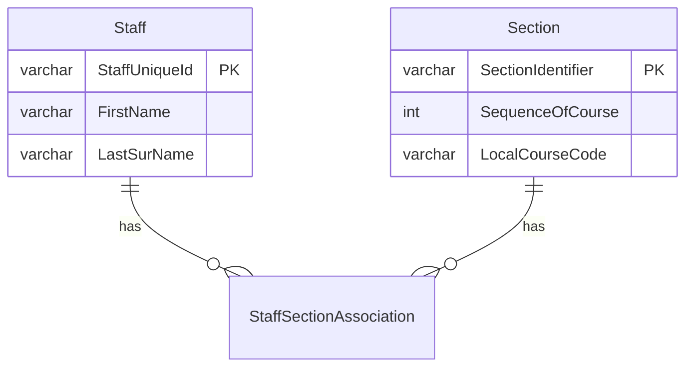

# API Composite Resources

## Overview

An Ed-Fi API Composite resource definition enables the Ed-Fi ODS / API to
provide subject-oriented data from multiple API resources in a single request,
resulting in a simple data integration experience for API consumers.

The following terminology is used when describing a composite resource
definition:

* **Composite Category**. The logical grouping of a set of related
    composite resources (e.g., Enrollment, Assessment). The Composite Category
    acts as a container for the composite definition and the Category name is
    used throughout the code and documentation to refer to the Composite.
* **Organization Code.** The organization owning the Composite definition.
    This value will be used in the route for accessing the composite data, and
    allows implementers to define composites without worrying about overlap with
    other organizations.
* **Base Resource.** The Ed-Fi ODS / API resource that forms the basis for the
    queries against the ODS and provides the data that appears at the root of
    the API's JSON response.
* **Collection.** Refers to one-to-many relationships within a resource (such
    as with StudentAddress within the Student resource).
* **Embedded Object.** Refers to one-to-one relationships within a resource
    (such as with StudentLearningStyle within the Student resource).
* **Linked Collection.** Refers to one-to-many relationships that span
    resources (such as with the relationship from a Student to the related
    StudentSectionAssociations, which are individual resources on the Ed-Fi ODS
    / API).
* **Referenced Resource.** Refers to many-to-one relationships between
    resources (such as with the relationship between a StudentSectionAssociation
 Note:    and its related Student).

The Composite resource is defined by first identifying the base resource that
will serve as the source of data that is at the root of the resulting JSON
payload. From that base resource, data can be included from other entities
within the base resource (such as collections or embedded objects) or by
"walking" the Ed-Fi model's relationships to other API resources (such as
references and linked collections).

The diagram below depicts the composition process of a possible
Enrollment Section composite resource:


## Composite Definition

The composite definition is expressed in XML in terms of the resource model's
members (not to be confused with the JSON representation). It is used by the
Ed-Fi ODS / API at runtime to construct the queries necessary to assemble the
composite resource, and by the code generation process in Visual Studio to
create the associated Swagger metadata.

:::info

Composites cannot include resource model members added via Ed-Fi Extensions. API
Composite definitions currently support only the resource models from the Ed-Fi
Core data model.

:::

The basic structure of a Composite Definition is as follows:

### Composite Definition Structure

```xml
<CompositeMetadata organizationCode="...">
  <Category displayName="..." name="...">
    <Routes>
       ...
    </Routes>
    <Composites>
      <Composite name="...">
        <Specification>
          ...
        </Specification>
        <BaseResource name="...">
          ...
        </BaseResource>
      </Composite>
      <Composite name="...">
        ...
      </Composite>
    </Composites>
  </Category>

  <Category>
    ...
  </Category>
</CompositeMetadata>
```

An XML schema containing standard Composite Definitions is included in the
Ed-Fi-ODS repository
at Ed-Fi-ODS\\Application\\EdFi.Ods.Common\\Metadata\\Schemas\\Ed-Fi-ODS-API-Composites.xsd.
Additionally, a full set of composite definitions used for unit testing can be
found at Ed-Fi-ODS\\Application\\EdFi.Ods.Composites.Test\\Composites.xml. These
definitions contain many different facets of the composite definition applied to
API resources and may serve as useful reference examples for implementers.

## Organization Code

```xml
<CompositeMetadata organizationCode="ed-fi">

```

The `organizationCode` specified in the Composite definition indicates the
organization that owns or originated the Composite definition.

## Composite Category

```xml
<Category name="Enrollment" displayName="Ed-Fi Enrollment">

```

The `Category` element provides a logical grouping for a set of related
Composite resources.

The organization code and the category `name` attributes determine the top-level
segment for the WebAPI route definitions in the Ed-Fi ODS / API. For example, a
Composite resource of "Section" defined by Ed-Fi with a category `name` of
"Enrollment" would be exposed on the following URL:

`http://`**`{host}`**`/api/composites/v1/ed-fi/enrollment/Sections`

:::info

The composites feature is now versioned independently of the primary API.

:::

The `name` attribute is used in the routes, and is also normalized (introducing
spaces, if appropriate) for display in the API Section drop-down list in the
Swagger UI:


## Composite Routes and Specifications

When the Composite Definition is processed during the initialization of the
Ed-Fi ODS / API, a default route is registered for each of the Composite
resources. Thus, the following URLs are supported by the as-shipped API for
Composite resources:

`http://`**`{host}`**`/api/composites/v1/ed-fi/enrollment/Sections`
`http://`**`{host}`**`/api/composites/v1/ed-fi/enrollment/Sections/647d626a7a434ca08621494efc406c06`

Additionally, each Composite Category has the opportunity to define an
additional set of WebAPI-style routes for the contained resources. The listing
below shows how routes could be defined for an "Enrollment" category. Note that
each route must contain a `{compositeName}` parameter as this is what is used by
the CompositeResourceController to identify the composite resource for an
incoming request.

### Routes

```xml
    <Routes>
      <Route relativeRouteTemplate="/localEducationAgencies/{LocalEducationAgency.Id}/{compositeName}" />
      <Route relativeRouteTemplate="/schools/{School.Id}/{compositeName}" />
      <Route relativeRouteTemplate="/sections/{Section.Id}/{compositeName}" />
      <Route relativeRouteTemplate="/staffs/{Staff.Id}/{compositeName}" />
      <Route relativeRouteTemplate="/students/{Student.Id}/{compositeName}" />
    </Routes>
```

When the routes are registered with WebAPI at runtime, the composite category
name is automatically included in the registration. For example, the first route
defined above would match an API request for the following URL:

`http://{host}/api/composites/v1/ed-fi/enrollment/647d626a7a434ca08621494efc406c06/sections`

In this example, once the route is matched by WebAPI,
the `LocalEducationAgency.Id` parameter will be bound to a value of
647d626a7a434ca08621494efc406c06. However, in order for the Ed-Fi ODS / API to
incorporate this criteria appropriately, it requires some additional information
about how to apply the `LocalEducationAgency.Id` parameter to the queries. This
is where the `Specification` for the Composite resource comes in to play.

Consider the following example:

### Section Composite Resource Specification

```xml
<Specification>
  <Parameter name="LocalEducationAgency.Id" filterPath="School->LocalEducationAgency.Id" />
  <Parameter name="School.Id" filterPath="School.Id" />
  <Parameter name="Staff.Id" filterPath="StaffSectionAssociations->Staff.Id" />
  <Parameter name="Student.Id" filterPath="StudentSectionAssociations->Student.Id" />
</Specification>
```

The `filterPath` attribute provides the detail necessary to incorporate
appropriate criteria and joins to the queries. Continuing with the example, the
parameter definition specifies that in order to apply
the `LocalEducationAgency.Id` parameter to the query, we first need to "crawl"
from the base resource (i.e., Section) up to the School, then to the
LocalEducationAgency to filter on its `Id` value. The path syntax uses arrows
(i.e., **`->`**) to indicate jumps between entities, and periods (i.e., `.`) to
indicate property access.

Note in the specification above for the Section resource that there is no
definition for the `Section.Id` parameter. Since it would not make sense for the
API to respond to a request
for /sections/647d626a7a434ca08621494efc406c06/sections, leaving this parameter
out of the specification effectively prevents the corresponding route definition
from being used to process the request. The caller would receive a `404 Not
Found` response in this situation.

## Composite Resource Structural Definition

Every Composite resource's structural definition begins with the `<Composite>`
element.

### Composite Element

```xml
<Composite name="SectionEnrollment">

```

The name attribute should be the singularized form of the name of the resource
to be exposed on the API. In the example above, this will appear on the API as
/sectionEnrollments.

The next element is the `<Specification>` element (which is described in the
previous section), followed by the `<BaseResource>` element:

### BaseResource Element

```xml
<BaseResource name="Section">
```

This element identifies the API Resource to be used as the root of the Composite
resource. Properties can be included through the use of the `<Property>`
element. The `displayName` can be used to change the name used in the JSON
output.

### Property Element

```xml
<Property name="FirstName" displayName="first" />
<Property name="LastSurname" displayName="last" />
```

The `<EmbeddedObject>`, `<ReferencedResource>`, `<Collection>`, and `<LinkedCollection>`
elements all represent entity constructs. These elements follow the same
structure as the `<BaseResource>` with the exception that they can be "aliased"
using the `displayName` attribute.

### EmbeddedObject, ReferencedResource, Collection and LinkedCollection Elements

```xml
<EmbeddedObject name="StudentLearningStyle">
  ...
</EmbeddedObject>

<ReferencedResource name='SessionReference'>
  ...
</ReferencedResource>

<Collection name="StaffElectronicMails">
  ...
</Collection>

<LinkedCollection name="StudentSectionAssociations">
  ...
</LinkedCollection>
```

Additionally, the `<ReferencedResource>` and `<EmbeddedObject>` elements, which
represent many-to-one and one-to-one relationships respectively, provide a
flatten attribute to enable the selected resource members to be flattened into
the containing parent element. This allows you to control the depth of the
resulting JSON payload.

The `displayName` and `flatten` attributes can be combined to create a more
natural collection output when the data is sourced through a many-to-many
relationship. For example, consider the relationship between Section and Staff
shown below:



Without the use of the `flatten` attribute, the composite resource would be
defined as follows:

### Section Composite Without Flattening

```xml
 <BaseResource name="Section">
  <Property name="Id" />
    <Property name="SectionIdentifier" />
    <Property name="SequenceOfCourse" />
    <LinkedCollection name="StaffSectionAssociations" displayName="staff">
     <ReferencedResource name="StaffReference" flatten="false">
         <Property name="StaffUniqueId" />
         <Property name="FirstName" />
         <Property name="LastSurname" />
      </ReferencedResource>
      </LinkedCollection>
      <ReferencedResource name="CourseOfferingReference" flatten="false">
            <Property name="LocalCourseCode" />
      </ReferencedResource>
 </BaseResource>
```

The resulting JSON payload for the definition above would look something like
the following:

### JSON Response (Unflattened)

```json
[
  {
    "id": "1580f51fef234193abcacbe927b02a78",
    "sectionIdentifier": "25590100102Trad220ALG112011",
    "sequenceOfCourse": 1,
    "staff": [
      {
        "staffReference": {
          "staffUniqueId": "207270",
          "firstName": "Kelley",
          "lastSurname": "Christian"
        }
      },
      {
        "staffReference": null
      }
    ],
    "courseOfferingReference": {
      "localCourseCode": "ALG-1"
    }
  }
]
```

Using `flatten` and `displayName` can be used together in the definition:

### Section Composite With Flattening

```xml
 <BaseResource name="Section">
  <Property name="Id" />
    <Property name="SectionIdentifier" />
    <Property name="SequenceOfCourse" />
    <LinkedCollection name="StaffSectionAssociations" displayName="staff">
     <ReferencedResource name="StaffReference" flatten="true">
         <Property name="StaffUniqueId" />
         <Property name="FirstName" />
         <Property name="LastSurname" />
      </ReferencedResource>
      </LinkedCollection>
      <ReferencedResource name="CourseOfferingReference" flatten="true">
            <Property name="LocalCourseCode" />
      </ReferencedResource>
 </BaseResource>
```

The definition above provides a natural result in the response:

### JSON Response (Flattened)

```json
[
  {
    "id": "1580f51fef234193abcacbe927b02a78",
    "sectionIdentifier": "25590100102Trad220ALG112011",
    "sequenceOfCourse": 1,
    "localCourseCode": "ALG-1",
    "staff": [
      {
        "staffUniqueId": "207270",
        "firstName": "Kelley",
        "lastSurname": "Christian"
      },
      {
        "staffUniqueId": "207271",
        "firstName": "Trent",
        "lastSurname": "Newton"
      }
    ]
  }
]
```

The `<ReferencedResource>` elements also provide a way to include the subtype
information using the `includeResourceSubtype` attribute.

Using the `includeResourceSubtype` attribute, the composite resource would be
defined as follows:

### Student Composite With IncludeResourceSubtype

```xml
 <BaseResource name="Student">
    <Property name="Id" />
    <Property name="StudentUniqueId" />
    <Property name="FirstName" />
    <Property name="LastSurname" />
    <LinkedCollection name="StudentEducationOrganizationAssociations" displayName="studentDemographics">
      <ReferencedResource name="EducationOrganizationReference" flatten="true" includeResourceSubtype="true">
        <Property name="EducationOrganizationId" />
      </ReferencedResource>
      <Property name="SexDescriptor" />
      <Property name="HispanicLatinoEthnicity" />
    </LinkedCollection>
 </BaseResource>
```

The resulting JSON payload for the definition above will include a property
specifying the resource subtype like the following:

### JSON Response (includeReferenceSubtype enabled)

```json
{
  "id": "629c778093244afaad8d6ae60a02182d",
  "studentUniqueId": "604821",
  "firstName": "Tyrone",
  "lastSurname": "Dyer",
  "studentDemographics": [
    {
      "educationOrganizationId": 255901,
      "educationOrganizationType": "edfi.LocalEducationAgency",
      "sexDescriptor": "uri://ed-fi.org/SexDescriptor#Male",
      "hispanicLatinoEthnicity": false
    }
  ]
}
```

## Security and Authorization

All data exposed through Composite API Resources is still subject to the same
security checks performed for the authorization of API requests at all levels of
the composite resources. The following list contains the impact of authorization
on the API responses:

* Composite API Resources do not require additional security metadata to be
    defined in the EdFi\_Security database. All authorization decisions and
    behavior are based on the metadata already defined for the existing Ed-Fi
    ODS / API resources.
* If the caller does not have access to the base resource of a composite,
    a `401 Unauthorized` response will be returned.
* If the caller has access to "Read" the base resource, but does not have
    "Read" access to a resource contained within the composite, that part of the
    composite resource will simply not be returned in the response.
* All data will be filtered appropriately for the current caller at all
    levels of the composite resource. In other words, you need not be concerned
    about accidentally exposing data to the API consumers that they couldn't
    obtain through the standard API domain aggregate resources.
* Due to security constraints, references to base resource objects that are
    abstract can only expose the primary key properties.

## Impact of API Profiles on Composites

API Profiles provide the ability to constrain the surface area of an API
resource, limiting what parts of a resource are available to specific API
consumers. While the main API resources require the use of a specific content
type header by consumers who have been assigned Profiles, there is no such
requirement for accessing composite resources (i.e., application/json is used in
the client content type header).

Nevertheless, the Ed-Fi ODS / API still honors all the Profiles assigned to the
current caller when processing a request. The Profiles are processed in an
additive manner to produce the JSON response. In other words, if one assigned
Profile includes a specific property through an "IncludeOnly" member selection
mode, while another assigned Profile excludes the same property through an
"ExcludeOnly" member selection mode, the property will be included in the
response.

Additionally, if collection value filters are in use (e.g., limiting accessible
student addresses to "Home" or "Physical"), only those items matching the
constraints from the Profile will be returned in the response. To reiterate, if
multiple Profiles are assigned to the caller, the collection value filters will
be combined using "OR" semantics with any positive match resulting in the
inclusion of the collection item in the API response.

## Adding Composites to the Ed-Fi ODS / API Solution

For a complete walkthrough of adding Composites, see the article [How To: Add
API Composites to the Ed-Fi ODS / API
Solution](../../how-to-guides/how-to-add-api-composites-to-the-ed-fi-ods-api-solution.md).
