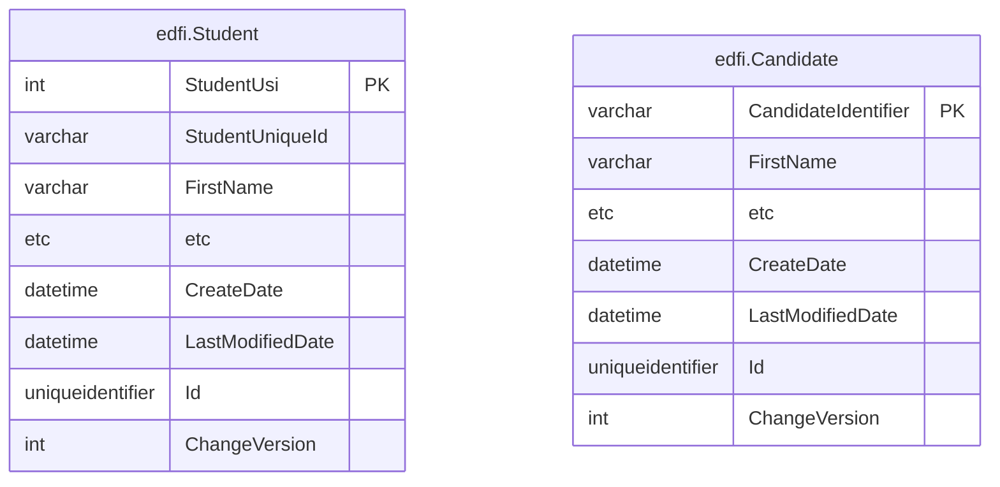
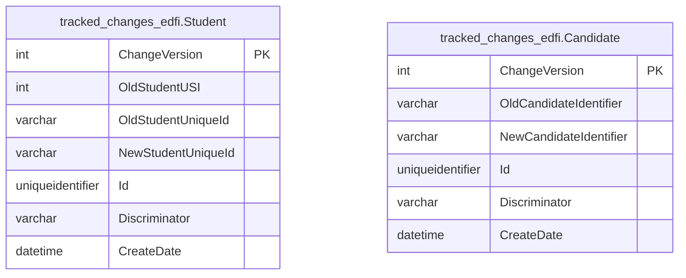

# Changed Record Queries

The Ed-Fi ODS / API platform contains data that gets updated frequently. The
platform can track inserts, updates, and deletes, and surface those changes to
client systems through a feature called changed record queries, or "change
queries." Change queries allow client systems to narrow requests for data to
only data that has changed since a specified point in time. This allows client
systems to stay in sync with the ODS / API without having to pull a complete
data set.

Client system interaction is documented in the [Using the Changed Record
Queries](../../client-developers-guide/using-the-changed-record-queries.md)
section of the API Client Developers' Guide.

Change queries is an optional feature and is turned on by default — but can be
turned off through configuration. This feature also provides
an [option](#changed-record-queries-with-snapshot-isolation) that enables
platform hosts to provide API clients with isolated context for processing
changes. This documentation covers the essentials for platform hosts to enable
and manage the feature.

## Enabling Change Queries

The change query feature is enabled by default since v5.1.0, and the schema
changes are included with all Ed-Fi provided backups. These steps are provided
to manage including the feature on previous versions as part of an upgrade, or
to reenable the feature after disabling it.

The feature is managed on the deployed code by changing the
appsettings.json file of the EdFi.Ods.WebApi project. This is
the appsettings.json of the "Api" component of the deployed solution. The app
setting `ApiSettings:Features:ChangeQueries` should be set to the value "true".
If the app setting doesn't exist, it should be created.

The following snippet shows the app setting:

```json
"ApiSettings": {
    ...
    "Features": [
      {
        "Name": "ChangeQueries",
        "IsEnabled": true
      },
    ...
  ]
}
```

To enable change queries, the database must be also be updated using the
provided scripts. These scripts will set up a new database schema and all the
changes necessary to support change queries. All scripts supporting change
queries will exist under a subfolder named "changes" inside the "Ods" target
database folder (i.e.,
\\Ed-Fi-ODS\\Application\\EdFi.Ods.Standard\\`(StandardVersion)`\\Artifacts\\MsSql\\Structure\\Ods\\Changes).
Scripts will be generated for this feature by MetaEd for Ed-Fi Extension
projects as well.

Note that in development environments, initdev process automatically deploys the
change query schema based on the "ApiSettings:Features:ChangeQueries" flag in
the appsettings.json file of the EdFi.Ods.WebApi project. This means that a
development instance will typically not require any additional database scripts
to be run.

In non-development environments, the schemas are already included with most
provided backups, but can be applied if working with an older release or
reapplying the feature by deploying the necessary change scripts to the target
ODS database(s). The exact steps depend on your deployment method:

* If you are using the built-in deployment PowerShell scripts, update the
    configuration.json to set the "ApiSettings:Features:ChangeQueries" flag to
    "true". Same changes to configuration.json are needed while installing
    databases using the EdFi.Suite3.RestApi.Databases NuGet package. Performing
    a deployment on top of an existing ODS database after setting this flag will
    correctly execute the change queries scripts, which perform the necessary
    updates to enable change queries functionality.
* If the built-in deployment scripts are not being used, all scripts under the
    "changes" inside the "Ods" target database folder
    (Ed-Fi-ODS\\Application\\EdFi.Ods.Standard\\`(StandardVersion)`\\Artifacts\\MsSql\\Structure\\Ods\\Changes)
    must be run against the ODS, including the extension version of the scripts
    (Ed-Fi-ODS-Implementation\\Application\\(YourExtensionProject)\\Versions\\(ExtensionVersion)\\Standard\\`(StandardVersion)`\\Artifacts\\MsSql\\Structure\\Ods\\Changes).

## Disabling Change Queries

It is normally recommended to leave change queries on, in order to support
client integrations that rely on it. However, if a field implementation wants to
remove the feature, it can be done by turning the feature flag off in the
appsettings.json, and then deleting the database objects from all ODS instances.

The scripts below for SQL Server and PostgreSQL will generate an
appropriate idempotent cleanup script to remove all change query related
artifacts, for both core and extensions. Execute the attached script, review the
output to verify what is being deleted, and then execute the generated script to
remove the database objects for change queries. As always, it is recommended to
take a backup prior to making major modifications to the ODS. This process would
need to be done to each ODS.

<details  >
<summary>MSSQL Change Queries Removal</summary>

```sql
-- Drop delete tracking triggers
SELECT 'DROP TRIGGER IF EXISTS ' + s.name + '.' + tr.name + ';'
FROM sys.triggers tr
INNER JOIN sys.tables ta
ON tr.parent_id = ta.object_id
INNER JOIN sys.schemas s
ON ta.schema_id = s.schema_id
WHERE tr.name LIKE '%TR/_DeleteTracking' ESCAPE '/' OR tr.name LIKE '%TR/_UpdateChangeVersion' ESCAPE '/'
UNION ALL
-- Drop delete tracking tables
SELECT 'DROP TABLE IF EXISTS ' + TABLE_SCHEMA + '.' + TABLE_NAME + ';'
FROM INFORMATION_SCHEMA.TABLES
WHERE TABLE_SCHEMA LIKE 'tracked/_changes/_%' ESCAPE '/'
UNION ALL
--Drop auth views related to key changes
SELECT 'DROP VIEW IF EXISTS ' + TABLE_SCHEMA + '.' + TABLE_NAME + ';'
FROM INFORMATION_SCHEMA.VIEWS
WHERE TABLE_SCHEMA LIKE 'auth' AND TABLE_NAME LIKE '%IncludingDeletes%'
UNION ALL
-- Drop indexes on ChangeVersion columns
SELECT 'DROP INDEX IF EXISTS ' + i.name + ' ON ' + s.name + '.' + t.name + ';'
FROM sys.indexes i
INNER JOIN sys.tables t
ON i.object_id = t.object_id
INNER JOIN sys.schemas s
ON t.schema_id = s.schema_id
WHERE i.name LIKE '%/_ChangeVersion' ESCAPE '/'
UNION ALL
-- Drop default constraints on ChangeVersion columns
SELECT 'ALTER TABLE ' + s.name + '.' + t.name + ' DROP CONSTRAINT IF EXISTS ' + dc.name + ';'
FROM sys.default_constraints dc
INNER JOIN sys.tables t
ON dc.parent_object_id = t.object_id
INNER JOIN sys.schemas s
ON t.schema_id = s.schema_id
WHERE dc.definition = '(NEXT VALUE FOR [changes].[ChangeVersionSequence])'
UNION ALL
-- Drop ChangeVersion columns
SELECT 'ALTER TABLE ' + c.TABLE_SCHEMA + '.' + c.TABLE_NAME + ' DROP COLUMN IF EXISTS ' + c.COLUMN_NAME + ';'
FROM INFORMATION_SCHEMA.COLUMNS c
WHERE COLUMN_NAME = 'ChangeVersion' AND COLUMN_DEFAULT LIKE '%ChangeVersionSequence%'
UNION ALL
-- Drop GetMaxChangeVersion function
SELECT 'DROP FUNCTION IF EXISTS changes.GetMaxChangeVersion;'
UNION ALL
-- Drop ChangeVersionSequence sequence
SELECT 'DROP SEQUENCE IF EXISTS changes.ChangeVersionSequence;'
UNION ALL
-- Drop snapshot table
SELECT 'DROP TABLE IF EXISTS changes.Snapshot;'
UNION ALL
-- Drop change query schemas
SELECT 'DROP SCHEMA IF EXISTS ' + SCHEMA_NAME + ';' FROM INFORMATION_SCHEMA.SCHEMATA WHERE SCHEMA_NAME = 'changes' OR SCHEMA_NAME LIKE 'tracked/_changes/_%' ESCAPE '/'
UNION ALL
-- Clean up journal entries related to Changes
SELECT 'DELETE FROM dbo.DeployJournal WHERE ScriptName LIKE ''%Artifacts.MsSql.Structure.Ods.Changes.%'''
```

</details>

<details>
<summary>PostgreSQL Change Queries Removal</summary>

```sql
-- Drop delete tracking triggers
SELECT 'DROP TRIGGER IF EXISTS ' || tr.trigger_name || ' ON ' || tr.event_object_schema || '.' || tr.event_object_table || ';'
FROM information_schema.triggers tr
WHERE tr.trigger_name = 'trackdeletes' OR tr.trigger_name = 'updatechangeversion' OR tr.trigger_name = 'handlekeychanges'
UNION ALL
-- Drop delete trigger functions
SELECT 'DROP FUNCTION IF EXISTS ' || routine_schema || '.' || routine_name || ';'
FROM information_schema.routines
WHERE routine_schema LIKE 'tracked/_changes/_%' ESCAPE '/'
UNION ALL
-- Drop auth views related to key changes
SELECT 'DROP VIEW IF EXISTS ' || table_schema || '.' || table_name || ';'
FROM information_schema.views
WHERE table_schema = 'auth' AND table_name LIKE '%includingdeletes'
UNION ALL
-- Drop delete tracking and changes tables
SELECT 'DROP TABLE IF EXISTS ' || table_schema || '.' || table_name || ';'
FROM information_schema.tables
WHERE table_schema = 'changes' OR table_schema LIKE 'tracked/_changes/_%' ESCAPE '/'
UNION ALL
-- Drop ChangeVersion columns, also drops linked index and default constraints
SELECT 'ALTER TABLE ' || c.table_schema || '.' || c.table_name || ' DROP COLUMN IF EXISTS ' || c.column_name || ';'
FROM information_schema.columns c
WHERE column_name = 'changeversion' AND column_default LIKE '%changes.changeversionsequence%'
UNION ALL
-- Drop GetMaxChangeVersion function
SELECT 'DROP FUNCTION IF EXISTS changes.GetMaxChangeVersion;'
UNION ALL
-- Drop updateChangeVersion function
SELECT 'DROP FUNCTION IF EXISTS changes.updateChangeVersion;'
UNION ALL
-- Drop ChangeVersionSequence sequence
SELECT 'DROP SEQUENCE IF EXISTS changes.ChangeVersionSequence;'
UNION ALL
-- Drop change query schemas
SELECT 'DROP SCHEMA IF EXISTS ' || SCHEMA_NAME || ';'
FROM information_schema.schemata
WHERE schema_name = 'changes' OR schema_name LIKE 'tracked/_changes/_%' ESCAPE '/'
UNION ALL
-- Clean up journal entries related to Changes
SELECT 'DELETE FROM public."DeployJournal" WHERE ScriptName LIKE ''%Artifacts.PgSql.Structure.Ods.Changes.%'''
```

</details>

## Technical Details

The change queries function uses basic versioning concepts. A global version
counter is introduced using a Sequence object, and each table representing the
top-level entities of a data domain are given a ChangeVersion column to
represent the current version of the entity instance. These columns are set up
with triggers to ensure they are automatically updated based on the latest value
of the sequence on all inserts and updates, whether they come from the API or
through scripts. Queries done against the API to find changed records function
by adding an additional where clause to based on this ChangeVersion column.



Supporting delete tracking requires another common change tracking concept,
using a "tombstone" table. This concept involves tracking all deletes and
storing a record of what was deleted, to allow future querying against deleted
records. In this case, the pattern is implemented using a delete trigger on the
main table, and the resource id and primary key of the deleted record are then
stored in the tracking table for deletes. API requests to retrieve information
on deletes queries against these tables to retrieve the resource ids of deleted
entity instance.

Note that there is a concern in use cases with very high volume of deletes or
for very long running ODS instances where the size of these delete tracking
tables can get very large, taking up a disproportionate percentage of the
database storage. In that case, these tables can be truncated periodically, the
only risk being losing visibility into any deletes that are removed by this
truncation. Given the typical uses cases of using an ODS per school year, no
automatic truncation was introduced by default since it's unlikely to be an
issue for most implementations.



The patterns described above are used for both the standard, as-shipped Ed-Fi
ODS database tables, as well as tables generated to serve Ed-Fi Extensions. By
using [MetaEd](/reference/metaed) (the recommended method for extending the
Ed-Fi ODS / API), scripts are generated to support the ChangeVersion column,
insert/update/delete triggers, and delete tracking tables. This allows hosts to
have consistent support for the feature across their entire API, even for new
top-level entities introduced by Extension projects.

## Changed Record Queries with Snapshot Isolation

In order to provide an environment for API clients that can guarantee data
consistency for downstream processing of Ed-Fi ODS data, it is _highly
recommended_ that API hosts setup snapshots and provide isolated snapshots to
use with Change Queries workflow.

This feature provides a mechanism for API clients to make API requests that are
served from a static copy of the ODS database isolated from ongoing changes in
the underlying ODS database. This isolation avoids data consistency problems,
processing failures, and, significantly, undetected missing data (or data
changes) in the target system.

The following ODS / API artifacts are relevant for snapshot isolation:

* A database table (`EdFi_Admin.dbo.OdsInstanceDerivative`) to capture
    information to override an OdsInstance.
* API support for processing the `Use-Snapshot` HTTP header to service API
    requests using the corresponding static ODS data source rather than the live
    operational ODS.

## Creating and Managing Snapshots

In order to provide an isolated context for API clients' processing, Platform
hosts must implement DevOps processes to maintain a periodically refreshed
static copy of the API's main ODS database and the corresponding record in the
`EdFi_Admin.dbo.OdsInstanceDerivative` table.

This would typically be implemented as a basic scheduled database
backup-and-restore operation. For SQL Server users with a server-based
installation (rather than a managed, cloud-based offering), it could also be
implemented using SQL Server's lighter-weight "Database Snapshots" feature.

### Sample creation of a SQL Server Database Snapshot**

```sql
CREATE DATABASE EdFi_Ods_Sandbox_CW39oP8dfsLr0yXVGTixq_Snapshot ON
(
    NAME = EdFi_Ods_Populated_Template_Test,
    FILENAME = 'C:\MSSQL\MSSQL14.MSSQLSERVER\MSSQL\DATA\EdFi_Ods_Sandbox_CW39oP8dfsLr0yXVGTixq_Snapshot.ss'
)
  AS SNAPSHOT OF EdFi_Ods_Sandbox_CW39oP8dfsLr0yXVGTixq;
```

The host's process MUST perform the following steps:

* Back up the current EdFi\_Ods database (or equivalent).
* Restore the ODS database using following naming convention: _`{Ed-Fi ODS
    database name}`\_`Snapshot`_.
* Insert a new record into the `EdFi_Admin.dbo.OdsInstanceDerivative` table
    with the snapshot connection string and the OdsInstanceId to override.
