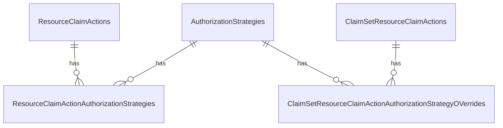
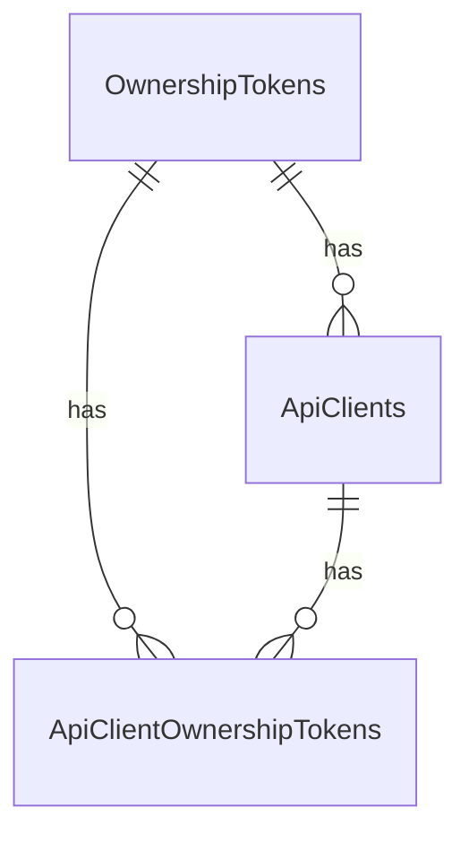
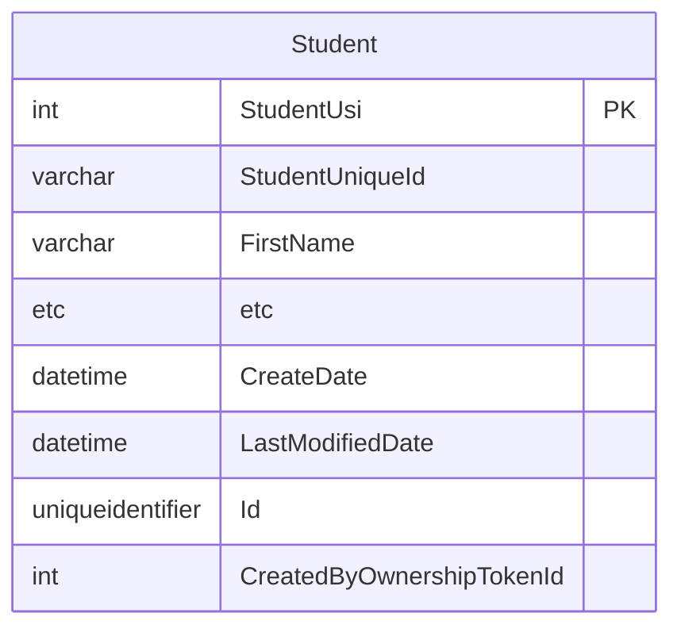

# Ownership Based Authorization

The Ed-Fi ODS / API primarily uses a relationship-based authorization strategy
based on education organizations. Ownership based authorization adds an optional
additional level of authorization that can be used in scenarios where more
granular access controls are needed. Refer to [API Claim Sets &
Resources](../security/api-claim-sets-resources.md)
for details on various available authorization strategies. This documentation
covers the essentials for platform hosts to enable and manage the feature.

Ownership based authorization is an optional feature that is turned off by
default - but can be turned on through configuration. When this feature is
turned on, each aggregate root entity in the ODS is assigned with an ownership
token indicating the access rights to that resource.  EdFi\_Admin database holds
ownership tokens for the API clients. API populates the new ownership token
property on the aggregate root entity from the API client's key context.
Authorization metadata in EdFi\_Security database allows platform hosts to
configure multiple authorization strategies for a given resource/action
combination to use ownership based authorization strategy in conjunction with
existing relationship based authorization strategies. API Authorization layer
identifies multiple matching authorization strategies for a request, and applies
multiple sets of filter criteria to apply authorization.

The following steps demonstrate setting up ownership based authorization.

## Enabling Ownership Based Authorization

The Ownership based authorization feature is managed on the deployed code by
changing the appsettings.json file of the EdFi.Ods.WebApi project. This is
the appsettings.json of the "Api" component of the deployed solution. The app
setting `ApiSettings:Features:OwnershipBasedAuthorization` should be set to the
value "true". If the app setting doesn't exist, it should be created.

The following snippet shows the app setting:

```json
"ApiSettings": {
    ...
    "Features": [
      {
        "Name": "OwnershipBasedAuthorization",
        "IsEnabled": true
      },
    ...
    ]
}
```

To enable ownership based authorization, the database must be also be updated
using the provided scripts. These scripts will set up a new column in all
aggregate root entities and necessary to support this feature. All scripts
supporting ownership based authorization will exist under a subfolder named
"RecordOwnership" inside the "Ods" target database folder (i.e.,
\\Ed-Fi-ODS\\Application\\EdFi.Ods.Standard\\`(StandardVersion)`\\Artifacts\\MsSql\\Structure\\Ods\\RecordOwnership).
Scripts will be generated for this feature by MetaEd for Ed-Fi Extension
projects as well.

Note that in development environments, initdev process automatically deploys
these scripts based on the "ApiSettings:Features:OwnershipBasedAuthorization"
flag in the appsettings.json file of the EdFi.Ods.WebApi project. This means
that a development instance will typically not require any additional database
scripts to be run.

In non-development environments, the schemas are already included with most
provided backups, but can be applied if working with an older release or
reapplying the feature by deploying the necessary change scripts to the target
ODS database(s). The exact steps depend on your deployment method:

* If you are using the built-in deployment PowerShell scripts, update the
    configuration.json to set the
    "ApiSettings:Features:OwnershipBasedAuthorization" flag to "true". Same
    changes to configuration.json are needed while installing databases using
    the EdFi.Suite3.RestApi.Databases NuGet package. Performing a deployment on
    top of an existing ODS database after setting this flag will correctly
    execute the ownership based authorization scripts, which performs the
    necessary updates to enable ownership based authorization functionality.
* If the built-in deployment scripts are not being used, all scripts under the
    "RecordOwnership" inside the "Ods" target database folder
    (Ed-Fi-ODS\\Application\\EdFi.Ods.Standard\\`(StandardVersion)`\\Artifacts\\MsSql\\Structure\\Ods\\RecordOwnership)
    must be run against the ODS, including the extension version of the scripts
    (Ed-Fi-ODS-Implementation\\Application\\(YourExtensionProject)\\Versions\\(ExtensionVersion)\\Standard\\`(StandardVersion)`\\Artifacts\\MsSql\\Structure\\Ods\\RecordOwnership).

:::caution

Ownership based authorization relies on appropriate ownership
tokens marked on aggregate root entities .  Once the feature is enabled, these
tokens are set during record creation. However, when setting up ownership
based authorization on an existing ODS, existing data must also be updated
with ownership tokens in order for authorization to work properly.

:::

## Setting up Security Metadata

Ownership based authorization feature takes advantage of claims-based
authorization to apply the ownership based authorization strategy against
specific resources.

Steps to set up security metadata involve:

1. Create a new Record Level Ownership claim set
2. Insert resource claim actions
3. Insert claim set resource claim actions
4. Insert claim set resource claim action authorization strategy overrides

<details>
<summary>Expand for SQL listing...</summary>

```sql
USE EdFi_Security
GO

DECLARE @ActionNames nvarchar(500)
DECLARE @ApplicationName NVARCHAR(MAX)
DECLARE @ApplicationId INT
DECLARE @AuthorizationStrategyName NVARCHAR(255)
DECLARE @AuthorizationStrategyId INT
DECLARE @ClaimName NVARCHAR(850)
DECLARE @ClaimSetName NVARCHAR(255)
DECLARE @ClaimSetId INT
DECLARE @ResourceClaimId INT

-- Set the actions to authorize
SET @ActionNames = 'read, update, delete'

-- Set the application to create the claim set for
SET @ApplicationName = 'Ed-Fi ODS API'

-- Set the authorization strategy
SET @AuthorizationStrategyName = 'OwnershipBased';

-- Set the resource claim name to authorize
SET @ClaimName = 'http://ed-fi.org/ods/identity/claims/student'

-- Set the claim set name to create
SET @ClaimSetName = 'Record Level Ownership'

SELECT @ApplicationId = ApplicationId FROM Applications WHERE ApplicationName = @ApplicationName
SELECT @AuthorizationStrategyId = AuthorizationStrategyId FROM AuthorizationStrategies WHERE AuthorizationStrategyName = @AuthorizationStrategyName
SELECT @ResourceClaimId = ResourceClaimId FROM ResourceClaims Where ClaimName = @ClaimName

-- Create a new claim set
INSERT INTO ClaimSets (ClaimSetName, Application_ApplicationId)
SELECT @ClaimSetName, @ApplicationId

SELECT @ClaimSetId = ClaimSetId FROM ClaimSets WHERE ClaimSetName = @ClaimSetName

-- Insert resource claim actions INSERT INTO ResourceClaimActions(ResourceClaimId, ActionId)
SELECT @ResourceClaimId, a.ActionID
FROM Actions a
WHERE a.ActionName IN(
    SELECT TRIM(value)
    FROM STRING_SPLIT(@actionNames, ',')
)
AND NOT EXISTS(
 SELECT 1
 FROM ResourceClaimActions rca
 WHERE rca.ResourceClaimID = @ResourceClaimId
 AND rca.ActionId = a.ActionId
)

-- Insert claim set resource claim actions
INSERT INTO ClaimSetResourceClaimActions(ClaimSetId, ResourceClaimId, ActionId)
SELECT  @ClaimSetId, rc.ResourceClaimId, a.actionId
FROM ResourceClaimActions rca
JOIN ResourceClaims rc on rc.ResourceClaimId = rca.ResourceClaimId
JOIN Actions a on a.ActionId = rca.ActionId
WHERE  rca.ResourceClaimId = @ResourceClaimId

-- Insert claim set resource claim action authorization strategy overrides
INSERT INTO ClaimSetResourceClaimActionAuthorizationStrategyOverrides(ClaimSetResourceClaimActionId, AuthorizationStrategyId)
SELECT csrca.ClaimSetResourceClaimActionId, @AuthorizationStrategyId
FROM ClaimSetResourceClaimActions csrca
WHERE csrca.ResourceClaimId = @ResourceClaimId
```

</details>

## Configuring the API Client

Steps to configuring the API Client involve:

1. Update Application Table to Use Record Level Ownership Claim Set
    1. (Claim set was created as part of Setting up Security Metadata)
2. Create an Ownership Token for each API Client
3. Assign the Creator Ownership Token to each API Client
4. Assign the Ownership Token to each API Client

<details>
<summary>Expand for SQL listing...</summary>

```sql
USE EdFi_Admin
GO

DECLARE @ClaimSetName NVARCHAR(255)
DECLARE @ApplicationName NVARCHAR(MAX)

SET @ClaimSetName = 'Ownership Based'
SET @ApplicationName = 'Default Sandbox Application Sample'

UPDATE Applications
SET ClaimSetName = @ClaimSetName
WHERE ApplicationName = @ApplicationName

INSERT INTO OwnershipTokens(Description)
SELECT client.[Name] + ' Ownership Token'
FROM Applications a
JOIN ApiClients client ON client.Application_ApplicationId = a.ApplicationId
WHERE a.ApplicationName = @ApplicationName

UPDATE ac
SET ac.CreatorOwnershipTokenId_OwnershipTokenId = ot.OwnershipTokenId
FROM OwnershipTokens ot
JOIN ApiClients ac ON ot.Description LIKE ac.[Name] + '%'
WHERE ac.CreatorOwnershipTokenId_OwnershipTokenId IS NULL

INSERT INTO ApiClientOwnershipTokens(ApiClient_ApiClientId, OwnershipToken_OwnershipTokenId)
SELECT ApiClientId, CreatorOwnershipTokenId_OwnershipTokenId
FROM Applications a
JOIN ApiClients client ON client.Application_ApplicationId = a.ApplicationId
WHERE a.ApplicationName = @ApplicationName
```

</details>

## Verifying a successful setup

In order to verify a successful setup, Swagger UI or Postman can be used to
query the API to ensure that aggregate root entities configured to use ownership
based authorization are returned correctly.

## Technical Details

The tables involved in ownership based authorization are as follows:

### EdFi\_Security Database

The application of an "ownership-based" authorization strategy is done in an
additive fashion. To facilitate this, EdFi\_Security database schema has been
updated to allow configuration of multiple authorization strategies for the
default resource claim/action "tuples" as well as for claim set-specific
overrides.



### EdFi\_Admin Database

In order to authorize individual resource items in the API based on the concept
of "ownership", each API client is associated with "CreatorOwnershipTokenId"
that is captured with each resource the client creates. The API client's claims
information also  includes a list of "ApiClientOwnershipTokens" that can be used
to identify which resource items they currently "own", and the authorization
process will filter results and access against this list against based on the
target resource's "CretedByOwnershipTokenId" value.



### Ed-Fi ODS Database

Each aggregate root entity table in the ODS has a CretedByOwnershipTokenId field
used to assign an ownership token to each record.

Eg. Student Table


